# **1** **线程概述**

## **1.1** **线程相关概念** 

> - **进程**
>
> > 进程(Process)是计算机中的程序关于某数据集合上的一次运行活 动,是操作系统进行资源分配与调度的基本单位. 可以把进程简单的理解为正在操作系统中运行的一个程序. 
>
> - **线程**
>
> > 线程(thread)是进程的**一个执行单元**. 一个线程就是进程中一个单一顺序的控制流, 进程的一个执行分支 
>
> > - **进程是线程的容器,一个进程至少有一个线程.一个进程中也可以有多个线程.** 
> > - 在操作系统中是以进程为单位分配资源,如虚拟存储空间,文件描 述符等. **每个线程都有各自的线程栈,自己的寄存器环境,自己的线程 本地存储.** 
>
> - **主线程与子线程** 
>
> - > JVM 启动时会创建一个主线程,该主线程负责执行 main 方法 . 主线程就是运行 main 方法的线程 .Java 中的线程不孤立的,线程之间存在一些联系. 如果在 A 线程中创建了 B 线程, 称 B 线程为 A 线程的子线程, 相应的 A 线程就是 B 线 程的父线程 .
>
> - **串行,并发与并行**
>
> - > 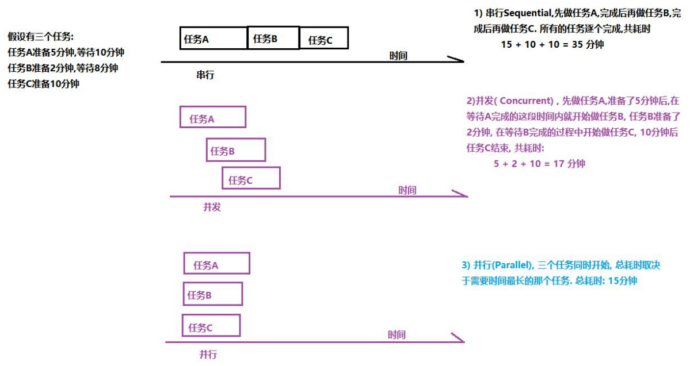
>   >
>   > > - 并发可以提高以事物的处理效率, 即一段时间内可以处理或者完 
>   > >
>   > >   成更多的事情.。并行是一种更为严格,理想的并发
>   >
>   > > - 从硬件角度来说, 如果单核 CPU,一个处理器一次只能执行一个线 
>   > >
>   > >   程的情况下,处理器可以使用**时间片轮转技术** ,可以让 CPU 快速的在 
>   > >
>   > >   各个线程之间进行切换, 对于用来来说,感觉是三个线程在同时执行. 
>   > >
>   > >   如果是**多核心CPU,可以为不同的线程分配不同的 CPU 内核.**

## 1.2 线程的创建与启动

> Thread 类有两个常用的构造方法:Thread()与 Thread(Runnable).对 应的创建线程的两种方式: 
>
> > - 定义 Thread 类的子类 
> > - 定义一个 Runnable 接口的实现类 **（使用较多，类是单继承）**
>
> 这两种创建线程的方式**没有本质的区别** 

- **定义 Thread 类的子类** 

```java
//1)定义类继承 Thread
public class MyThread extends Thread{ 
    @Override //2) 重写 Thread 父类中的 run() 
    public void run() { System.out.println("这是子线程打印的内容"); } }
//测试
public class Test { 
public static void main(String[] args) { 
    //3)创建子线程对象 
    MyThread thread = new MyThread(); 
    //4)启动线程 
    thread.start(); 
} }
```

> - **调用线程的 start()方法来启动线程。启动线程的实质就是请求 JVM 运行相应的线程,这个线程具体在什么时候运行由线程调度器(Scheduler)决定** 
> - **Start()方法的作用：启动一个分支先线程，在jvm中开辟一个新的栈空间。在段代码任务完成后，瞬间就结束。这段代码的任务只是为了开启一个新的栈空间，只要新的栈空间开出来，方法就结束，线程就启动成功。启动成功的线程会自动调用run()方法，并且run()方法在分支栈底部（压栈）。**
> -   **注意:**
>           start()方法调用结束并不意味着子线程开始运行 ， 新开启的线程会执行 run()方法 
>   **如果开启了多个线程,start()调用的顺序并不一定就是线程启动的顺序， 多线程运行结果与代码执行顺序或调用顺序无关（抢夺时间片）** 

- **实现Runnable 接口创建线程（可使用匿名内部类的方式）**

- > 1. **实现接口的类不是一个线程类，是一个可运行的类（Thread也实现了Runnable 接口）**
  > 2. **使用Thread t =new Thread(new MyThread);//封装为线程对象**

## 1.3 线程的常用方法

### 1.3.1 currentThread()方法

> - **Thread.currentThread()方法可以获得当前线程** 
> - **Java 中的任何一段代码都是执行在某个线程当中的. 执行当前代码的线程就是当前线程.** 
> - 同一段代码可能被不同的线程执行, 因此当前线程是相对的,     Thread.currentThread()方法的**返回值是在代码实际运行时候的线程对象** 

```java
public class SubThread2 extends Thread {
    public SubThread2() {
System.out.println("构造方法,Thread.currentThread().getName() : " +
Thread.currentThread().getName());
System.out.println("构造方法,this.getName() : " + this.getName());
    }
    @Override
    public void run() {
System.out.println("run方法中,Thread.currentThread().getName():" +
                Thread.currentThread().getName());
System.out.println("run 方法,this.getName() : " + this.getName());
    }}
//test
public class Test02CurrentThread {
    public static void main(String[] args) throws InterruptedException {
        SubThread2 t2 = new SubThread2();
        t2.setName("t2");
        t2.start();
        Thread.sleep(500);
//main 线程睡眠 500 毫秒 
//Thread(Runnable)构造方法形参是 Runnable 接口,调用时传递的实参是接口的实现类对象
        Thread t3 = new Thread(t2);
        t3.start();
    }
}
/**
main Thread-0 t2 t2 Thread-1（t3） t2
**/
```

### **1.3.2 setName()/getName()** 

> - thread.setName(线程名称), 设置线程名称 
> - thread.getName()返回线程名称 

### **1.3.3 isAlive()**

> thread.isAlive()判断当前线程是否处于活动状态,活动状态就是线程已启动并且尚未终止.

```java
public class Test {
    public static void main(String[] args) {
        SubThread3 t3 = new SubThread3();
        System.out.println("begin==" + t3.isAlive());
		//false,在启动线程之前 
        t3.start();
        System.out.println("end==" + t3.isAlive());
//结果不一定,打印这一行时,如果 t3线程还没结束就返回 true, 如果 t3 线程已结束,返回 false
    }
}
```

### **1.3.4 sleep()** 

> Thread.sleep(millis); 让当前线程休眠指定的毫秒数

```java
public class SubThread4 extends Thread {
    @Override
    public void run() {
        try {
           System.out.println("run, threadname=" + 					Thread.currentThread().getName() + " ,begin= " + 				System.currentTimeMillis());
            Thread.sleep(2000);
//当前线程睡眠 2000 毫秒 
            System.out.println("run, threadname=" + Thread.currentThread().getName()
                    + " ,end= " + System.currentTimeMillis());
        } catch (InterruptedException e) {
/*
在子线程的 run 方法中, 如果有受检异常(编译时异常)需要处理,只有选择捕 
获处理,不能抛出处理*/
            e.printStackTrace();
        }
    }
}
```

### **1.3.5 getId()** 

> - thread.getId()可以获得线程的唯一标识
> - **某个编号的线程运行结束后,该编号可能被后续创建的线程使用** 重启的 JVM 后,同一个线程的编号可能不一样 

### **1.3.6 yield()** 

> **Thread.yield()方法的作用是放弃当前的 CPU 资源**

### **1.3.7 setPriority()** 

> **thread.setPriority( num ); 设置线程的优先级** 
>
> - java 线程的优先级取值范围是 1 ~ 10 , 如果超出这个范围会抛出 异常 IllegalArgumentException. 
>
> - 在操作系统中,优先级较高的线程获得 CPU 的资源越多。线程优先级本质上是只是给线程调度器一个提示信息,以便于调度器决定先调度哪些线程. **注意不能保证优先级高的线程先运行.**
>
> - Java 优先级设置不当或者滥用可能会导致某些线程永远无法得到 
>
>   运行,即产生了**线程饥饿**. 
>
> - 线程的优先级并不是设置的越高越好,一般情况下使用普通的优 
>
>   先级即可,即在开发时不必设置线程的优先级
>
> - **线程的优先级具有继承性, 在 A 线程中创建了 B 线程,则 B 线程的** **优先级与 A 线程是一样的**

### **1.3.8 interrupt()** 

> **中断线程.** 
>
> - **注意调用 interrupt()方法仅仅是在当前线程打一个停止标志,并不是真正的停止线程**

```java
public class SubThread2 extends Thread {
    @Override
    public void run() {
        super.run();
        for(int i = 1; i <= 10000; i++){
//判断线程的中断标志,线程有 isInterrupted()方法,该方法返回线程的中断标志
            if ( this.isInterrupted() ){
          System.out.println("当前线程的中断标志为true,我要退出了"); 
		//中断循环, run()方法体执行完毕,子线程运行完毕
                return;
            }
            System.out.println("sub thread --> " + i);
        }
    }
}
```

### **1.3.9 setDaemon()** 

> **Java 中的线程分为用户线程与守护线程** 
>
> - **守护线程是为其他线程提供服务的线程,如垃圾回收器(GC)就是一 个典型的守护线程 守护线程不能单独运行, 当 JVM 中没有其他用户线程,只有守护线 程时,守护线程会自动销毁, JVM 会退出**

## 1.4 线程的生命周期

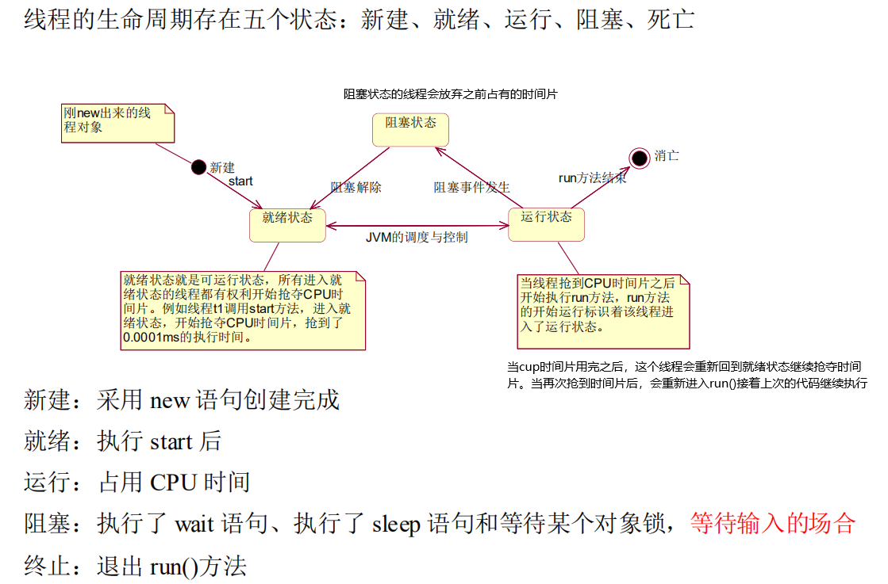

## **1.5** **多线程编程的优势与存在的风险** 

- 优势: 

- > - 提高系统的**吞吐率**(Throughout). 多线程编程可以使一个进程 有多个并发(concurrent,即同时进行的)的操作 
  > - 提高**响应性**(Responsiveness).Web 服务器会采用一些专门的线 程负责用户的请求处理,缩短了用户的等待时间 
  > - **充分利用多核(Multicore)处理器资源**. 通过多线程可以充分的 利用 CPU 资源

- 问题与风险:

- > -  **线程安全(Thread safe)问题**.多线程共享数据时,如果没有采取 正确的并发访问控制措施,就可能会产生数据一致性问题,如读取脏数 据(过期的数据), 如丢失数据更新. 
  >
  > - **线程活性(thread liveness)问题**.由于程序自身的缺陷或者由资 源稀缺性导致线程一直处于非 RUNNABLE 状态,这就是线程活性问题, 
  >
  > - 常见的活性故障有以下几种: 
  >
  > - > - (1) **死锁(Deadlock)**. 类似鹬蚌相争. 
  >   > - (2) **锁死(Lockout),** 类似于睡美人故事中王子挂了 
  >   > - (3) **活锁(Livelock)**. 类似于小猫咬自己尾巴 
  >   > - (4) **饥饿(Starvation)**.类似于健壮的雏鸟总是从母鸟嘴中抢到食物. 
  >
  > -  **上下文切换(Context Switch)**. 处理器从执行一个线程切换到执 行另外一个线程 
  >
  > - **可靠性**. 可能会由一个线程导致 JVM 意外终止,其他的线程也 无法执行

# **2** **线程安全问题**

> - 非线程安全主要是指**多个线程对同一个对象的实例变量进行操作**时,会出现值被更改,值不同步的情况. 
> - 线程安全问题表现为三个方面: **原子性,可见性和有序性**

## 2.1 原子性

> 原子(Atomic)就是不可分割的意思. 原子操作的不可分割有两层含义: 
>
> - **即使是多个线程一起执行的时候，一个操作一旦开始，就不会被其他线程干扰。**
>
> - 访问(读,写)某个共享变量的操作从其他线程来看,该操作**要么已经执行完毕,要么尚未发生**, 即其他线程年看不到当前操作的中间结果
>
> - **访问同一组共享变量的原子操作是不能够交错的** 
>
> - > 如现实生活中从 ATM 机取款, 对于用户来说,要么操作成功,用户拿到钱, 余额减少了,增加了一条交易记录; 要么没拿到钱,相当于取款操作没有发生
>
> Java 有两种方式实现原子性: **一种是使用锁; 另一种利用处理器的 CAS(Compare and Swap)指令.** 
>
> > - **锁具有排它性,保证共享变量在某一时刻只能被一个线程访问.** 
> > - **CAS 指令直接在硬件(处理器和内存)层次上实现,看作是硬件锁**

## **2.2** **可见性**

> - 在多线程环境中, 一个线程对某个共享变量进行**更新之后 , 后续其他的线程可能无法立即读到这个更新的结果**, 这就是线程安全问 题的另外一种形式: 可见性(visibility).
> - 多线程程序因为可见性问题可能会导致其他线程读取到了旧数据 (**脏数据**).

```java
import javax.swing.*;
class SubThread2 extends Thread {
    public boolean flag=true;
    @Override
    public void run() {
       while (true){
           if (flag){
               System.out.println("flag为true,程序继续执行！");
           }else{
               System.out.println("flag为false,程序退出！！");
               return;
           }
       }
    }}
public class test {
    public static void main(String[] args) throws InterruptedException {
        SubThread2 t=new SubThread2();
        t.start();
        Thread.sleep(5000);
        t.flag=false;
    }
}
```

> 可能会出现以下情况:
> 在main线程中 t.flag=false执行后，可能存在子线程看不到main线程对flag做的修改,在子线程中flag变量一直为false导致子线程看不到main线程对flag变量更新的原因,可能:
>
> > 1. **JIT即时编译器可能会对run方法中while循环进行优化**为:
> >    		if( !flag){
> >       				while( true ){
> >       				sout("flag为true,程序继续执行！");
> >       			}}
> > 2. **可能与计算机的存储系统有关**．假设分别有两个cpu内核运行main线程与子线程，运行子线程的cpu无法立即读取运行main线程cpu中的数据

## **2.3** **有序性**

> - **有序性(Ordering)是指一个处理器上运行的一个线程所执行的内存访问操作在另外一个处理器运行的其他线程看来是乱序的(Out of Order).**
> - 乱序是指**内存访问操作的顺序**看起来发生了变化

### **2.3.1** **重排序**

在**多核处理器**的环境下,编写的顺序结构,这种操作执行的顺序可能是没有保障的:

> - **编译器可能会改变两个操作的先后顺序;** 
> - **处理器也可能不会按照目标代码的顺序执行;** 
>
> - **这种一个处理器上执行的多个操作,在其他处理器来看它的顺序与目标代码指定的顺序可能不一样,这种现象称为重排序.** 
> - **重排序是对内存访问有序操作的一种优化**,可以在**不影响单线程**程序正确的情况下提升程序的性能.但是,**可能对多线程程序的正确性产生影响**,即可能导致线程安全问题 
> - **重排序与可见性问题类似,不是必然出现的.** 
> - 与内存操作顺序有关的几个概念: 
>
> > **源代码顺序**, 就是源码中指定的内存访问顺序. 
> >
> > **程序顺序**, 处理器上运行的目标代码所指定的内存访问顺序 
> >
> > **执行顺序**,内存访问操作在处理器上的实际执行顺序 
> >
> > **感知顺序**,给处理器所感知到的该处理器及其他处理器的内存访问操作的顺序 
>
> - 可以把重排序分为**指令重排序与存储子系统重排序**两种
>
> - > - 指令重排序主要是由 JIT 编译器,处理器引起的, 指程序顺序与执行顺序不一样 
>   > - 存储子系统重排序是由高速缓存,写缓冲器引起的, 感知顺序与执行顺序不一致

### **2.3.2** **指令重排序**

> 在源码顺序与程序顺序不一致,或者程序顺序与执行顺序不一致的情况下,我们就说发生了指令重排序(Instruction Reorder).
>
> 指令重排是一种动作,确实对指令的顺序做了调整, **重排序的对象指令.**
>
> > - javac 编译器一般不会执行指令重排序, 而 JIT 编译器可能执行指令重排序. 
> > - 处理器也可能执行指令重排序, 使得执行顺序与程序顺序不一致. 
>
> 指令重排不会对单线程程序的结果正确性产生影响,可能导致多线程程序出现非预期的结果

### **2.3.3** **存储子系统重排序** 

> - *存储子系统是指写缓冲器与高速缓存.* 
> - *高速缓存(Cache)是 CPU 中为了匹配与主内存处理速度不匹配而设计的一个高速缓存写缓冲器(Store buffer, Write buffer)用来提高写高速缓存操作的效率* 
> - 即使处理器严格按照程序顺序执行两个内存访问操作,在存储子系统的作用下, 其他处理器对这两个操作的感知顺序与程序顺序不 一致,即这两个操作的顺序顺序看起来像是发生了变化, 这种现象称为**存储子系统重排序** 
> - 存储子系统重排序**并没有真正的对指令执行顺序进行调整**,而是造成一种指令执行顺序被调整的**现象**.
> - **存储子系统重排序对象是内存操作的结果.**

从处理器角度来看, 读内存就是从指定的 RAM 地址中加载数据到寄存器,称为 Load 操作; 写内存就是把数据存储到指定的地址表示的 RAM 存储单元中,称为 Store 操作.**内存重排序**有以下四种可能

> 1. LoadLoad 重排序,一个处理器先后执行两个读操作 L1 和 L2,其他处理器对两个内存操作的感知顺序可能是 L2->L1 
> 2. StoreStore重排序,一个处理器先后执行两个写操作W1和W2,其他 处理器对两个内存操作的感知顺序可能是 W2->W1 
> 3. LoadStore 重排序,一个处理器先执行读内存操作 L1 再执行写内存操作 W1, 其他处理器对两个内存操作的感知顺序可能是 W1->L1 
> 4. StoreLoad重排序,一个处理器先执行写内存操作W1再执行读内存操作 L1, 其他处理器对两个内存操作的感知顺序可能是 L1->W1 
>
> 内存重排序与具体的处理器微架构有关,不同架构的处理器所允许的内存重排序不同 

### 2.3.4 貌似串行语义

> **JIT 编译器,处理器,存储子系统是按照一定的规则对指令,内存操作的结果进行重排序**, 给单线程程序造成一种假象----指令是按照源码的顺序执行的.这种假象称为貌似串行语义. 并不能保证多线程环境程序的正确性
>
> 为了保证貌似串行语义,有数据依赖关系的语句不会被重排序,**只有不存在数据依赖关系的语句才会被重排序**.**如果两个操作(指令)访问同一个变量,且其中一个操作(指令)为写操作,那么这两个操作之间就存在数据依赖关系(Data dependency).** 
>
> > ```java
> > x = 1; y = x + 1; 后一条语句的操作数包含前一条语句的执 行结果; 
> > y = x; x = 1; 先读取 x 变量,再更新 x 变量的值; 
> > x = 1; x = 2; 两条语句同时对一个变量进行写操作
> > ```
> >
> > 如果不存在数据依赖关系则可能重排序,如:
> >
> > ```java
> > double price = 45.8; int quantity = 10;
> > ```
>
> 存在控制依赖关系的语句允许重排.**一条语句(指令)的执行结果会决定另一条语句(指令)能否被执行,这两条语句(指令)存在控制依赖关系(Control Dependency).** *如在 if 语句中允许重排,可能存在处理器先执行 if 代码块,再判断 if 条件是否成立*

### **2.3.5** **保证内存访问的顺序性**

可以使用 volatile 关键字, synchronized 关键字实现有序性

## **2.4 Java** **内存模型**

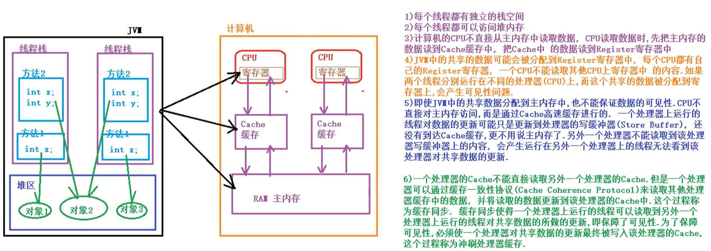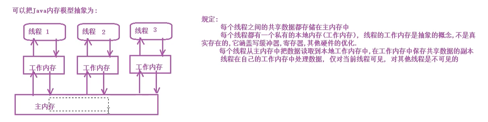

# **3** **线程同步** 

## **3.1** **线程同步机制简介**

> - 线程同步机制是一套**用于协调线程之间的数据访问的机制.该机制可以保障线程安全**. 
> - Java 平台提供的线程同步机制包括: **锁, volatile 关键字, final 关键字,static 关键字,以及相关的 API,如 Object.wait()/Object.notify()等**

## **3.2** **锁概述** 

**线程安全问题的产生前提是多个线程并发访问共享数据.**

> - 将多个线程对共享数据的并发访问转换为串行访问,即一个共享数据一次只能被一个线程访问.锁就是复用这种思路来保障线程安全的 
> - 锁(Lock)可以理解为对共享数据进行保护的一个许可证. 一线程在访问共享数据前必须先获得锁; 获得锁的线程称为**锁的持有线程**; 一个锁一次只能被一个线程持有. 锁的持有线程在**获得锁之后和释放锁之前这段时间所执行的代码称为临界区(Critical Section)**
> - 锁具有**排他性**(Exclusive), 即一个锁一次只能被一个线程持有.这种锁称为**排它锁或互斥锁(Mutex).**
> - 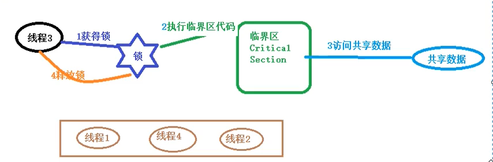
> - JVM 把锁分为**内部锁和显示锁**两种. 内部锁通过 **synchronized**关键字实现; 显示锁通过 **java.concurrent.locks.Lock 接口**的实现类实现的

### **3.2.1** **锁的作用**

**锁可以实现对共享数据的安全访问. 保障线程的原子性,可见性与有序性**

> - 锁是通过互斥保障原子性. 一个锁只能被一个线程持有, 这就保证临界区的代码一次只能被一个线程执行.使得临界区代码所执行的操作自然而然的具有不可分割的特性,即具备了原子性. 
>
> - 可见性的保障是通过写线程冲刷处理器的缓存和读线程刷新处理器缓存这两个 动作实现的. 在 java 平台中,锁的获得隐含着刷新处理器缓存的动作, 锁的释放隐含着冲刷处理器缓存的动作. 
>
> - 锁能够保障有序性.写线程在临界区所执行的在读线程所执行的临界区看来像是完全按照源码顺序执行的
>
> - **注意:** 
>
> - > 使用锁保障线程的安全性,必须满足以下条件: 
>   >
>   > > - 这些线程在访问共享数据时必须使用同一个锁 
>   > > - 即使是读取共享数据的线程也需要使用同步锁

### **3.2.2** **锁相关的概念** 

#### 1)可重入性

> 可重入性(Reentrancy)描述: 一个线程持有该锁的时候能再次(多次)申请该锁

```java
void methodA(){ 申请 a 锁 methodB(); 释放 a 锁 }
void methodB(){ 申请 a 锁 .... 释放 a 锁 }
```

> **如果一个线程持有一个锁的时候还能够继续成功申请该锁,称该锁是可重入的, 否则就称该锁为不可重入的**

#### 2)锁的争用与调度

> **Java 平台中内部锁属于非公平锁, 显示 Lock 锁既支持公平锁又支持非公平锁**

#### 3)锁的粒度

**一个锁可以保护的共享数据的数量大小称为锁的粒度.**

> - 锁保护共享数据量大,称该锁的粒度粗, 否则就称该锁的粒度细. 
> - 锁的粒度过粗会导致线程在申请锁时会进行不必要的等待.锁的粒度过细会增加锁调度的开销. 

## 3.3 内部锁:synchronized 关键字

> **Java 中的每个对象都有一个与之关联的内部锁(Intrinsic lock)**. **这种锁也称为监视器(Monitor), 这种内部锁是一种排他锁**,可以保障原子性,可见性与有序性. 
>
> 内部锁是通过 synchronized 关键字实现的.synchronized 关键字修饰代码块,修饰该方法
>
> > - 修饰代码块的语法:
> >
> > - > synchronized( 对象锁 ) { 
> >   >
> >   > 同步代码块,可以在同步代码块中访问共享数据 
> >   >
> >   > } 
> >   >
> >   > - 修饰实例方法就称为同步实例方法 
> >   > - 修饰静态方法称称为同步静态方法 

### 3.3.1 synchronized 同步代码块

```java
public class Test01 {//可以实现同步，锁相同
    public static void main(String[] args) {
        Test01 obj = new Test01();
        new Thread(new Runnable() {
            @Override
            public void run() {
                obj.mm();//使用的锁对象this就是obj对象 
            }
        }).start();
        new Thread(new Runnable() {
            @Override
            public void run() {
                obj.mm();//使用的锁对象this也是obj对象 
            }
        }).start();
    }
    //定义方法,打印 100 行字符串 
    public void mm(){
        synchronized ( this ) {//经常使用this当前对象作为锁对象
            for (int i = 1; i <= 100; i++) {System.out.println(Thread.currentThread().getName() + " --> " + i);
            } }}}
```

```java
 //如果线程的锁不同, 不能实现同步
public class Test02 {
    public static void main(String[] args) {
        Test02 obj = new Test02();
        Test02 obj2 = new Test02();
        new Thread(new Runnable() {
            @Override
            public void run() {
                obj.mm();//使用的锁对象this就是obj对象
            }
        }).start();
        new Thread(new Runnable() {
            @Override
            public void run() {
                obj2.mm();//使用的锁对象 this 也是 obj2对象
            }
        }).start();}
    public void mm(){
        synchronized ( this ) {//经常使用this当前对象作为锁对象
            for (int i = 1; i <= 100; i++) {
             System.out.println(Thread.currentThread().getName() + " --> " + i);
            }}}}
```

```java
// 使用一个常量对象作为锁对象(可以实现同步)
public class Test03 {
    public static void main(String[] args) {
        Test03 obj = new Test03();
        Test03 obj2 = new Test03();
        new Thread(new Runnable() {
            @Override
            public void run() {
                obj.mm();//使用的锁对象 OBJ 常量
            }
        }).start();
        new Thread(new Runnable() {
            @Override
            public void run() {
                obj2.mm();//使用的锁对象 OBJ 常量
            }
        }).start(); }
    public static final Object OBJ = new Object();
    //定义一个常量,
    public (static )void mm(){
        synchronized ( OBJ ) {//使用一个常量对象作为锁对象
            for (int i = 1; i <= 100; i++) {
           System.out.println(Thread.currentThread().getName() + " --> " + i);
            } }  }}
```

> **使用一个常量对象作为锁对象,不同方法(实例方法、静态方法)中的同步代码块也可以同步**

### **3.3.2** **同步方法** 

```java
 //把整个方法体作为同步代码块,默认的锁对象是 this 对象
public class Test05 {
    public static void main(String[] args) {
        Test05 obj = new Test05();
        new Thread(new Runnable() {
            @Override
            public void run() {
                obj.mm22();//使用的锁对象this就是obj对象
            }
        }).start();
        new Thread(new Runnable() {
            @Override
            public void run() {
                obj.mm22();//使用的锁对象 this 也是 obj对象, 可以同步
                new Test05().mm22();
            }
        }).start(); }
//使用 synchronized 修饰实例方法,同步实例方法, 默认 this 作为锁对象
    public synchronized void mm22(){
        for (int i = 1; i <= 100; i++) {
            System.out.println(Thread.currentThread().getName() + " --> " + i);
        }}}
```

```java
 //把整个静态方法体作为同步代码块,默认的锁对象是当前类的运行时类对象, Test06.class, 有人称它为类锁 
public class Test06 {
    public static void main(String[] args) {
        Test06 obj = new Test06();
        new Thread(new Runnable() {
            public void run() {
                obj.m1();//使用的锁对象是 Test06.class 
            }
        }).start();
        new Thread(new Runnable() {
            @Override
            public void run() {
                Test06.sm2();//使用的锁对象是 Test06.class 
            }
        }).start();
    }
//使用 synchronized 修饰静态方法,同步静态方法, 默认运行时类作为锁对象
    public synchronized static void sm2(){//synchronized（Test06.class）
        for (int i = 1; i <= 100; i++) {
            System.out.println(Thread.currentThread().getName() + " --> " + i);
        }}}
```

```java
 //同步方法与同步代码块如何选择 :同步方法锁的粒度粗, 执行效率低, 同步代码块执行效率高 
public class Test07 {
    public static void main(String[] args) {
        Test07 obj = new Test07();
        new Thread(new Runnable() {
            @Override
            public void run() {
                obj.doLongTimeTask();
            }
        }).start();
        new Thread(new Runnable() {
            @Override
            public void run() {
                obj.doLongTimeTask();
            }
        }).start();}
    //同步方法, 执行效率低 
    public synchronized void doLongTimeTask(){
        try {
            System.out.println("Task Begin");
            Thread.sleep(3000); //模拟任务需要准备 3 秒 
            System.out.println("开始同步");
            for(int i = 1; i <= 100; i++){
                System.out.println(Thread.currentThread().getName() + "-->" + i);
            }
            System.out.println("Task end");
        } catch (InterruptedException e) {
            e.printStackTrace();
        }}
    //同步代码块,锁的粒度细, 执行效率高 
    public void doLongTimeTask2(){
        try {
            System.out.println("Task Begin");
            Thread.sleep(3000);//模拟任务需要准备 3 秒 
            synchronized (this){
                System.out.println("开始同步");
                for(int i = 1; i <= 100; i++){
            System.out.println(Thread.currentThread().getName() + "-->" + i);
                } }
            System.out.println("Task end");
        } catch (InterruptedException e) {
            e.printStackTrace();
        }}}

```

### 3.3.3 脏读

```java
/**
 * 脏读
 * 出现读取属性值出现了一些意外, 读取的是中间值,而不是修改之后的值
 * 出现脏读的原因是 对共享数据的修改 与对共享数据的读取不 同步
 * 解决方法:
 不仅对修改数据的代码块进行同步,还要对读取数据的代码块同步
 */
public class Test08 {
    public static void main(String[] args) throws InterruptedException {
        //开启子线程设置用户名和密码
        PublicValue publicValue = new PublicValue();
        SubThread t1 = new SubThread(publicValue);t1.start();
        Thread.sleep(100);//为了确定设置成功
        publicValue.getValue();//在 main 线程中读取用户名,密码 }
    //定义线程,设置用户名和密码
    static class SubThread extends Thread{
        private PublicValue publicValue;
        public SubThread( PublicValue publicValue){
            this.publicValue = publicValue;}
        @Override
        public void run() {
            publicValue.setValue("bjpowernode", "123");
        } }
    static class PublicValue{
        private String name = "wkcto";
        private String pwd = "666";
        public synchronized void getValue(){
            System.out.println(Thread.currentThread().getName() + ",getter name: " + name + ",--pwd: " + pwd);
        }
        public synchronized void setValue(String name, String pwd){
            this.name = name;
            try {
                Thread.sleep(1000);//模拟操作 name 属性需要一定时间
            } catch (InterruptedException e) {
                e.printStackTrace();
            }
            this.pwd = pwd;
            System.out.println(Thread.currentThread().getName() + ",etter --name:" + name + ", --pwd: " + pwd );
        }}}
```

### 3.3.4 线程出现异常会自动释放锁

**同步过程中线程出现异常, 会自动释放锁对象.并不会影响其他线程的执行**

### 3.3.5 死锁

```java
/**
 * 死锁 
 * 在多线程程序中,同步时可能需要使用多个锁,如果获得锁的顺序 不一致,可能会导致死锁 
 * 如何避免死锁? 
    当需要获得多个锁时,所有线程获得锁的顺序保持一致即可 
 */
public class Test10 {
    public static void main(String[] args) {
        SubThread t1 = new SubThread();
        t1.setName("a");
        t1.start();
        SubThread t2 = new SubThread();
        t2.setName("b");
        t2.start();}
    static class SubThread extends Thread{
        private static final Object lock1 = new Object();
        private static final Object lock2 = new Object();
        @Override
        public void run() {
            if ("a".equals(Thread.currentThread().getName())){
                synchronized (lock1){
                    System.out.println("a 线程获得了 lock1 锁,还需要获得 lock2 锁"); 
                    synchronized (lock2){
       System.out.println("a 线程获得 lock1 后又获得了 lock2,可以想干任何想干的事"); 
                    }}}
            if ("b".equals(Thread.currentThread().getName())){
                synchronized (lock2){
                    System.out.println("b 线程获得了 lock2 锁,还需要获得 lock1 锁");
                    synchronized (lock1){
         System.out.println("b 线程获得lock2后又获得了 lock1,可以想干任何想干的事"); 
      }}}}}}

```

## 3.4 轻量级同步机制:volatile 关键字

### **3.4.1 volatile** **的作用**

**volatile 关键的作用使变量在多个线程之间可见.**

```java
/**
 * volatile 的作用可以强制线程从公共内存中读取变量的值,而不是从工作内存中读取 
 */
public class Test02 {
    public static void main(String[] args) {
//创建 PrintString 对象 
        PrintString printString = new PrintString();
//开启子线程,让子线程执行 printString 对象的 printStringMethod()方法 
        new Thread(new Runnable() {
            @Override
            public void run() {
                printString.printStringMethod();
            }
        }).start();
//main 线程睡眠 1000 毫秒 
        try {
            Thread.sleep(1000);
        } catch (InterruptedException e) {
            e.printStackTrace();
        }
        System.out.println("在 main 线程中修改打印标志");
        printString.setContinuePrint(false);
        //程序运行,查看在 main 线程中修改了打印标志之后 ,子线程打印是否可以结束打印
        //程序运行后, 可能会出现死循环情况 
        //分析原因: main 线程修改了 printString 对象的打印标志后, 子线程读不到 
        //解决办法: 使用 volatile 关键字修饰 printString 对象的打印标志. 
        //volatile 的作用可以强制线程从公共内存中读取变量的值,而不是从工作内存中读取
    }
    static class PrintString{private volatile boolean continuePrint = true;
        public PrintString setContinuePrint(boolean continuePrint) {
            this.continuePrint = continuePrint;
            return this;
        }
        public void printStringMethod(){
            System.out.println(Thread.currentThread().getName() + "开始....");
            while ( continuePrint ){
            }
            System.out.println(Thread.currentThread().getName() + "结束++++++++++++++");
        }}} 
```

> **volatile 与 synchronized 比较** 
>
> > - **volatile 关键字是线程同步的轻量级实现,所以volatile性能肯定比synchronized 要好; volatile 只能修饰变量,而 synchronized 可以修饰方法,代码块.** 随着 JDK 新版本的发布,synchronized 的执行效率也有较大的提升,在开发中使用 sychronized 的比率还是很大的. 
> > -  多线程访问 volatile 变量不会发生阻塞,而 synchronized 可能会阻塞
> > -  **volatile 能保证数据的可见性,但是不能保证原子性; 而synchronized 可以保证原子性,也可以保证可见性** 
> > -  **关键字 volatile 解决的是变量在多个线程之间的可见性; synchronized 关键字解决多个线程之间访问公共资源的同步性.**

### 3.4.2 volatile 非原子特性

volatile 关键字增加了实例变量在多个线程之间的可见性,但是不具备原子性.

```java
public class Test03 {
    public static void main(String[] args) {
//在 main 线程中创建 10 个子线程 
        for (int i = 0; i < 100; i++) {
            new MyThread().start();
        }
    }
    static class MyThread extends Thread{
        //volatile 关键仅仅是表示所有线程从主内存读取 count 变量的值 
        public static int count;
        /* 这段代码运行后不是线程安全的,想要线程安全,需要使用 synchronized 进行同 
        步,如果使用 synchronized 同时,也就不需要 volatile 关键了 
        public static void addCount(){ 
        for (int i = 0; i < 1000; i++) { 
        //count++不是原子操作 
        count++; 
        }
        System.out.println(Thread.currentThread().getName() + " count=" + count); //输出的结构有非1000的倍数的数
        */
        public synchronized static void addCount(){
            for (int i = 0; i < 1000; i++) {
                count++;
            }
            System.out.println(Thread.currentThread().getName() + " count=" + count);
        }
        @Override
        public void run() {
            addCount();
        }}}
```

### **3.4.3** **常用原子类进行自增自减操作**

我们知道 i++操作不是原子操作, 除了使用 Synchronized 进行同步外,也可以使用 AtomicInteger/AtomicLong **原子类**进行实现

```java
import java.util.concurrent.atomic.AtomicInteger;
//使用原子类进行自增 
public class Test04 {
    public static void main(String[] args) throws InterruptedException {
//在 main 线程中创建 10 个子线程 
        for (int i = 0; i < 1000; i++) {
            new MyThread().start();
            Thread.sleep(1000);
            System.out.println( MyThread.count.get());
        }
       static class MyThread extends Thread{
            //使用 AtomicInteger 对象 
            private static AtomicInteger count = new AtomicInteger();
            public static void addCount(){
                for (int i = 0; i < 10000; i++) {
                    count.getAndIncrement();//自增的后缀形式 
                }
                System.out.println(Thread.currentThread().getName() + " count=" + count.get());
            }
            @Override
            public void run() {
                addCount();
            }}}}
```

## 3.5 CAS

> - **CAS(Compare And Swap)是由硬件实现的.** 
> - **CAS 可以将 read- modify - write 这类的操作转换为原子操作.**
> - **CAS 原理: 在把数据更新到主内存时,再次读取主内存变量的值,如果现在变量的值与期望的值(操作起始时读取的值)一样就更新.**

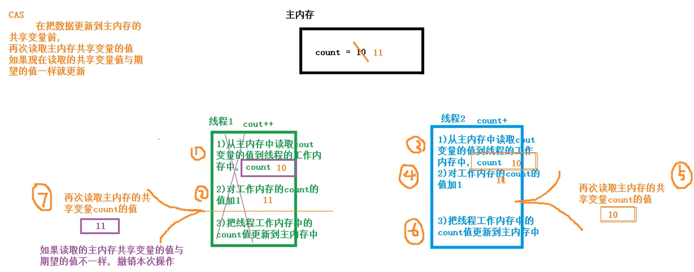

**使用 CAS 实现线程安全的计数器** 

```java
public class test {
    public static void main(String[] args) {
        CASCounter casCounter = new CASCounter();
        for (int i = 0; i < 1000; i++) {
            new Thread(new Runnable() {
                @Override
                public void run() {
                 System.out.println(Thread.currentThread().getName()+"-->"+casCounter.incrementAndGet());   System.out.println(Thread.currentThread().getName()+"========>"+casCounter.getValue());
                }
            }).start();
        }
    }
}
class CASCounter{
    //使用 volatile 修饰 value 值,使线程可见
    volatile private long value;
    public long getValue() {
        return value;
    }
    //定义 comare and swap 方法
    private boolean compareAndSwap(long expectedValue, long newValue){
//如果当前 value 的值与期望的expectedVAlue值一样,就把当前的 Value 字段替换为newValue值
        synchronized (this){
            if ( value == expectedValue){
            value = newValue;
                return true;
        }else {
            return false;
        }
    }
}
    //定义自增的方法
    public long incrementAndGet(){
        long oldvalue ;
        long newValue;
        do {
            oldvalue = value;
            newValue = oldvalue+1;
        }while ( !compareAndSwap(oldvalue, newValue) );
        return newValue;
    }
}

```

> - CAS 实现原子操作背后有一个假设: 共享变量的当前值与当前线程提供的期望值相同, 就认为这个变量没有被其他线程修改过. 
> - 实际上这种假设不一定总是成立.如有共享变量 count = 0 
> - - A 线程对 count 值修改为 10 
>   - B 线程对 count 值修改为 20 
>   - C 线程对 count 值修改为 0 
> - 当前线程看到 count 变量的值现在是 0,现在是否认为 count 变量的值没有被其他线程更新呢? 这种结果是否能够接受?? 
> - 这就是 CAS 中的 **ABA 问题**,即共享变量经历了 A->B->A 的更新.
>
> > - **是否能够接收 ABA 问题跟实现的算法有关.** 
> > - 如果想要规避 ABA 问题,可以**为共享变量引入一个修订号(时间戳)**, 每次修改共享变量时,相应的修订号就会增加 .ABA 变量更新过程变量: [A,0] ->[B,1]->[A,2], 每次对共享变量的修改都会导致修订号的增加,通过修订号依然可以准确判断变量是否被其他线程修改过. **AtomicStampedReference** 类就是基于这种思想产生的.

## 3.6 原子变量类

> **原子变量类基于CAS实现的**, 当对共享变量进行read-modify-write更新操作时,通过原子变量类可以**保障操作的原子性与可见性**.对变量的 read-modify-write 更新操作是指当前操作**不是一个简单的赋值,而是变量的新值依赖变量的旧值**,如自增操作i++. 由于volatile只能保证 可见性,无法保障原子性, **原子变量类内部就是借助一个 Volatile 变量,**并且保障了该变量的 read-modify-write 操作的原子性, 有时把原子变量类看作增强的 volatile 变量. 原子变量类有 12 个,如:
>
> |    **分组**    |                        **原子变量类**                        |
> | :------------: | :----------------------------------------------------------: |
> | **基础数据型** |         **AtomicInteger, AtomicLong, AtomicBoolean**         |
> |   **数组型**   | **AtomicIntegerArray, AtomicLongArray,AtomicReferenceArray** |
> | **字段更新器** | **AtomicIntegerFieldUpdater,AtomicLongFieldUpdater, AtomicReferenceFieldUpdater** |
> |   **引用型**   | **AtomicReference, AtomicStampedReference, AtomicMarkableReference** |

### 3.6.1 AtomicLong

```java
import java.util.Random;
import java.util.concurrent.atomic.AtomicLong;
/**
 * 使用原子变量类定义一个计数器 
 * 该计数器,在整个程序中都能使用,并且所有的地方都使用这一个计数器,这个计数器可以设计为单例 */
public class Indicator {
    //构造方法私有化 
    private Indicator(){}
    //定义一个私有的本类静态的对象 
    private static final Indicator INSTANCE = new Indicator();
    //3)提供一个公共静态方法返回该类唯一实例 
    public static Indicator getInstance(){
        return INSTANCE;
    }//使用原子变量类保存请求总数,成功数,失败数 
    private final AtomicLong requestCount = new AtomicLong(0); //记录请求总数 
    private final AtomicLong successCount = new AtomicLong(0); //处理成功总数 
    private final AtomicLong fialureCount = new AtomicLong(0); //处理失败总数 
    //有新的请求 
    public void newRequestReceive(){
        requestCount.incrementAndGet();
    }
    //处理成功 
    public void requestProcessSuccess(){
        successCount.incrementAndGet();
    }
    //处理失败 
    public void requestProcessFailure(){
        fialureCount.incrementAndGet();
    }
    //查看总数,成功数,失败数 
    public long getRequestCount(){
        return requestCount.get();
    }
    public long getSuccessCount(){
        return successCount.get();
    }
    public long getFailureCount(){
        return fialureCount.get();
    }
}
 //模拟服务器的请求总数, 处理成功数,处理失败数 
public class Test {
    public static void main(String[] args) {
//通过线程模拟请求,在实际应用中可以在 ServletFilter 中调用 Indicator 计数器的相关方法
        for (int i = 0; i < 10000; i++) {
            new Thread(new Runnable() {
                @Override
                public void run() {
    Indicator.getInstance().newRequestReceive();//每个线程就是一个请求,请求总数要加 1 
                    int num = new Random().nextInt();
                    if (num % 2 == 0) {
            Indicator.getInstance().requestProcessSuccess();//偶数模拟成功 
                    } else {
                  Indicator.getInstance().requestProcessFailure();//处理失败 
                    }
                }
            }).start();
        }
        try {
            Thread.sleep(1000);
        } catch (InterruptedException e) {
            e.printStackTrace();
        }
        System.out.println(Indicator.getInstance().getRequestCount());
        System.out.println(Indicator.getInstance().getSuccessCount());
        System.out.println(Indicator.getInstance().getFailureCount());
    }}
```

### 3.6.2 AtomicIntegerArray

```java
import java.util.concurrent.atomic.AtomicIntegerArray;
/**
 * AtomicIntegerArray 的基本操作
 * 原子更新数组
 */
public class Test {
    public static void main(String[] args) {
        //1)创建一个指定长度的原子数组
        AtomicIntegerArray atomicIntegerArray = new AtomicIntegerArray(10);
        System.out.println( atomicIntegerArray );//[0, 0, 0, 0, 0, 0, 0, 0, 0, 0]
        //2)返回指定位置的元素
        System.out.println( atomicIntegerArray.get(0));
        //3)设置指定位置的元素
        atomicIntegerArray.set(0, 10);
        //在设置数组元素的新值时, 同时返回数组元素的旧值
        System.out.println( atomicIntegerArray.getAndSet(1, 11) ); //0
        //4)修改数组元素的值,把数组元素加上某个值
        System.out.println( atomicIntegerArray.addAndGet(0, 22) ); //32
        System.out.println( atomicIntegerArray.getAndAdd(1, 33));
        //5)CAS 操作
        //如果数组中索引值为 0 的元素的值是 32 , 就修改为 222
        System.out.println( atomicIntegerArray.compareAndSet(0, 32, 222)); //true
        //6)自增/自减
        System.out.println( atomicIntegerArray.incrementAndGet(0) );
        System.out.println( atomicIntegerArray.getAndIncrement(1));
        System.out.println( atomicIntegerArray.decrementAndGet(2));
        System.out.println( atomicIntegerArray.getAndDecrement(3));
    }}
```

```java
 //在多线程中使用 AtomicIntegerArray 原子数组
public class Test02 {
    //定义原子数组
    static AtomicIntegerArray atomicIntegerArray = new AtomicIntegerArray(10);
    public static void main(String[] args) {
//定义线程数组
        Thread[] threads = new Thread[10];
//给线程数组元素赋值
        for (int i = 0; i < threads.length; i++) {
            threads[i] = new AddThread();
        }
//开启子线程
        for (Thread thread : threads) {
            thread.start();
        }
//在主线程中查看自增完以后原子数组中的各个元素的值,在主线程中需要在所有子线程都执行完后再查看,把所有的子线程合并到当前主线程中
        for (Thread thread : threads) {
            try {
                thread.join();
            } catch (InterruptedException e) {
                e.printStackTrace();
            }}
        System.out.println( atomicIntegerArray );
    }
    //定义一个线程类,在线程类中修改原子数组
    static class AddThread extends Thread{
        @Override
        public void run() {
//把原子数组的每个元素自增 1000 次
            for (int j = 0; j < 100000; j++) {
                for (int i = 0; i < atomicIntegerArray.length(); i++) {
atomicIntegerArray.getAndIncrement(i % atomicIntegerArray.length());
                }}}}}
```

### 3.6.2 AtomicIntegerFieldUpdater

AtomicIntegerFieldUpdater 可以对原子整数字段进行更新,**要求:**

> -  **字符必须使用 volatile 修饰,使线程之间可见** 
> - **只能是实例变量,不能是静态变量,也不能使用 final 修饰**

```java
import java.util.concurrent.atomic.AtomicIntegerFieldUpdater;
// 使用 AtomicIntegerFieldUpdater 更新的字段必须使用 volatile 修饰
public class User {
    int id;
    volatile int age;//必须使用 volatile 修饰，实例变量
    public User(int id, int age) {
        this.id = id;
        this.age = age;
    }
    @Override
    public String toString() {
        return "User{" +
                "id=" + id +
        ", age=" + age +
                '}';
    }
}
//线程类
public class SubThread extends Thread {
    private User user;
    //要更新的 User 对象创建 AtomicIntegerFieldUpdater 更新器
    private  AtomicIntegerFieldUpdater<User>  updater  = AtomicIntegerFieldUpdater.newUpdater(User.class, "age");
    public SubThread(User user) {
        this.user = user;
    }
    @Override
    public void run() {
        for (int i = 0; i < 10; i++) {//在子线程中对 user 对象的 age 字段自增 10 次
            System.out.println( updater.getAndIncrement(user));
        } }}
        //测试
public class Test {
    public static void main(String[] args) {
        User user = new User(1234, 10);
        for (int i = 0; i < 10; i++) {
            new SubThread(user).start();
        }
        try {
            Thread.sleep(1000);
        } catch (InterruptedException e) {
            e.printStackTrace();
        }
        System.out.println( user );
    }}
```

### 3.6.3 AtomicReference

```java
 /*使用 AtomicReference 原子读写一个对象*/
public class Test01 {
    //创建一个 AtomicReference 对象 
    static AtomicReference<String> atomicReference = new AtomicReference<>("abc");
    public static void main(String[] args) throws InterruptedException {
	//创建 100 个线程修改字符串 
        for (int i = 0; i < 100; i++) {
            new Thread(new Runnable() {
                @Override
                public void run() {
                    try {
                        Thread.sleep(new Random().nextInt(20));
                    } catch (InterruptedException e) {
                        e.printStackTrace();
                    }
                    if (atomicReference.compareAndSet("abc", "def")) {
   System.out.println(Thread.currentThread().getName() + "把字符串abc 更改为 def");
                    }
                }
            }).start();
        }
	//再创建 100 个线程 
        for (int i = 0; i < 100; i++) {
            new Thread(new Runnable() {
                @Override
                public void run() {
                    try {
                        Thread.sleep(new Random().nextInt(20));
                    } catch (InterruptedException e) {
                        e.printStackTrace();
                    }
                    if (atomicReference.compareAndSet("def", "abc")) {
      System.out.println(Thread.currentThread().getName() + "把字符串还原为 abc");
                    }
                }
            }).start();
        }
        Thread.sleep(1000);
        System.out.println(atomicReference.get());
    }}
```

```java
/**示 AtomicReference 可能会出现 CAS 的 ABA 问题*/
public class Test02 {
    private static AtomicReference<String> atomicReference = new AtomicReference<>("abc");
    public static void main(String[] args) throws InterruptedException {
        //创建第一个线程,先把 abc 字符串改为"def",再把字符串还原为 abc
        Thread t1 = new Thread(new Runnable() {
            @Override
            public void run() {
                atomicReference.compareAndSet("abc", "def");
                System.out.println(Thread.currentThread().getName() + "--" + atomicReference.get());
                atomicReference.compareAndSet("def", "abc");
            }
        });
        Thread t2 = new Thread(new Runnable() {
            @Override
            public void run() {
                try {
                    TimeUnit.SECONDS.sleep(1);
                } catch (InterruptedException e) {
                    e.printStackTrace();
                }
                System.out.println(atomicReference.compareAndSet("abc", "ghg"));
            }
        });
        t1.start(); t2.start();
        t1.join(); t2.join();
        System.out.println(atomicReference.get());
    }}
```


```java
import java.util.concurrent.TimeUnit;
import java.util.concurrent.atomic.AtomicStampedReference;
/**
 * AtomicStampedReference 原子类可以解决 CAS 中的 ABA 问题
 * 在 AtomicStampedReference 原子类中有一个整数标记值 stamp, 每次执行 CAS 操作时,需
 * 要对比它的版本,即比较 stamp 的值
 * 北京动力节点老崔
 */
public class Test03 {
    //定义 AtomicStampedReference 引用操作"abc"字符串,指定初始化版本号为 0
    private static AtomicStampedReference<String> stampedReference = new AtomicStampedReference<>("abc", 0);
    public static void main(String[] args) throws InterruptedException {
        Thread t1 = new Thread(new Runnable() {
            @Override
            public void run() {
                System.out.println(Thread.currentThread().getName()+"--"+ stampedReference.getReference());
           stampedReference.compareAndSet("def","abc",stampedReference.getStamp(), stampedReference.getStamp() + 1);
            }
        });
        Thread t2 = new Thread(new Runnable() {
            @Override
            public void run() {
                int stamp = stampedReference.getStamp();//可能会出现ABA问题
                //获得版本号
                try {
                    TimeUnit.SECONDS.sleep(1);
                } catch (InterruptedException e) {
                    e.printStackTrace();
                }
//int stamp = stampedReference.getStamp();放在这里无法验证解决ABA问
                System.out.println(stampedReference.compareAndSet("abc", "ggg",stamp,stamp + 1));
            }
        });
        t1.start();t2.start();
        t1.join();t2.join();
        System.out.println(stampedReference.getReference());
    }}
```

# 4 线程间的通信

## 4.1 等待/通知机制

### 4.1.1 什么是等待通知机制

> - 在单线程编程中,要执行的操作需要满足一定的条件才能执行,可以把这个操作放在 if 语句块中.
>
> - 在多线程编程中,可能 A 线程的条件没有满足只是暂时的, 稍后其他的线程 B 可能会更新条件使得 A 线程的条件得到满足. 可以将 A 线程暂停,直到它的条件得到满足后再将 A 线程唤醒.它的伪代码:
>
> - > ```
>   > atomics{ //原子操作 while( 条件不成立 ){ 等待 }当前线程被唤醒条件满足后,继续执行下面的操作 
>   > ```

### 4.1.2 等待/通知机制的实现

> Object 类中的 wait()方法可以使执行当前代码的线程等待,暂停执行,直到接到通知或被中断为止
>
> - 注意: 
>
> - > - wait()方法只能在同步代码块中由锁对象调用 
>   > - 调用 wait()方法,当前线程会释放锁 
>   >
>   > 其伪代码如下:
>   >
>   > ```java
>   > //在调用 wait()方法前获得对象的内部锁 
>   > synchronized( 锁对象 ){ while( 条件不成立 ){ 
>   > //通过锁对象调用 wait()方法暂停线程,会释放锁对象
>   > 锁对象.wait(); }
>   > //线程的条件满足了继续向下执行 } 
>   > ```
>   
> - Object 类的 notify()可以唤醒线程,该方法也**必须在同步代码块中由锁对象调用** . 没有使 用 锁 对 象 调 用 wait()/notify() 会 抛 出 **IlegalMonitorStateExeption** 异常. **如果有多个等待的线程,notify()方法 只能唤醒其中的一个. 在同步代码块中调用 notify()方法后,并不会立即释放锁对象,需要等当前同步代码块执行完后才会释放锁对象,一般将 notify()方法放在同步代码块的最后.** 它的伪代码如下:
>
>   ```java
>   synchronized( 锁对象 ){ //执行修改保护条件 的代码 //唤醒其他线程 
>       锁对象.notify(); }
>   ```

```java
//需要通过 notify()唤醒等待的线程 
public class Test03 {
    public static void main(String[] args) throws InterruptedException {
        String lock = "wkcto";//定义一个字符串作为锁对象 
        Thread t1 = new Thread(new Runnable() {
            @Override
            public void run() {
                synchronized (lock) {
 System.out.println("线程 1 开始等待: " + System.currentTimeMillis());
                    try {
                 lock.wait();//线程等待,会释放锁对象,当前线程转入 blocked 阻塞状态
                    } catch (InterruptedException e) {
                        e.printStackTrace();
                    }
   System.out.println("线程 1 结束等待:" + System.currentTimeMillis());
                }
            }
        });
            //定义第二个线程,在第二个线程中唤醒第一个线程 
        Thread t2 = new Thread(new Runnable() {
            @Override
            public void run() {
            //notify()方法也需要在同步代码块中,由锁对象调用 
                synchronized (lock){
           System.out.println("线程 2 开始唤醒 : " + System.currentTimeMillis());
                    lock.notify();
                //唤醒在 lock 锁对象上等待的某一个线程 
         System.out.println("线程 2 结束唤醒 : " + System.currentTimeMillis());
                }
            }
        });
        t1.start();
        Thread.sleep(3000);//main 线程睡眠 3 秒,确保 t1 入睡 
        t2.start();
    }}
```

### 4.1.3 interrupt()方法会中断 wait()

> 当线程处于 wait()等待状态时, **调用线程对象的 interrupt()方法会中断线程的等待状态, 会产生 InterruptedException 异常**

```java
//Interrupt()会中断线程的 wait()等待
public class Test05 {
    public static void main(String[] args) throws InterruptedException {
        SubThread t = new SubThread();
        t.start();
        Thread.sleep(2000);//主线程睡眠 2 秒, 确保子线程处于 Wait 等待状态
        t.interrupt();
    }
    private static final Object LOCK = new Object();
    //定义常量作为锁对象
    static class SubThread extends Thread{
        @Override
        public void run() {
            synchronized (LOCK){
            try {
                System.out.println("begin wait...");
                LOCK.wait();
                System.out.println("end wait..");
            } catch (InterruptedException e) {
                System.out.println("wait 等待被中断了****");
            }}}}}
```

### 4.1.4 notify()与 notifyAll()

notify()一次只能唤醒一个线程,如果有多个等待的线程,只能随机 唤醒其中的某一个; 想要唤醒所有等待线程,需要调用 **notifyAll().**

```java
public class test {
    public static void main(String[] args) throws InterruptedException {
        Object lock = new Object();
        SubThread t1 = new SubThread(lock);
        SubThread t2 = new SubThread(lock);
        SubThread t3 = new SubThread(lock);
        t1.setName("t1");t2.setName("t2");t3.setName("t3");
        t1.start();t2.start();t3.start();
        Thread.sleep(2000);
        synchronized (lock){
        // //调用 notify()唤醒子线程 
               lock.notify();
        //调用一次 notify()只能唤醒其中的一个线程,其他等待的线程依然处于等待状态,对于处于等待状态的线程来说,错过了通知信号,这种现象也称为信号丢失
            lock.notifyAll();        //唤醒所有的线程 
        }}
    static class SubThread extends Thread{
        private Object lock;
        //定义实例变量作为锁对象 
        public SubThread(Object lock) {
            this.lock = lock;
        }
        @Override
        public void run() {
            synchronized (lock){
                try {
    System.out.println(Thread.currentThread().getName() + " -- begin wait..."); 
                    lock.wait();
    System.out.println( Thread.currentThread().getName() + " -- end wait..."); 
                } catch (InterruptedException e) {
                    e.printStackTrace();
                }}}}}
```

### 4.1.5 wait(long)的使用

wait(long)带有 long 类型参数的 wait()等待,**如果在参数指定的时间内没有被唤醒,超时后会自动唤醒**

```java
public class Test07 {
    public static void main(String[] args) {
        final Object obj = new Object();
        Thread t = new Thread(new Runnable() {
            @Override
            public void run() {
                synchronized (obj) {
                    try {
                        System.out.println("thread begin wait");
                        obj.wait(5000);    //如果 5000 毫秒内没有被唤醒 ,会自动唤醒
                        System.out.println("end wait....");
                    } catch (InterruptedException e) {
                        e.printStackTrace();
                    }}}});
        t.start();
    }}
```

### 4.1.6 通知过早

线程 wait()等待后,可以调用 notify()唤醒线程, 如果 notify()唤醒的过早,在等待之前就调用了 notify()可能会打乱程序正常的运行逻辑.

```java
public class Test08 {
    public static void main(String[] args) {
        final Object Lock = new Object();
        Thread t1 = new Thread(new Runnable() {
            @Override
            public void run() {
                synchronized (Lock){
                    try {
                        System.out.println("begin wait");
                        Lock.wait();
                        System.out.println("wait end...");
                    } catch (InterruptedException e) {
                        e.printStackTrace();
                    }}} });
        Thread t2 = new Thread(new Runnable() {
            @Override
            public void run() {
                synchronized (Lock){
                    System.out.println("begin notify");
                    Lock.notify();;
                    System.out.println("end nofity");
                }}});
//如果先开启 t2 通知线程,再开启 t1 等待线程,可能会出现 t1 线程等待没有收到通知的情况,
                t2.start();
        		t1.start();
    }}
```

```java
// notify()通知过早, 就不让线程等待了
public class Test09 {
    static boolean isFirst = true;
    //定义静态变量作为是否第一个运行的线程标志
    public static void main(String[] args) {
        final Object Lock = new Object();
//定义对象作为锁对象
        Thread t1 = new Thread(new Runnable() {
            @Override
            public void run() {
                synchronized (Lock) {
                    while (isFirst) {
//当线程是第一个开启的线程就等待
                        try {
                            System.out.println("begin wait");
                            Lock.wait();
                            System.out.println("wait end...");
                        } catch (InterruptedException e) {
                            e.printStackTrace();
                        }} }} });
        Thread t2 = new Thread(new Runnable() {
            @Override
            public void run() {
                synchronized (Lock) {
                    System.out.println("begin notify");
                    Lock.notify();
                    System.out.println("end nofity");
                    isFirst = false;//通知后,就把第一个线程标志修改为 false
                }}});
//如果先开启 t2 通知线程,再开启 t1 等待线程,可能会出现 t1 线程等待没有收到通知的情况,
        t2.start();
        t1.start();
//在当前示例中,t1 等待后让 t2 线程唤醒 , 如果 t2 线程先唤醒了,就不让 t1 线程等 待了
    }}
```

### 4.1.7 wait 等待条件发生了变化(重点)

**wait()方法套在while循环中，线程下次醒过来后会继续进行循环，判断条件是否满足，满足就重新等待。**

> 在使用 wait/nofity 模式时,注意 wait 条件发生了变化,也可能会造 成逻辑的混乱

```java
import java.util.ArrayList;
import java.util.List;

/**
 * wait 条件发生变化
 * 定义一个集合
 * 定义一个线程向集合中添加数据,添加完数据后通知另外的线程从集合中取数据
 * 定义一个线程从集合中取数据,如果集合中没有数据就等待
 * 北京动力节点老崔
 */
public class Test10 {
    //1)定义 List 集合
    static List list = new ArrayList<>();

    public static void main(String[] args) {
//定义添加数据的线程对象
        ThreadAdd threadAdd = new ThreadAdd();
//定义取数据的线程对象
        ThreadSubtract threadSubtract = new ThreadSubtract();
        threadSubtract.setName("subtract 1 ");
//测试一: 先开启添加数据的线程,再开启一个取数据的线程,大多数情况下会正常取数据
//
        threadAdd.start();
//
        threadSubtract.start();
//测试二: 先开启取数据的线程,再开启添加数据的线程, 取数据的线程会先等待,等到添加数据之后, 再取数据
//
        threadSubtract.start();
//
        threadAdd.start();
//测试三: 开启两个 取数据的线程,再开启添加数据的线程
        ThreadSubtract threadSubtract2 = new ThreadSubtract();
        threadSubtract2.setName("subtract 2 ");
        threadSubtract.start();
        threadSubtract2.start();
        threadAdd.start();
/*
某一次执行结果如下:
        subtract 1 begin wait....
        subtract 2 从集合中取了 data 后,集合中数据的数量:0
        subtract 1 end wait..
        Exception in thread "subtract 1 " java.lang.IndexOutOfBoundsException:
分析可能的执行顺序:	
        threadSubtract 线程先启动, 取数据时,集合中没有数据,wait()等待
        threadAdd 线程获得 CPU 执行权, 添加数据 , 把 threadSubtract 线程唤醒,
        threadSubtract2 线程开启后获得 CPU 执行权, 正常取数据
        threadSubtract 线程获得 CPU 执行权, 打印 end wait..., 然后再执行
        list.remove(0) 取 数 据 时 , 现 在 list 集合中已经没有数据了 , 这 时 会 产 生
        java.lang.IndexOutOfBoundsException 异常
出现异常的原因是: 向 list 集合中添加了一个数据,remove()了两次
如何解决?
当等待的线程被唤醒后, 再判断一次集合中是否有数据可取. 即需要把sutract()方法中的 if 判断改为 while
*/
    }
    //2)定义方法从集合中取数据
    public static void subtract() {
        synchronized (list) {
            if (list.size() == 0) {
                while (list.size() == 0) {
                    try {
        System.out.println(Thread.currentThread().getName() + " begin wait....");
                        list.wait();//等待
      System.out.println(Thread.currentThread().getName() + " end wait..");
                    } catch (InterruptedException e) {
                        e.printStackTrace();
                    } }
                Object data = list.remove(0);//从集合中取出一个数据
                System.out.println(Thread.currentThread().getName() + "从集合中取了" + data +"后,集合中数据的数量:" + list.size());
            }}}
//3)定义方法向集合中添加数据后,通知等待的线程取数据
        public static void add(){
            synchronized (list) {
                list.add("data");
           System.out.println(Thread.currentThread().getName() + "存储了一个数据");
                list.notifyAll();
            }}}}
//4)定义线程类调用 add()取数据的方法
class ThreadAdd extends Thread {
    @Override
    public void run() {
        Test10.add();
    }
}
//定义线程类调用 subtract()方法
class ThreadSubtract extends Thread {
    @Override
    public void run() {
        Test10.subtract();
    }}  
```

> ​             [**wait()方法之所以要用while而不是if是因为 :**](https://blog.csdn.net/csp_6666/article/details/103547048?utm_medium=distribute.pc_relevant.none-task-blog-2%7Edefault%7EBlogCommendFromBaidu%7Edefault-1.control&depth_1-utm_source=distribute.pc_relevant.none-task-blog-2%7Edefault%7EBlogCommendFromBaidu%7Edefault-1.control)
>
> **当多个线程并发访问同一个资源的时候, 若消费者同时被唤醒,但是只有一个资源可用, 那么if会导致资源被用完后直接去获取资源(发生越界异常等),而while则会让每个消费者获取之前再去判断一下资源是否可用.可用则获取,不可用则继续wait住.**

### 4.1.8 生产者消费者模式

> 在 Java 中,负责产生数据的模块是生产者,负责使用数据的模块是消费者. 生产者消费者解决数据的平衡问题,即先有数据然后才能使用,没有数据时,消费者需要等待

```java
//定义一个操作数据的类
public class ValueOP {
    private String value = "";
    //定义方法修改 value 字段的值
    public void setValue() {
        synchronized (this) {
            if (!value.equalsIgnoreCase("")) {//if
                try {
                    this.wait();//如果 value 值不是""空串就等待
                } catch (InterruptedException e) {
                    e.printStackTrace();
                }
            }
            String value = System.currentTimeMillis() + " - " + System.nanoTime();
            System.out.println("set 设置的值是: " + value);
            this.value = value;//如果 value 字段值是容串, 就设置 value 字段的值
            //this.notify();在多生产者多消费者环境中,notify()不能保证是生产者唤醒消费者,如果生产者唤醒的还是生产者可能会出现假死的情况
            this.notifyAll();
        }
    }
    //定义方法读取字段值
    public void getValue() {
        synchronized (this) {
            if (value.equalsIgnoreCase("")) {//if
                try {
                    this.wait();//如果 value 是空串就等待
                } catch (InterruptedException e) {
                    e.printStackTrace();
                }
            }//不是空串,读取 字段值
            System.out.println("get 的值是: " + this.value);
            this.value = "";
            this.notifyAll();
        }}}
/**
 * 定义线程类模拟生产者
 */
public class ProducerThread extends Thread {
    //生产者生产数据就是调用 ValueOP 类的 setValue 方法给 value 字段赋值
    private ValueOP obj;
    public ProducerThread(ValueOP obj) {
        this.obj = obj;
    }
    @Override
    public void run() {
        while (true) {
            obj.setValue();
        }}}
// 定义线程类模拟消费者
public class ConsumerThread extends Thread {
    private ValueOP obj;
    public ConsumerThread(ValueOP obj) {
        this.obj = obj;
    }
    @Override
    public void run() {
        while (true) {
            obj.getValue();
        } }}
//测试单生产,单消费的情况
public class Test2 {
    public static void main(String[] args) {
        ValueOP valueOP = new ValueOP();
        ProducerThread p3 = new ProducerThread(valueOP);
        ConsumerThread c3 = new ConsumerThread(valueOP);
        p3.start(); c3.start();
    }}
```

**多消费者，多生产者**

```java
//定义一个操作数据的类
public class ValueOP {
    private String value = "";
    //定义方法修改 value 字段的值
    public void setValue() {
        synchronized (this) {
            while (!value.equalsIgnoreCase("")) {//while
                try {
                    this.wait();//如果 value 值不是""空串就等待
                } catch (InterruptedException e) {
                    e.printStackTrace();
                }
            }
            String value = System.currentTimeMillis() + " - " + System.nanoTime();
            System.out.println("set 设置的值是: " + value);
            this.value = value;//如果 value 字段值是容串, 就设置 value 字段的值
            //this.notify();在多生产者多消费者环境中,notify()不能保证是生产者唤醒消费者,如果生产者唤醒的还是生产者可能会出现假死的情况
            this.notifyAll();
        }}
    //定义方法读取字段值
    public void getValue() {
        synchronized (this) {
            while (value.equalsIgnoreCase("")) {//while
                try {
                    this.wait();//如果 value 是空串就等待
                } catch (InterruptedException e) {
                    e.printStackTrace();
                }
            }//不是空串,读取 字段值
            System.out.println("get 的值是: " + this.value);
            this.value = "";
            this.notifyAll();
        }}}
/**
 * 定义线程类模拟生产者
 */
public class ProducerThread extends Thread {
    //生产者生产数据就是调用 ValueOP 类的 setValue 方法给 value 字段赋值
    private ValueOP obj;
    public ProducerThread(ValueOP obj) {
        this.obj = obj;
    }
    @Override
    public void run() {
        while (true) {
            obj.setValue();
        }}}
// 定义线程类模拟消费者
public class ConsumerThread extends Thread {
    private ValueOP obj;
    public ConsumerThread(ValueOP obj) {
        this.obj = obj;
    }
    @Override
    public void run() {
        while (true) {
            obj.getValue();
        }}}
//测试多生产,多消费的情况
public class Test2 {
    public static void main(String[] args) {
        ValueOP valueOP = new ValueOP();
        ProducerThread p1 = new ProducerThread(valueOP);
        ProducerThread p2 = new ProducerThread(valueOP);
        ConsumerThread c1 = new ConsumerThread(valueOP);
        ConsumerThread c2 = new ConsumerThread(valueOP);
        p1.start();  p2.start();
        c1.start(); c2.start();
    }}
```

## 4.2通过管道流实现线程间的通信

```java
//发送数据
class SendThread implements Runnable{
    private PipedOutputStream outputStream = new PipedOutputStream();
    @Override
    public void run() {
        try {
            outputStream.write("管道对接成功！！".getBytes());
        } catch (IOException e) {
            e.printStackTrace();
        }
    }
    public PipedOutputStream getOutputStream() {
        return outputStream;
    }
    public void setOutputStream(PipedOutputStream outputStream) {
        this.outputStream = outputStream;
    }
}
//接收数据
class RecieveThread implements Runnable{
    private PipedInputStream inputStream = new PipedInputStream();
    @Override
    public void run() {
        byte[] data = new byte[1024];
        try {
            int len = inputStream.read(data);
            System.out.println("对接情况："+new String(data,0,len));
        } catch (IOException e) {
            e.printStackTrace();
        }}
    public PipedInputStream getInputStream() {
        return inputStream;
    }

    public void setInputStream(PipedInputStream inputStream) {
        this.inputStream = inputStream;
    }}
public class GuandaoTest {
    public static void main(String[] args) {
        SendThread sendThread = new SendThread();
        RecieveThread recieveThread = new RecieveThread();
        PipedOutputStream outputStream = sendThread.getOutputStream();
        try {//建立连接
            outputStream.connect(recieveThread.getInputStream());
            new Thread(sendThread).start();
            new Thread(recieveThread).start();
        } catch (IOException e) {
            e.printStackTrace();
        }}}
```

## 4.3Join()

> join有什么用?  他是用来确定线程何时结束的 .看例子

```java
例子1://a和b进入同一个方法
main{
a.start();
b.start();
}
 /*顺序是这样的: 主线程开始->a和b(看脸谁先跑)->a和b\主线程(看脸谁先死);
```

```java
main{
a.start();
a.join
b.start();
}
/*它的执行顺序应该是主线程启动-》a线程开启-》主线程阻塞-》a线程死亡-》b线程启动-》(b和主线程看速度谁先死)a，b线程虽然和主线程都是独立的线程，但都是由start()方法启动的

```

> **主线程中调用a.join(),在a线程结束前，主线程陷入阻塞状态，a线程结束后，主线程顺序执行a.join()后的代码,并不会因为a的死亡导致主线程的死亡**

## **4.4 ThreadLocal** **的使用**

除了控制资源的访问外, 还可以通过增加资源来保证线程安全. ThreadLocal 主要解决**为每个线程绑定自己的值**

```java
/**
 * 在多线程环境中,把字符串转换为日期对象,多个线程使用同一个 SimpleDateFormat 对象可能会产生线程安全问题,有异常 
 * 为每个线程指定自己的 SimpleDateFormat 对象, 使用 ThreadLocal 
 */
public class Test02 {
    //定义 SimpleDateFormat 对象,该对象可以把字符串转换为日期 
    private static SimpleDateFormat sdf = new SimpleDateFormat("yyyy 年 MM 月 dd 日 HH:mm:ss"); 
    static ThreadLocal<SimpleDateFormat> threadLocal = new ThreadLocal<>();
    static class ParseDate implements Runnable{
        private int i = 0 ;
        public ParseDate(int i) {
            this.i = i;
        }
        @Override
        public void run() {
            try {
            String text = "2068 年 11 月 22 日 08:28:" + i%60;//构建日期字符串 
        //先判断当前线程是否有 SimpleDateFormat 对象,如果当前线程没有SimpleDateFormat 对象就创建一个,如果有就直接使用
                if (threadLocal.get() == null){
	 threadLocal.set(new SimpleDateFormat("yyyy 年 MM 月 dd 日 HH:mm:ss")); 
                }
                Date date = threadLocal.get().parse(text);
                System.out.println(i + " -- " + date);
            } catch (ParseException e) {
                e.printStackTrace();
            }}}
    public static void main(String[] args) {
        for (int i = 0; i < 100; i++) {
            new Thread(new ParseDate(i)).start();
        }}}
```

### 4.4.2ThreadLocal指定初始值

```java
/**
 * ThreadLocal 初始值, 定义 ThreadLocal 类的子类,在子类中重写 initialValue()方法指定初始值,再第一次调用 get()方法不会返回 null
 */
//1) 定义 ThreadLocal 的子类 
class SubThreadLocal extends ThreadLocal<Date> {
    // 重写 initialValue 方法,设置初始值 
    @Override
    protected Date initialValue() {
        return new Date(System.currentTimeMillis() - 1000 * 60 * 15);
    }
}
public class Test03 {
    //直接使用自定义的 SubThreadLocal 对象 
    static SubThreadLocal threadLocal = new SubThreadLocal();
    public static void main(String[] args) {
        SubThread t1 = new SubThread();
        t1.start();
        SubThread t2 = new SubThread();
        t2.start();
    }
    //定义线程类 
    static class SubThread extends Thread {
        @Override
        public void run() {
            for (int i = 0; i < 10; i++) {
                //第一次调用 threadLocal 的 get()方法会返回 null 
 System.out.println("---------" + Thread.currentThread().getName() + " value=" + threadLocal.get());
                //如果没有初始值就设置当前日期 
                if (threadLocal.get() == null) {
                    System.out.println("*****************");
                    threadLocal.set(new Date());
                }
                try {
                    Thread.sleep(new Random().nextInt(500));
                } catch (InterruptedException e) {
                    e.printStackTrace();
                }}}}}
```

# **5 Lock** **显示锁**

在 JDK5 中 增 加 了 Lock 锁 接 口 , 有 ReentrantLock 实 现 类,**ReentrantLock 锁称为可重入锁**, 它功能比 synchronized 多

## 5.1 锁的可重入性

**锁的可重入是指,当一个线程获得一个对象锁后,再次请求该对象 锁时是可以获得该对象的锁的.**

```java
public class Test01 {
    public synchronized void sm1(){
        System.out.println("同步方法 1");
   /*线程执行 sm1()方法,默认 this 作为锁对象,在 sm1()方法中调用了 sm2()方法,注意当前线程还是持有 this 锁对象的 sm2()同步方法默认的锁对象也是 this 对象, 要执行 sm2()必须先获得 this 锁对象,当前 this 对象被当前线程持有,可以 再次获得 this 对象, 这就是锁的可重入性. 假设锁不可重入的话,可能会造成死锁*/
        sm2();
    }
    private synchronized void sm2() {System.out.println("同步方法 2");}
    public static void main(String[] args) {
        Test01 obj = new Test01();
        new Thread(new Runnable() {
            @Override
            public void run() {
                obj.sm1();
            }
        }).start();
    }}
```

## 5.2 ReentrantLock

### 5.2.1 ReentrantLock 的基本使用

> **调用 lock()方法获得锁, 调用 unlock()释放锁 **

```java
public class Test02 {
    //定义显示锁 
    static Lock lock = new ReentrantLock();
    //定义方法 
    public static void sm(){
	//先获得锁 
        lock.lock();
	//for 循环就是同步代码块 ========================
        for (int i = 0; i < 100; i++) {
            System.out.println(Thread.currentThread().getName() + " -- " + i);
        }
	//释放锁 	=========================================
        lock.unlock();
    }
    public static void main(String[] args) {
        Runnable r = new Runnable() {
            @Override
            public void run() {
                sm();
            }
        };
//启动三个线程 
        new Thread(r).start();
        new Thread(r).start();
        new Thread(r).start();
    }}
```

**使用 Lock 锁同步不同方法中的同步代码块**

```java
public class Test03 {
    static Lock lock = new ReentrantLock();//同步代码块的锁使用的同一个锁
    //定义锁对象 
    public static void sm1() {
        //经常在 try 代码块中获得 Lock 锁, 在 finally 子句中释放锁 
        try {
            lock.lock();//获得锁 
            System.out.println(Thread.currentThread().getName() + "-- method 1 -- " +  System.currentTimeMillis());
            Thread.sleep(new Random().nextInt(1000));
            System.out.println(Thread.currentThread().getName() + "-- method 1 -- " +  System.currentTimeMillis());
        } catch (InterruptedException e) {
            e.printStackTrace();
        } finally {
            lock.unlock();//释放锁 
        }
    }
    public static void sm2() {
        try {
            lock.lock();//获得锁 
            System.out.println(Thread.currentThread().getName() + "-- method 22 -- " +System.currentTimeMillis());
            Thread.sleep(new Random().nextInt(1000));
            System.out.println(Thread.currentThread().getName() + "-- method 22 -- " + System.currentTimeMillis());
        } catch (InterruptedException e) {
            e.printStackTrace();
        } finally {
            lock.unlock();//释放锁 
        }
    }
    public static void main(String[] args) {
        Runnable r1 = new Runnable() {
            @Override
            public void run() {
                sm1();
            }
        };
        Runnable r2 = new Runnable() {
            @Override
            public void run() {
                sm2();
            }};
        new Thread(r1).start();
        new Thread(r2).start();
    }}
```

### 5.2.2 ReentrantLock 锁的可重入性

```java
/* ReentrantLock 锁的可重入性  */
public class Test04 {
    static class Subthread extends Thread{
        private static Lock lock = new ReentrantLock();
        //定义锁对象 
        public static int num = 0;
        //定义变量 
        @Override
        public void run() {
            for (int i = 0; i <10000 ; i++) {
                try {
                //可重入锁指可以反复获得该锁 
                    lock.lock();lock.lock();
                    num++;
                }finally {
                    lock.unlock();lock.unlock();
                } } }}
    public static void main(String[] args) throws InterruptedException {
        Subthread t1 = new Subthread();
        Subthread t2 = new Subthread();
        t1.start();
        t2.start();
        t1.join();
        t2.join();
        System.out.println( Subthread.num );
    }}
```

### 5.2.3 lockInterruptibly()方法

**lockInterruptibly() 方法的作用:如果当前线程未被中断则获得锁, 如果当前线程被中断则出现异常.**

```java
/* lockInterruptibly() 方法的作用:如果当前线程未被中断则获得锁,如果当前线程被中断则
 出现异常.*/
public class Test05 {
    static class Servier{
        private Lock lock = new ReentrantLock();
        public void serviceMethod(){
            try {
  //lock.lock();//获得锁定,即使调用了线程的 interrupt()方法,也没有真正的中断线程
                lock.lockInterruptibly();//如果线程被中断了,不会获得锁,会产生异常
        System.out.println(Thread.currentThread().getName() + "-- begin lock");
                for (int i = 0; i < Integer.MAX_VALUE; i++) {
                    new StringBuilder();//执行一段耗时的操作
                }
          System.out.println( Thread.currentThread().getName() + " -- end lock");
            } catch (InterruptedException e) {
                e.printStackTrace();
            } finally {
       System.out.println( Thread.currentThread().getName() + " ***** 释放锁");
                lock.unlock();//释放锁
            } }}
    public static void main(String[] args) throws InterruptedException {
        Servier s = new Servier();
        Runnable r = new Runnable() {
            @Override
            public void run() {
                s.serviceMethod();
            }
        };
        Thread t1 = new Thread(r);
        t1.start();
        Thread.sleep(50);
        Thread t2 = new Thread(r);
        t2.start();
        Thread.sleep(50);
        t2.interrupt();//中断 t2 线程
    }}
```

> - 对于 synchronized 内部锁来说,如果一个线程在等待锁,只有两个结果:要么该线程获得锁继续执行;要么就保持等待. 
>
> - 对于 ReentrantLock 可重入锁来说,提供另外一种可能,**在等待锁的过程中,程序可以根据需要取消对锁的请求.**

#### **5.2.3 .1lockInterruptibly()方法避免死锁的产生**

```java
/*通过 ReentrantLock 锁的 lockInterruptibly()方法避免死锁的产生 */
public class Test06 {
    public static void main(String[] args) throws InterruptedException {
        IntLock intLock1 = new IntLock(11);
        IntLock intLock2 = new IntLock(22);
        Thread t1 = new Thread(intLock1);
        Thread t2 = new Thread(intLock2);
        t1.start();
        t2.start();
        Thread.sleep(3000);//在 main 线程,等待 3000 秒,如果还有线程没有结束就中断该线程 
 //可以中断任何一个线程来解决死锁, t2 线程会放弃对锁 1 的申请,同时释放锁 2,t1 线程会完成它的任务
        if (t2.isAlive()) {
            t2.interrupt();
        }
    }
    static class IntLock implements Runnable {
        //创建两个 ReentrantLock 锁对象 
        public static ReentrantLock lock1 = new ReentrantLock();
        public static ReentrantLock lock2 = new ReentrantLock();
        int lockNum;
        //定义整数变量,决定使用哪个锁 
        public IntLock(int lockNum) {
            this.lockNum = lockNum;
        }
        @Override
        public void run() {
            try {
                if (lockNum % 2 == 1) {//奇数,先锁 1,再锁 2 
                    lock1.lockInterruptibly();
System.out.println(Thread.currentThread().getName() + "获得锁 1,还需 要获得锁 2");
                    Thread.sleep(new Random().nextInt(500));
                    lock2.lockInterruptibly();
System.out.println(Thread.currentThread().getName() + "同时获得 1与锁 2....");
                } else {//偶数,先锁 2,再锁 1 
                    lock2.lockInterruptibly();
 System.out.println(Thread.currentThread().getName() + "获得锁 2,还需 要获得锁 1");
                    Thread.sleep(new Random().nextInt(500));
                    lock1.lockInterruptibly();
 System.out.println(Thread.currentThread().getName() + "同时获得了锁 1与锁 2....");
                }
            } catch (InterruptedException e) {
                e.printStackTrace();
            } finally {
                if (lock1.isHeldByCurrentThread())//判断当前线程是否持有该锁 
                    lock1.unlock();
                if (lock2.isHeldByCurrentThread())
                    lock2.unlock();
                System.out.println(Thread.currentThread().getName() + "线程退出");
            }}}}
```

### 5.2.4 tryLock()方法

> tryLock(long time, TimeUnit unit) 的作用**在给定等待时长内锁没有被另外的线程持有,并且当前线程也没有被中断,则获得该锁.通过该方法可以实现锁对象的限时等待.**

```java
/*tryLock(long time, TimeUnit unit) 的基本使用 */
public class Test07 {
    static class TimeLock implements Runnable{
        private static ReentrantLock lock = new ReentrantLock();
        //定义锁对象 
        @Override
        public void run() {
            try {
                if ( lock.tryLock(3, TimeUnit.SECONDS) ){//获得锁返回 true 
System.out.println(Thread.currentThread().getName() + "获得锁,执行耗 时任务"); 
                            Thread.sleep(4000);
//假设 Thread-0 线程先持有锁,完成任务需要 4 秒钟,Thread-1 线程尝试获得锁,Thread-1 线程在 3 秒内还没有获得锁的话,Thread-1线程会放弃
                    Thread.sleep(2000);
//假设 Thread-0 线程先持有锁,完成任 务需要 2 秒钟,Thread-1 线程尝试获得锁,Thread-1 线程会一直尝试,在它约定尝试的 3 秒内可以获得锁对象
                }else {//没有获得锁 
        system.out.println(Thread.currentThread().getName() + "没有获得锁");
                }
            } catch (InterruptedException e) {
                e.printStackTrace();
            } finally {
                if (lock.isHeldByCurrentThread()){
                    lock.unlock();
                } } } }
    public static void main(String[] args) {
        TimeLock timeLock = new TimeLock();
        Thread t1 = new Thread(timeLock);
        Thread t2 = new Thread(timeLock);
        t1.start();
        t2.start();
    }} 
```

> tryLock()**仅在调用时锁定未被其他线程持有的锁,如果调用方法时,锁对象对其他线程持有,则放弃.** 调用方法尝试获得没,如果该锁没有被其他线程占用则返回 true 表示锁定成功; 如果锁被其他线程占用则返回 false,不等待
>

```java
 //tryLock()当锁对象没有被其他线程持有的情况下才会获得该锁定 
public class Test08 {
    static class Service{
        private ReentrantLock lock = new ReentrantLock();
        public void serviceMethod(){
            try {
                if (lock.tryLock()){
            System.out.println(Thread.currentThread().getName() + "获得锁定");
                    Thread.sleep(3000);//模拟执行任务的时长 
                }else {
         System.out.println(Thread.currentThread().getName() + "没有获得锁定 "); 
                }
            } catch (InterruptedException e) {
                e.printStackTrace();
            } finally {
                if (lock.isHeldByCurrentThread()){
                    lock.unlock();
                }}} }
    public static void main(String[] args) throws InterruptedException {
        Service service = new Service();
        Runnable r = new Runnable() {
            @Override
            public void run() {
                service.serviceMethod();
            }
        };
        Thread t1 = new Thread(r);
        t1.start();
        Thread.sleep(50);//睡眠 50 毫秒,确保 t1 线程锁定 
        Thread t2 = new Thread(r);
        t2.start();
    }}
```

#### 5.2.4.1使用 tryLock()可以避免死锁

```java
public class test {
    public static void main(String[] args) {
        IntLock intLock1 = new IntLock(11);
        IntLock intLock2 = new IntLock(22);
        Thread t1 = new Thread(intLock1);
        Thread t2 = new Thread(intLock2);
        t1.start();
        t2.start();
//运行后,使用 tryLock()尝试获得锁,不会傻傻的等待,通过循环不停的再次尝试,如果等待的时间足够长,线程总是会获得想要的资源
    }
    static class IntLock implements Runnable {
        private static ReentrantLock lock1 = new ReentrantLock();
        private static ReentrantLock lock2 = new ReentrantLock();
        private int lockNum;
        //用于控制锁的顺序
        public IntLock(int lockNum) {
            this.lockNum = lockNum;
        }
        @Override
        public void run() {
            if (lockNum % 2 == 0) {//偶数先锁 1,再锁 2
                while (true) {
                    try {
                        if (lock1.tryLock()) {//true
  System.out.println(Thread.currentThread().getName() + "获得锁 1, 还想获得锁 2");
                            try {
                                if (lock2.tryLock()) {      System.out.println(Thread.currentThread().getName() + "同时获得锁 1 与锁 2 ----完成任务了");
                          return;//结束 run()方法执行,即当前线程 结束
                                }
                            } finally {
                                if (lock2.isHeldByCurrentThread()) {
                                    lock2.unlock();
                                }
                            }
                        }
                    } catch (Exception e) {
                        e.printStackTrace();
                    } finally {
                        if (lock1.isHeldByCurrentThread()) {
                            lock1.unlock();
                        }
                    }
                }
            } else {//奇数就先锁 2,再锁 1
                while (true) {
                    try {
                        if (lock2.tryLock()) {
System.out.println(Thread.currentThread().getName() + "获得锁 2, 还想获得锁 1");
                            try {
                                if (lock1.tryLock()) {System.out.println(Thread.currentThread().getName() + "同时获得锁 1 与锁 2 ----完成任务了"); return;
//结束 run()方法执行,即当前线程 结束
                                }
                            } finally {
                                if (lock1.isHeldByCurrentThread()) {
                                    lock1.unlock();
                                }
                            }
                        }
                    } catch (Exception e) {
                        e.printStackTrace();
                    } finally {
                        if (lock2.isHeldByCurrentThread()) {
                            lock2.unlock();
                        } } }}}}}
```

### 5.2.5 newCondition()方法

> - 关键字 synchronized 与 wait()/notify()这两个方法一起使用可以实现等待/通知模式. **Lock 锁的 newContition()方法返回 Condition 对象,Condition 类也可以实现等待/通知模式.**
>
> - 使用 notify()通知时, JVM 会随机唤醒某个等待的线程. 使用 **Condition 类可以进行选择性通知.** Condition 比较常用的两个方法:
>
> > - **await()会使当前线程等待,同时会释放锁,**
> > - **当其他线程调用 signal() 时,线程会重新获得锁并继续执行. signal()用于唤醒一个等待的线程**
>
> **注意:**
>
> - > 在**调用 Condition 的 await()/signal()方法前,也需要线程持有相关的 Lock 锁**. 调用 await()后线程会释放这个锁,在 singal()调用后会从当前 Condition 对象的等待队列中,唤醒 一个线程,唤醒的线程尝试获得锁, 一旦获得锁成功就继续执行

```java
/* Condition 等待与通知*/
public class Test01 {
    //定义锁 
    static Lock lock = new ReentrantLock();
    //获得 Condtion 对象 
    static Condition condition = lock.newCondition();
    static class SubThread extends Thread{
        @Override
        public void run() {
            try {
                lock.lock();//在调用 await()前必须先获得锁 
                System.out.println("method lock");
                condition.await();//等待 
                System.out.println("method await");
            } catch (InterruptedException e) {
                e.printStackTrace();
            } finally {
                lock.unlock();//释放锁 
                System.out.println("method unlock");
            }}}
    public static void main(String[] args) throws InterruptedException {
        SubThread t = new SubThread();
        t.start();//子线程启动后,会转入等待状态 
        Thread.sleep(3000);//主线程在睡眠 3 秒后,唤醒子线程的等待 
        try {
            lock.lock();
            condition.signal();
        } finally {
            lock.unlock();
        }}}
```

#### **5.2.5.1多个 Condition 实现通知部分线程, 使用更灵活**

```java
public class Test02 {
    public static void main(String[] args) throws InterruptedException {
        Service service = new Service();
//开启两个线程,分别调用 waitMethodA(),waitMethodB()方法
        new Thread(new Runnable() {
            @Override
            public void run() {
                service.waitMethodA();
            }
        }).start();
        new Thread(new Runnable() {
            @Override
            public void run() {
                service.waitMethodB();
            }
        }).start();
        Thread.sleep(3000);
//main 线程睡眠 3 秒
        service.signalA();
//唤醒 conditionA 对象上的等待,conditionB 上的等待依然继续等待
        service.signalB();
    }
    static class Service {
        private ReentrantLock lock = new ReentrantLock();
        //定义锁对象
	//定义两个 Condtion 对象
        private Condition conditionA = lock.newCondition();
        private Condition conditionB = lock.newCondition();
        //定义方法,使用 conditionA 等待
        public void waitMethodA() {
            try {
                lock.lock();
                System.out.println(Thread.currentThread().getName() + " begin wait:" +System.currentTimeMillis());
                conditionA.await();//等待
                System.out.println(Thread.currentThread().getName() + " end wait:" + System.currentTimeMillis());
            } catch (InterruptedException e) {
                e.printStackTrace();
            } finally {
                lock.unlock();
            }}
        //定义方法,使用 conditionB 等待
        public void waitMethodB() {
            try {
                lock.lock();
                System.out.println(Thread.currentThread().getName() + " begin wait:" + System.currentTimeMillis());
                conditionB.await();//等待
                System.out.println(Thread.currentThread().getName() + " end wait:" + System.currentTimeMillis());
            } catch (InterruptedException e) {
                e.printStackTrace();
            } finally {
                lock.unlock();
            }}
        //定义方法唤醒 conditionA 对象上的等待
        public void signalA() {
            try {
                lock.lock();
System.out.println(Thread.currentThread().getName() + " sigal A time = " + System.currentTimeMillis());
                conditionA.signal();
System.out.println(Thread.currentThread().getName() + " sigal A time = " + System.currentTimeMillis());
            } finally {
                lock.unlock();
            }
        }
        //定义方法唤醒 conditionB 对象上的等待
        public void signalB() {
            try {
                lock.lock();
System.out.println(Thread.currentThread().getName() + " sigal A time = " +System.currentTimeMillis());
                conditionB.signal();
System.out.println(Thread.currentThread().getName() + " sigal A time = " + System.currentTimeMillis());
            } finally {
                lock.unlock();
            }}}}
```

#### **5.2.5.2使用 Condition 实现生产者/消费者设计模式, 两个线程交替打印**

```java
public class Test03 {
    public static void main(String[] args) {
        MyService myService = new MyService();
//创建线程打印--
        new Thread(new Runnable() {
            @Override
            public void run() {
                for (int i = 0; i < 100; i++) {
                    myService.printOne();
                }}
        }).start();
//创建线程打印**
        new Thread(new Runnable() {
            @Override
            public void run() {
                for (int i = 0; i < 100; i++) {
                    myService.printTwo();
                }}
        }).start();
    }}
class MyService {
    private Lock lock = new ReentrantLock();
    //创建锁对象
    private Condition condition = lock.newCondition(); //创建 Condition 对象
    private boolean flag = true;
    //定义交替打印标志
	//定义方法只打印----横线
    public void printOne() {
        try {
            lock.lock();
            while (flag) {//当 flag 为 true 等待
 System.out.println(Thread.currentThread().getName() + " waiting...");
                condition.await();
            }//flag 为 false 时打印
      System.out.println(Thread.currentThread().getName() + " ---------------- ");
            flag = true;//修改交替打印标志
            condition.signal();//通知另外的线程打印
        } catch (InterruptedException e) {
            e.printStackTrace();
        } finally {
            lock.unlock();
        }}
    //定义方法只打印***横线
    public void printTwo() {
        try {
            lock.lock();
            while (!flag) {//当 flag 为 false 等待
      System.out.println(Thread.currentThread().getName() + " waiting...");
                condition.await();
            }//flag 为 true 时打印
            System.out.println(Thread.currentThread().getName() + " ****** ");
            flag = false;//修改交替打印标志
            condition.signal();//通知另外的线程打印
        } catch (InterruptedException e) {
            e.printStackTrace();
        } finally {
            lock.unlock();//释放锁对象
        }}}
```

**5.2.5.3使用 Condition 实现生产者/消费者设计模式, 多对多线程交替打印**

```java
/** 使用 Condition 实现生产者/消费者设计模式, 两个线程交替打印 */
public class test {
    public static void main(String[] args) {
        MyService myService = new MyService();
//创建线程打印--
        new Thread(new Runnable() {
            @Override
            public void run() {
                for (int i = 0; i < 100; i++) {
                    myService.printOne();
                } }}).start();
//创建线程打印**
        new Thread(new Runnable() {
            @Override
            public void run() {
                for (int i = 0; i < 100; i++) {
                    myService.printTwo();
                }} }).start();
    }}
class MyService {
    private Lock lock = new ReentrantLock();
    //创建锁对象
    private Condition conditionA = lock.newCondition(); //创建 Condition 对象
    private Condition conditionB = lock.newCondition(); //创建 Condition 对象
    private boolean flag = true;//定义交替打印标志
//定义方法只打印----横线
    public void printOne() {
        try {
            lock.lock();
            while (flag) {//当 flag 为 true 等待
 System.out.println(Thread.currentThread().getName() + " waiting...");
                conditionA.await();
            }//flag 为 false 时打印
     System.out.println(Thread.currentThread().getName() + " ---------------- ");
            flag = true;//修改交替打印标志
            conditionB.signal();//通知另外的线程打印
        } catch (InterruptedException e) {
            e.printStackTrace();
        } finally {
            lock.unlock();
        }}
    //定义方法只打印***横线
    public void printTwo() {
        try {
            lock.lock();
            while (!flag) {//当 flag 为 false 等待
   System.out.println(Thread.currentThread().getName() + " waiting...");
                conditionB.await();
            }//flag 为 true 时打印
            System.out.println(Thread.currentThread().getName() + " ****** ");
            flag = false;//修改交替打印标志
            conditionA.signal();//通知另外的线程打印
        } catch (InterruptedException e) {
            e.printStackTrace();
        } finally {
            lock.unlock();//释放锁对象
        }}}
```

### **5.2.6** **公平锁与非公平锁** 

> - 大多数情况下,锁的申请都是非公平的. 如果线程1与线程2都在请求锁 A, 当锁 A 可用时, 系统只是会从阻塞队列中随机的选择一个线程, 不能保证其公平性
> - **公平的锁会按照时间先后顺序,保证先到先得, 公平锁的这一特点不会出现线程饥饿现象.** 
> - synchronized 内部锁就是非公平的. ReentrantLock 重入锁提供了一个构造方法**:ReentrantLock(boolean fair)** ,**当在创建锁对象时实参传递 true 可以把该锁设置为公平锁.** 
> - 公平锁看起来很公平,但是要实现公平锁必须要求系统维护一个有序队列,公平锁的实现**成本较高,性能也低.** 因此默认情况下锁是非公平的. 不是特别的需求,一般不使用公 平锁. 

```java
/**公平锁与非公平锁*/
public class Test01 {
    //static ReentrantLock lock = new ReentrantLock();    //默认是非公平锁
    static ReentrantLock lock = new ReentrantLock(true);
    //定义公平锁
    public static void main(String[] args) {
        Runnable runnable = new Runnable() {
            @Override
            public void run() {
                while (true){
                    try {
                        lock.lock();
        System.out.println(Thread.currentThread().getName() + " 获 得 了 锁对象");
                    }finally {
                        lock.unlock();
                    }}}};
        for (int i = 0; i < 5; i++) {
            new Thread(runnable).start();
        }
/*
运行程序
1)如果是非公平锁, 系统倾向于让一个线程再次获得已经持有的锁, 这种分配策略是高效的,非公平的
2)如果是公平锁, 多个线程不会发生同一个线程连续多次获得锁的可能,保证了公平性
*/}
}
```

### **5.2.7** **几个常用的方法** 

> - int getHoldCount() 返回当前线程调用 lock()方法的次数 
> - int getQueueLength() 返回正等待获得锁的线程预估数 
> - int getWaitQueueLength(Condition condition) 返回与 Condition 条件相关的等待的线程预估数 
> - boolean hasQueuedThread(Thread thread) 查询参数指定的线程是否在等待获得锁 
> - boolean hasQueuedThreads() 查询是否还有线程在等待获得该锁 
> - boolean hasWaiters(Condition condition) 查询是否有线程正在等待 指定的 Condition 条件 
> - boolean isFair() 判断是否为公平锁 
> - boolean isHeldByCurrentThread() 判断当前线程是否持有该锁 
> - boolean isLocked() 查询当前锁是否被线程持有；

#### （1）getHoldCount

```java
/*int getHoldCount()  方法可以返回当前线程调用lock()方法的次数*/
   public class Test02 {
   static ReentrantLock lock = new ReentrantLock();        //定义锁对象
   public static void m1(){
       try {
           lock.lock();
           //打印线程调用lock()的次数
System.out.println(Thread.currentThread().getName() + " -- hold count : " + lock.getHoldCount());
           //调用m2()方法, ReentrantLock是可重入锁,在m2()方法可以再次获得该锁对象
           m2();
       }finally {
           lock.unlock();
       } }
   public static void m2(){
       try {
           lock.lock();
           //打印线程调用lock()的次数
 System.out.println(Thread.currentThread().getName() + " ==== hold count : " + lock.getHoldCount());
       }finally {
           lock.unlock();
       } }
   public static void main(String[] args) {
       //main线程调用m1()
       m1();
   } }
```

#### (2)getQueueLength

```java
/* int getQueueLength()  返回等待获得锁的线程预估数*/
   public class Test03 {
   static ReentrantLock lock = new ReentrantLock();
   public static void sm(){
       try {
           lock.lock();
System.out.println(Thread.currentThread().getName() + "获得锁,执行方法, 估计等待获得锁的线程数: " + lock.getQueueLength());
           Thread.sleep(1000);     //睡眠1秒,模拟执行时间
       } catch (InterruptedException e) {
           e.printStackTrace();
       }finally {
           lock.unlock();
       } }
   public static void main(String[] args) {
       Runnable r = new Runnable() {
           @Override
           public void run() {
               Test03.sm();
           } };
       //开启10个线程,执行sm()方法
       for (int i = 0; i < 10; i++) {
           new Thread(r).start();
       } } }
```

#### (3)getWaitQueueLength

```java
//int getWaitQueueLength(Condition condition)  返回在Condition条件上等待的线程预估数
   public class Test04 {
   static  class  Service{
       private ReentrantLock lock = new ReentrantLock();      //定义锁对象
       private Condition condition = lock.newCondition();   //返回锁给定的Condition
       public void waitMethod(){
           try {
               lock.lock();
System.out.println( Thread.currentThread().getName() + " 进入等待前, 现在该condtion条件上等待的线程预估数: " + lock.getWaitQueueLength(condition));
               condition.await();
           } catch (InterruptedException e) {
               e.printStackTrace();
           }finally {
               lock.unlock();
           }}
       public void  notifyMethod(){
           try {
               lock.lock();
               condition.signalAll();      //唤醒所有的等待
System.out.println("唤醒所有的等待后,condtion条件上等待的线程预估数: " + lock.getWaitQueueLength(condition));
           }finally {
               lock.unlock();
           }}}
   public static void main(String[] args) throws InterruptedException {
       Service service = new Service();
       Runnable r = new Runnable() {
           @Override
           public void run() {
               service.waitMethod();
           } };
       //创建10个线程调用waitMethod()
       for (int i = 0; i < 10; i++) {
           new Thread(r).start();
       }
       Thread.sleep(2000);
       service.notifyMethod();     //唤醒所有的等待
   }}
```

#### (5)hasQueuedThread、hasQueuedThreads

```java
/**boolean hasQueuedThread(Thread thread)  查询指定的线程是否在等待获得锁
 * boolean hasQueuedThreads()  查询是否有线程在等待获得锁*/
   public class Test05 {
   static ReentrantLock lock = new ReentrantLock();        //定义锁
   public static void waitMethod(){
       try {
           lock.lock();
           System.out.println(Thread.currentThread().getName() + "获得了锁");
           Thread.sleep(1000);
       } catch (InterruptedException e) {
           e.printStackTrace();
       }finally {
 System.out.println(Thread.currentThread().getName() + " 释放了锁对象.....");
           lock.unlock();
       } }
   public static void main(String[] args) throws InterruptedException {
       Runnable r = new Runnable() {
           @Override
           public void run() {
               Test05.waitMethod();
           } };
       Thread [] threads = new Thread[3];      //定义线程数组
       //给数组数组的元素赋值,每个线程都 调用waitMethod()方法, 并启动线程
       for (int i = 0 ; i < threads.length; i++ ){
           threads[i] = new Thread(r);
           threads[i].setName("thread - " + i);
           threads[i].start();
       }
       Thread.sleep(3000);
       //判断数组中的每个线程对象是否正在等待获得锁
       System.out.println( lock.hasQueuedThread( threads[0]));
       System.out.println( lock.hasQueuedThread( threads[1]));
       System.out.println( lock.hasQueuedThread( threads[2]));
       Thread.sleep(2000);
       //再次判断是否还有线程在等待获得该锁
       System.out.println( lock.hasQueuedThreads() );
   }}
```

#### （6）hasWaiters

```java
//boolean hasWaiters(Condition condition)   查询是否有线程正在等待指定以Condition条件
public class Test06 {
    static ReentrantLock lock = new ReentrantLock();    //创建锁对象
    static Condition condition = lock.newCondition();       //返回锁定的条件
    static void sm(){
        try {
            lock.lock();
            System.out.println( "是否有线程正在等待当前Condition条件? " + lock.hasWaiters(condition) + " -- waitqueuelenth: " + lock.getWaitQueueLength(condition) );
            System.out.println(Thread.currentThread().getName() + " waing....");
            condition.await(new Random().nextInt(1000), TimeUnit.MILLISECONDS);  //超时后会自动唤醒
        } catch (InterruptedException e) {
            e.printStackTrace();
        }finally {
 System.out.println( Thread.currentThread().getName() +"超时唤醒, 是否有线程正在等待当前Condition条件? " + lock.hasWaiters(condition) + " -- waitqueuelenth: " + lock.getWaitQueueLength(condition) );
            lock.unlock();
        }  }
    public static void main(String[] args) {
        Runnable runnable = new Runnable() {
            @Override
            public void run() {
                sm();
            } };
        //开启10个线程,调用sm()方法
        for (int i = 0; i < 10; i++) {
            new Thread(runnable).start();
        } }}
```

#### (7)isFair、isHeldByCurrentThread

```java
/** boolean isFair()  判断是否为公平锁
 boolean isHeldByCurrentThread()  判断锁是否被当前线程持有*/
   public class Test07 {
   static class Service{
       private ReentrantLock lock;
       //通过构造方法接收布尔值,确定当前锁是否公平
       public Service(boolean isFair) {
           this.lock = new ReentrantLock(isFair);
       }
       public void serviceMethod(){
           try {
               System.out.println( "是否公平锁? " + lock.isFair() + " -- " + Thread.currentThread().getName() + "调用lock前是否持有锁? " + lock.isHeldByCurrentThread() );
               lock.lock();
System.out.println(Thread.currentThread().getName() + "调用lock方法后是否持有锁? " + lock.isHeldByCurrentThread());
           }finally {
               if ( lock.isHeldByCurrentThread()) {//如果锁对象被当前线程持有就释放锁
                   lock.unlock();
               } } } }
   public static void main(String[] args) {
       Runnable runnable = new Runnable() {
           @Override
           public void run() {
               int num = new Random().nextInt();
               new Service(num % 2 == 0 ? true : false) .serviceMethod();
           }};
       for (int i = 0; i < 3; i++) {
           new Thread(runnable, "thread-" + i ).start();
       } }}
```

#### (8)isLocked

```java
/* boolean isLocked()  判断锁是否被线程持有 */
   public class Test08 {
   static ReentrantLock lock = new ReentrantLock();
   static void sm(){
       try {
           System.out.println(" before lock() -- " + lock.isLocked());     //false
           lock.lock();
           System.out.println("after lock() == " + lock.isLocked() );      //true
           Thread.sleep(2000);
       } catch (InterruptedException e) {
           e.printStackTrace();
       }finally {
           if ( lock.isHeldByCurrentThread()) {
               lock.unlock();
           } }}
   public static void main(String[] args) throws InterruptedException {
       System.out.println("11 -- " + lock.isLocked());     //false
       //开启线程调用sm();
       new Thread(new Runnable() {
           @Override
           public void run() {
               sm();
           }}).start();
       Thread.sleep(3000);     //确保子线程执行结束
       System.out.println(" 22 --- " + lock.isLocked());   //false
   }}
```

## 5.3 ReentrantLock（重点）

> - synchronized内部锁与ReentrantLock,锁都是独占锁(排它锁),同一时间只允许一个线程执行同步代码块,可以保证线程的安全性,但是执行效率低.
>
> - **ReentrantReadWriteLock读写锁是一种改进的排他锁,也可以称作共享/排他锁.允许多个线程同时读取共享数据,但是一次只允许一个线程对共享数据进行更新!**
>
> - **读写锁通过读锁与写锁来完成读写操作. 线程在读取共享数据前 必须先持有读锁,该读锁可以同时被多个线程持有,即它是共享的.线程在修改共享数据前必须先持有写锁,写锁是排他的, 一个线程持有写锁时其他线程无法获得相应的锁**
>
> - **读锁只是在读线程之间共享,任何一个线程持有读锁时,其他线程都无法获得写锁, 保证线程在读取数据期间没有其他线程对数据进行更新,使得读线程能够读到数据的最新值,保证在读数据期间共享变量不被修改**
>
> - |          | **获得条件**                                                | **排他性**                             |                           **作用**                           |
>   | -------- | ----------------------------------------------------------- | -------------------------------------- | :----------------------------------------------------------: |
>   | **读锁** | **写锁未被任意线程持有**                                    | **对读线程是共享的, 对写线程是排他的** | **允许多个读线程可以同时读 取共享数据,保证在读共享数 据时,没有其他线程对共享数 据进行修改** |
>   | **写锁** | **该写锁未被其他线程持有,并且相应的读锁也未被其他线程持有** | **对读线程或者写线程都是排他的**       |           **保证写线程以独占的方式修 改共享数据**            |
>
> - **读写锁允许读读共享, 读写互斥,写写互斥**
>
> - > [读写锁](http://baike.baidu.com/link?url=P728B9MpRJ5rrQHIZRPgiyl5tcC4d4ekVGHGvVlMWlnnchj3cAcVlNFwgVH0hjtApaLznxJlauOyXYQqXPPfOa)的特点如下：
>   >
>   > > 1）如果有其它线程读数据，则允许其它线程执行读操作，但不允许写操作。
>   > >
>   > > 2）如果有其它线程写数据，则其它线程都不允许读、写操作。
>   >
>   > 读写锁分为读锁和写锁，规则如下：
>   >
>   > > 1）如果某线程申请了读锁，其它线程可以再申请读锁，但不能申请写锁。
>   > >
>   > > 2）如果某线程申请了写锁，其它线程不能申请读锁，也不能申请写锁。
>
> - 在java.util.concurrent.locks包中定义了ReadWriteLock接口,该接口中定义**readLock()返回读锁**,定义 **writeLock()方法返回写锁**. 该接口 的实现类ReentrantReadWriteLock. 注意 **readLock()与 writeLock()方法返回的锁对象是同一个锁的两个不同的角色**, 不是分别获得两个不同的锁. ReadWriteLock 接口实例可 以充当两个角色.读写锁的其他使用方法
>
> - ```java
>   ReadWriteLock rwLock = new ReentrantReadWriteLock(); //定义读写锁 
>   Lock readLock = rwLock.readLock();//获得读锁
>   Lock writeLock = rwLock.writeLock(); //获得写锁
>   readLock.lock(); //读数据 ,//申请读锁
>   try{读取共享数据 }
>   finally{readLock.unlock(); //总是在 finally 子句中释放锁 }
>   writeLock.lock(); //写数据,//申请写锁 
>   try{更新修改共享数据 }
>   finally{ writeLock.unlock(); //总是在 finally 子句中释放锁 }
>   ```

### 5.3.1 读读共享

ReadWriteLock 读写锁可以实现多个线程同时读取共享数据,即读 读共享,可以提高程序的读取数据的效率

```java
/** ReadWriteLock读写锁可以实现读读共享,允许多个线程同时获得读锁*/
   public class Test01 {
   static class Service{
       //定义读写锁
       ReadWriteLock readWriteLock = new ReentrantReadWriteLock();
       //定义方法读取数据
       public void read(){
           try {
               readWriteLock.readLock().lock();        //获得读锁
System.out.println(Thread.currentThread().getName() + "获得读锁,开始读取数据的时间--" + System.currentTimeMillis());
               TimeUnit.SECONDS.sleep(3);  //模拟读取数据用时
           } catch (InterruptedException e) {
               e.printStackTrace();
           }finally {
               readWriteLock.readLock().unlock();  //释放读锁
           }  } }

   public static void main(String[] args) {
       Service service = new Service();
       //创建5个线程,调用read()方法
       for (int i = 0; i < 5; i++) {
           new Thread(new Runnable() {
               @Override
               public void run() {
                   service.read();     //在线程中调用read()读取数据
               }
           }).start();//运行程序后,这多个线程几乎可以同时获得锁读,执行lock()后面的代码
       } } }
```

### 5.3.2 写写互斥

通过 ReadWriteLock 读写锁中的写锁,只允许有一个线程执行 lock() 后面的代码.

```java
/**演示ReadWriteLock的writeLock()写锁是互斥的,只允许有一个线程持有 */
   public class Test02 {
   static class Service{
       //先定义读写锁
       ReadWriteLock readWriteLock = new ReentrantReadWriteLock();
       //定义方法修改数据
       public void write(){
           try {
               readWriteLock.writeLock().lock();       //申请获得写锁
System.out.println(Thread.currentThread().getName() + "获得写锁,开始修改数据的时间--" + System.currentTimeMillis());
               Thread.sleep(3000);     //模拟修改数据的用时
           } catch (InterruptedException e) {
               e.printStackTrace();
           }finally {
System.out.println(Thread.currentThread().getName() + "修改数据完毕时的时间==" + System.currentTimeMillis());
               readWriteLock.writeLock().unlock();     //释放写锁
           } }}
   public static void main(String[] args) {
       Service service = new Service();
       //创建5个线程修改数据
       for (int i = 0; i < 5; i++) {
           new Thread(new Runnable() {
               @Override
               public void run() {
                   service.write();    //调用修改数据的方法
               }
           }).start();//从执行结果来看,同一时间只有一个线程获得写锁
       } }}
```

### 5.3.3 读写互斥

写锁是独占锁,是排他锁,读线程与写线程也是互斥的

```java
/**演示ReadWriteLock的读写互斥,一个线程获得读锁时,写线程等待; 一个线程获得写锁时,其他线程等待 */
   public class Test03 {
   static class Service{
       //先定义读写锁
       ReadWriteLock readWriteLock = new ReentrantReadWriteLock();
       Lock readLock = readWriteLock.readLock();       //获得读锁
       Lock writeLock = readWriteLock.writeLock();     //获得写锁
       //定义方法读取数据
       public void read(){
           try {
               readLock.lock();       //申请获得读锁
System.out.println(Thread.currentThread().getName() + "获得读锁,开始读取数据的时间--" + System.currentTimeMillis());
               Thread.sleep(3000);     //模拟读取数据的用时
           } catch (InterruptedException e) {
               e.printStackTrace();
           }finally {
 System.out.println(Thread.currentThread().getName() + "读取数据完毕时的时间==" + System.currentTimeMillis());
               readLock.unlock();     //释放读锁
           }}
       //定义方法修改数据
       public void write(){
           try {
               writeLock.lock();       //申请获得写锁
System.out.println(Thread.currentThread().getName() + "获得写锁,开始修改数据的时间--" + System.currentTimeMillis());
               Thread.sleep(3000);     //模拟修改数据的用时
           } catch (InterruptedException e) {
               e.printStackTrace();
           }finally {
               System.out.println(Thread.currentThread().getName() + "修改数据完毕时的时间==" + System.currentTimeMillis());
               writeLock.unlock();     //释放写锁
           } }}
   public static void main(String[] args) {
       Service service = new Service();
      //定义一个线程读数据
       new Thread(new Runnable() {
           @Override
           public void run() {
               service.read();
           } }).start();
       //定义一个线程写数据
       new Thread(new Runnable() {
           @Override
           public void run() {
               service.write();
           }}).start();
   }}
```

# 6 线程管理

## 6.1 线程组(了解)

> - 类似于在计算机中使用文件夹管理文件,也可以使用线程组来管理线程. 在线程组中定义一组相似(相关)的线程,在线程组中也可以定义子线程组 
> - Thread 类有几个构造方法允许在创建线程时指定线程组,如果在创建线程时没有指定线程组则该线程就属于父线程所在的线程组. JVM 在创建 main 线程时会为它指定一个线程组,因此每个 Java 线程都有一个线程组与之关联, 可以调用线程的 getThreadGroup()方法返回 
> - 线程组. 
> - 线程组开始是出于安全的考虑设计用来 区分不同的 Applet,然而 ThreadGroup 并未实现这一目标,在新开发的系统中,已经不常用线程 组, 现在一般会将一组相关的线程存入一个数组或一个集合中,如果仅仅是用来区分线程时,可以使用线程名称来区分, 多数情况下,可以忽略线程组

### 6.1.1 创建线程组

```java
/* 演示创建线程组  */
   public class Test01 {
   public static void main(String[] args) {
       // 1) 返回当前main线程的线程组
       ThreadGroup mainGroup = Thread.currentThread().getThreadGroup();
       System.out.println(mainGroup);
       //2) 定义线程组,如果不指定所属线程组,则自动归属当前线程所属的线程组中
       ThreadGroup group1 = new ThreadGroup("group1");
       System.out.println(group1);
       //3)定义线程组, 同时指定父线程组
       ThreadGroup group2 = new ThreadGroup(mainGroup, "group2");
       //现在group1与group2都是maingroup线程组中的子线程组, 调用线程组的getParent()方法返回父线程组
       System.out.println( group1.getParent() == mainGroup);       //true
       System.out.println( group2.getParent() == mainGroup);
       //4) 在创建线程时指定所属线程组
       Runnable r = new Runnable() {
           @Override
           public void run() {
               System.out.println(Thread.currentThread());
           }};
       //在创建线程时,如果没有指定线程组,则默认线程归属到父线程的线程组中
       //在main线程中创建了t1线程,称main线程为父线程,t1线程为子线程, t1没有指定线程组则t1线程就归属到父线程main线程的线程组中
       Thread t1 = new Thread(r, "t1");
       System.out.println( t1 );   //Thread[t1,5,main], t1的线程组是main线程组
       //创建线程时,可以指定线程所属线程组
       Thread t2 = new Thread(group1, r, "t2");
       Thread t3 = new Thread(group2, r, "t3");
       System.out.println(t2);
       System.out.println(t3);
   } }
```

### 6.1.2 线程组的基本操作

> - activeCount() 返回当前线程组及子线程组中活动线程的数量(近似值) 
> - activeGroupCount() 返回当前线程组及子线程组中活动线程组的数量(近似值) 
> - int enumerate(Thread[] list) 将当前线程组中的活动线程复制到参数数组中 
> - enumerate(ThreadGroup[] list) 将当前线程组中的活动线程组复制到参数数组中 
> - getMaxPriority() 返回线程组的最大优先级,默认是 10 
> - getName() 返回线程组的名称 
> - getParent() 返回父线程组 
> - interrupt() 中断线程组中所有的线程 
> - isDaemon() 判断当前线程组是否为守护线程组 
> - list() 将当前线程组中的活动线程打印出来 
> - parentOf(ThreadGroup g) 判断当前线程组是否为参数线程组的父线程组
> - setDaemon(boolean daemon) 设置线程组为守护线程组 

```java
/** 演示线程组的基本操作 */
   public class Test02 {
   public static void main(String[] args) {
 ThreadGroup mainGroup = Thread.currentThread().getThreadGroup();    //返回当前线程组
       //再定义线程组
 ThreadGroup group = new ThreadGroup("group");  //默认group的父线程组是main线程组
       Runnable r = new Runnable() {
           @Override
           public void run() {
               while (true){
System.out.println("-----------当前线程: " + Thread.currentThread());
                   try {
                       Thread.sleep(1000);
                   } catch (InterruptedException e) {
                       e.printStackTrace();
                   } }  } };
       Thread t1 = new Thread(r, "t1");        //默认在main线程组中创建线程
       Thread t2 = new Thread(group, r, "t2");     //在指定的group线程组中创建线程
       t1.start();
       t2.start();
       //打印线程组的相关属性
       System.out.println("main 线程组中活动线程数量: " + mainGroup.activeCount());  		//4, main线程组中活动线程: main, t1, t2, 垃圾回收器
       System.out.println("group 子线程组中活动线程数量: " + group.activeCount());    			//1,  t2
       System.out.println("main线程组中子线程组数量: " + mainGroup.activeGroupCount());  //1,  group
       System.out.println("group子线程组中子线程组数量: " + group.activeGroupCount());    //0
       System.out.println("main线程组的父线程组: " + mainGroup.getParent());   		//main线程组的父线程组是system
       System.out.println("group线程组的父线程组: " + group.getParent());  //main
       System.out.println( mainGroup.parentOf(mainGroup));//true, 线程组也是它自己的父线程组
       System.out.println( mainGroup.parentOf(group));     //true
       mainGroup.list();   //把main线程组中所有的线程打印输出
   } }
```

### 6.1.3 复制线程组中的线程及子线程组

> - enumerate(Thread[] list) 把当前线程组和子线程组中所有的线程复制到参数数组中 
> - enumerate(Thread[] list, boolean recursive) , 如果第二个参数设置为 false,则只复制当前线程组中所有的线程,不复制子线程组中的线程 
> - enumerate(ThreadGroup[] list) 把当前线程组和子线程组中所有的线程组复制到参数数组中 
> - enumerate(ThreadGroup[] list, boolean recurse) 第二个参数设置false,则只复制当前线程组的子线程组

```java
/* 演示复制线程组中的内容*/
   public class Test03 {
   public static void main(String[] args) {
ThreadGroup mainGroup = Thread.currentThread().getThreadGroup();//返回main线程main线程组
       //main线程组中定义了两个子线程组
ThreadGroup group1 = new ThreadGroup("group1");     //默认group1的父线程组就是当前线程组main
       ThreadGroup group2 = new ThreadGroup(mainGroup, "group2");
       Runnable r = new Runnable() {
           @Override
           public void run() {
               while (true){
                   System.out.println("----当前线程: " + Thread.currentThread());
                   try {
                       Thread.sleep(1000);
                   } catch (InterruptedException e) {
                       e.printStackTrace();
                   }}}};
       //创建并启动三个线程
       Thread t1 = new Thread(r, "t1");    //默认在main线程组中创建线程
       Thread t2 = new Thread(group1, r, "t2");    //在group1线程组中创建线程
       Thread t3 = new Thread(group2, r, "t3");    //在group2线程组中创建线程
       t1.start();
       t2.start();
       t3.start();
       //1) 把main线程组中的线程复制到数组中
       //先定义存储线程的数组,数组的长度为main线程组中活动线程的数量
       Thread[] threadList = new Thread[mainGroup.activeCount()];

    /*       //把main线程组包括子线程组中的所有的线程复制到数组中
       mainGroup.enumerate(threadList);
       //遍历threadList数组
       for (Thread thread : threadList) {
           System.out.println(thread);
       }
       System.out.println("----------------------------");*/

       //只把main线程组中的线程复制到数组中,不包含子线程组的线程
       mainGroup.enumerate(threadList, false);
       //遍历threadList数组
       for (Thread thread : threadList) {
           System.out.println(thread);
       }
       System.out.println("----------------------------");
       //2) 把main线程组中的子线程组复制到数组中
       //定义数组存储线程组
       ThreadGroup [] threadGroups = new ThreadGroup[mainGroup.activeGroupCount()];
       //把main线程组中的子线程组复制到数组中
       mainGroup.enumerate(threadGroups);
       System.out.println("============================");
       for (ThreadGroup threadGroup : threadGroups) {
           System.out.println(threadGroup);
```

### 6.1.4 线程组的批量中断

> 线程组的 interrupt() 可以给该线程组中所有的活动线程添加中断标志

```java
/** 线程组的批量中断 */
   public class Test04 {
   public static void main(String[] args) throws InterruptedException {
       Runnable r = new Runnable() {
           @Override
           public void run() {
     System.out.println("当前线程--" + Thread.currentThread() + "--开始循环");
               //当线程没有被中断就一直循环
               while ( !Thread.currentThread().isInterrupted()){
 System.out.println(Thread.currentThread().getName() + "------------------");
                 /*  try {
                       Thread.sleep(500);
                   } catch (InterruptedException e) {
                       //如果中断睡眠中的线程,产生中断异常, 同时会清除中断标志
                       e.printStackTrace();
                   }*/
               }
               System.out.println(Thread.currentThread().getName() + "循环结束");
           }};
       //创建线程组
       ThreadGroup group = new ThreadGroup("group");
       //在group线程组中创建5个线程
       for (int i = 0; i < 5; i++) {
           new Thread(group,r).start();
       }
       //main线程睡眠2秒
       Thread.sleep(50);
       //中断线程组, 会中断线程组中所有的线程
       group.interrupt();
   }}
```

### 6.1.5 设置守护线程组

> - 守护线程是为其他线程提供服务的,当 JVM 中只有守护线程时,守护线程会自动销毁,JVM 会退出. 
> - 调用线程组的 setDaemon(true)可以把线程组设置为守护线程组,当守护线程组中没有任何活动线程时,守护线程组会自动销毁. 
> - 注意线程组的守护属性,不影响线程组中线程的守护属性,或者说守护线程组中的线程可以是非守护线程 

```java
/** 演示设置守护线程组*/
   public class Test05 {
   public static void main(String[] args) throws InterruptedException {
       //先定义线程组
       ThreadGroup group = new ThreadGroup("group");
       //设置线程组为守护线程组
       group.setDaemon(true);
       //向组中添加3个线程
       for (int i = 0; i < 3; i++) {
           new Thread(group, new Runnable() {
               @Override
               public void run() {
                   for (int j = 0; j < 20; j++) {
               xSystem.out.println(Thread.currentThread().getName() + " -- " + j);
                       try {
                           Thread.sleep(500);
                       } catch (InterruptedException e) {
                           e.printStackTrace();
                       }} }}).start();
       }
       //main线程睡眠5秒
       Thread.sleep(5000);
       System.out.println("main...end....");
   } }
```

## 6.2 捕获线程的执行异常

> 在线程的run方法中,如果有受检异常必须进行捕获处理,如果**想要 获 得 run() 方 法 中 出 现 的 运 行 时 异 常 信 息 , 可以通过回调UncaughtExceptionHandler 接口获得哪个线程出现了运行时异常.**在 Thread 类中有关处理运行异常的方法有:
>
> > - getDefaultUncaughtExceptionHandler() 获得全局的(默认 的)UncaughtExceptionHandler 
> > - getUncaughtExceptionHandler()获得当前线程的UncaughtExceptionHandler 
> > - setDefaultUncaughtExceptionHandler(Thread.UncaughtExceptionHandler eh) 设置全局的 UncaughtExceptionHandler 
> > - setUncaughtExceptionHandler(Thread.UncaughtExceptionHandler eh)设置当前线程的 UncaughtExceptionHandler 
>
> - 当 线 程 运 行 过 程 中 出 现 异 常 ,JVM 会 调 用 Thread 类 的dispatchUncaughtException(Throwable e) 方 法 , 该 方 法 会 调 用 getUncaughtExceptionHandler().uncaughtException(this, e); 如果想要获 得 线 程 中 出 现 异 常 的 信 息 , 就 需 要 设 置 线 程 的 UncaughtExceptionHandler

```java
/** 演示设置线程的UnCaughtExceptionHandler回调接口 */
   public class Test01 {
    public static void main(String[] args) {
        //1)设置线程全局的回调接口
        Thread.setDefaultUncaughtExceptionHandler(new Thread.UncaughtExceptionHandler() {
            @Override
            public void uncaughtException(Thread t, Throwable e) {
System.out.println(t.getName() + "线程产生了异常: " + e.getMessage());
            }});
        Thread t1 = new Thread(new Runnable() {
            @Override
            public void run() {
                System.out.println(Thread.currentThread().getName() + "开始运行");
                try {
                    Thread.sleep(2000);
                } catch (InterruptedException e) {
                    //线程中的受检异常必须捕获处理
                    e.printStackTrace();
                }
                System.out.println(12 / 0 );    //会产生算术异常
            } });
        t1.start();
        new Thread(new Runnable() {
            @Override
            public void run() {
                String txt = null;
                System.out.println( txt.length());  //会产生空指针异常
            } }).start();
        /*在实际开发中,这种设计异常处理的方式还是比较常用的,尤其是异常执行的方法
            如果线程产生了异常, JVM会调用dispatchUncaughtException()方法,在该方法中调用了getUncaughtExceptionHandler().uncaughtException(this, e); 如果当前线程设置了UncaughtExceptionHandler回调接口就直接调用它自己的uncaughtException方法, 如果没有设置则调用当前线程所在线程组UncaughtExceptionHandler回调接口的uncaughtException方法,如果线程组也没有设置回调接口,则直接把异常的栈信息定向到System.err中
         */
}  }
```

## 6.3 注入 Hook 钩子线程

> - 现在很多软件包括 MySQL, Zookeeper, kafka 等都存在 Hook 线程的校验机制, 目的是**校验进程是否已启动,防止重复启动程序.** 
> - **Hook 线程也称为钩子线程, 当 JVM 退出的时候会执行 Hook 线程.经常在程序启动时创建一个.lock 文件, 用.lock 文件校验程序是否启动,在程序退出(JVM 退出)时删除该.lock 文件, 在 Hook 线程中除了防止重新启动进程外,还可以做资源释放, 尽量避免在 Hook 线程中进行 复杂的操作.** 

```java
/* 通过 Hook 线程防止程序重复启动*/
public class test {
    public static void main(String[] args) {
//1)注入 Hook 线程,在程序退出时删除.lock 文件
        Runtime.getRuntime().addShutdownHook(new Thread(){
            @Override
            public void run() {
 System.out.println("JVM 退出,会启动当前 Hook 线程,在 Hook 线程中删 ·除.lock 文件");
                  getLockFile().toFile().delete();
            }});
//2)程序运行时,检查 lock 文件是否存在,如果 lock 文件存在,则抛出异常
        if ( getLockFile().toFile().exists()){
            throw new RuntimeException("程序已启动");
        }else {
//文件不存在,说明程序是第一次启动,创建 lock 文件
            try {
getLockFile().toFile().createNewFile();System.out.println("程序在启动时创建了 lock 文件");
            } catch (IOException e) {
                e.printStackTrace();
            } }
        for (int i = 0; i < 10; i++) {//模拟程序运行
            System.out.println("程序正在运行");
            try {
                TimeUnit.SECONDS.sleep(1);
            } catch (InterruptedException e) {
                e.printStackTrace();
            } }}
    private static Path getLockFile(){
        return Paths.get("", "tmp.lock");
    }}
```

## 6.4 线程池

### 6.4.1 什么是线程池

> - 可以以 new Thread( () -> { 线程执行的任务 }).start(); 这种形式开启一个线程. 当 run()方法运行结束,线程对象会被 GC 释放.
> - 在真实的生产环境中,可能需要很多线程来支撑整个应用,当线程数量非常多时 ,反而会耗尽 CPU 资源. 如果不对线程进行控制与管理,反而会影响程序的性能. 线程开销主要包括: 创建与启动线程的开销;线程销毁开销; 线程调度的开销; 线程数量受限 CPU 处理器数量. 
> - **线程池就是有效使用线程的一种常用方式. 线程池内部可以预先创建一定数量的工作线程,客户端代码直接将任务作为一个对象提交给线程池, 线程池将这些任务缓存在工作队列中, 线程池中的工作线程不断地从队列中取出任务并执行**
> - 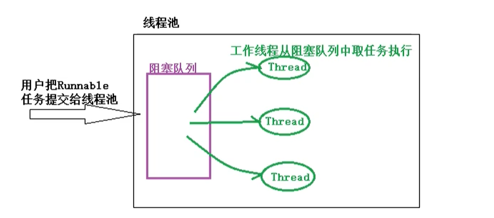

### **6.4.2 JDK** **对线程池的支持**

**JDK 提供了一套 Executor 框架,可以帮助开发人员有效的使用线程池**

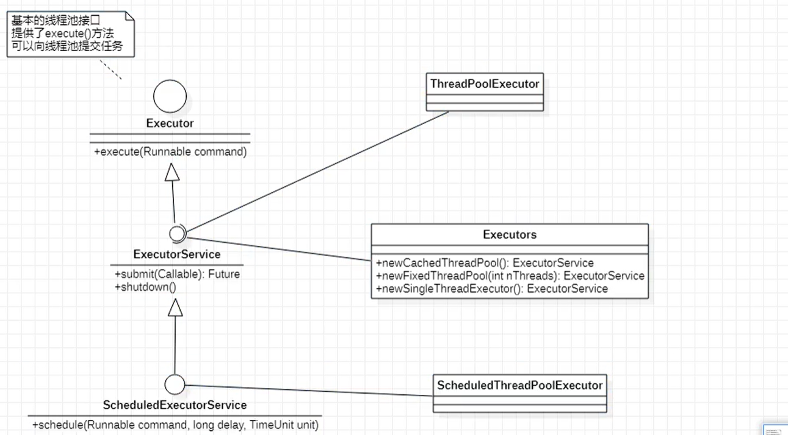

```java
/** 线程池的基本使用 */
   public class Test01 {
   public static void main(String[] args) {
       //创建有5个线程大小的线程池,
       ExecutorService fixedThreadPool = Executors.newFixedThreadPool(5);
       //向线程池中提交18个任务,这18个任务存储到线程池的阻塞队列中, 线程池中这5个线程就从阻塞队列中取任务执行
       for (int i = 0; i < 18; i++) {
           fixedThreadPool.execute(new Runnable() {
               @Override
               public void run() {
System.out.println(Thread.currentThread().getId() + " 编号的任务在执行任务,开始时间: " + System.currentTimeMillis());
                   try {
                       Thread.sleep(3000);     //模拟任务执行时长
                   } catch (InterruptedException e) {
                       e.printStackTrace();
                   }} });
       }}}
```

```java
 /* 线程池的计划任务  */
   public class Test02 {
   public static void main(String[] args) {
       //创建一个有调度功能的线程池
       ScheduledExecutorService scheduledExecutorService = Executors.newScheduledThreadPool(10);
       //在延迟2秒后执行任务, schedule(  Runnable任务, 延迟时长, 时间单位)
       scheduledExecutorService.schedule(new Runnable() {
           @Override
           public void run() {
               System.out.println(Thread.currentThread().getId() + " -- " + System.currentTimeMillis() );
           }
       }, 2, TimeUnit.SECONDS);
       //以固定的频率执行任务,开启任务的时间是固定的, 在3秒后执行任务,以后每隔5秒重新执行一次

   /*        scheduledExecutorService.scheduleAtFixedRate(new Runnable() {
           @Override
           public void run() {
               System.out.println(Thread.currentThread().getId() + "----在固定频率开启任务---" + System.currentTimeMillis());
               try {
                   TimeUnit.SECONDS.sleep(3);  //睡眠模拟任务执行时间 ,如果任务执行时长超过了时间间隔,则任务完成后立即开启下个任务
               } catch (InterruptedException e) {
                   e.printStackTrace();
               }
           }
       }, 3, 2, TimeUnit.SECONDS);*/

//在上次任务结束后,在固定延迟后再次执行该任务,不管执行任务耗时多长,总是在任务结束后的2秒再次开启新的任务(5s)
        scheduledExecutorService.scheduleWithFixedDelay(new Runnable() {
            @Override
            public void run() {
System.out.println(Thread.currentThread().getId() + "----在固定频率开启任务---" + System.currentTimeMillis());
                try {
          TimeUnit.SECONDS.sleep(3);  //睡眠模拟任务执行时间 ,如果任务执行时长超过了时间间隔,则任务完成后立即开启下个任务
                } catch (InterruptedException e) {
                    e.printStackTrace();
                } } }, 3, 2, TimeUnit.SECONDS);
  }}
```

### 6.4.3 核心线程池的底层实现

**查 看 Executors 工 具 类 中 newCachedThreadPool(), newSingleThreadExcecutor(), newFixedThreadPool()源码:**

```java
public static ExecutorService newCachedThreadPool() { 
return new ThreadPoolExecutor(0, Integer.MAX_VALUE, 60L, TimeUnit.SECONDS, 
new SynchronousQueue<Runnable>()); 
}
/*该线程池在极端情况下,每次提交新的任务都会创建新的线程执行. 适合用来执行大量 
耗时短并且提交频繁的任务

```

```java
public static ExecutorService newFixedThreadPool(int nThreads) { 
return new ThreadPoolExecutor(nThreads, nThreads,0L, TimeUnit.MILLISECONDS, 
new LinkedBlockingQueue<Runnable>()); 
}
```

```java
public static ExecutorService newSingleThreadExecutor() { 
return new FinalizableDelegatedExecutorService(new ThreadPoolExecutor(1, 1,0L, TimeUnit.MILLISECONDS, 
new LinkedBlockingQueue<Runnable>())); 
}
```

> **Excutors 工 具 类 中 返 回 线 程池方法底层 都使用了 ThreadPoolExecutor 线程池,这些方法都是 ThreadPoolExecutor 线程池的封装.**
>
> ```java
> //ThreadPoolExecutor 的构造方法:
> public ThreadPoolExecutor(int corePoolSize,
>         int maximumPoolSize,
>         long keepAliveTime,
>         TimeUnit unit,
>         BlockingQueue<Runnable> workQueue,
>         ThreadFactory threadFactory,
>         RejectedExecutionHandler handler){}
> ```
>
> - 各个参数含义: 
>
> - > - corePoolSize, 指定线程池中核心线程的数量 
>   > - maxinumPoolSize,指定线程池中最大线程数量 
>   > - keepAliveTime,当线程池线程的数量超过 corePoolSize 时,多余的空闲线程的存活时长,即空闲线程在多长时长内销毁 
>   > - unit, 是 keepAliveTime 时长单位 
>   > - workQueue,任务队列,把任务提交到该任务队列中等待执行 
>   > - threadFactory,线程工厂,用于创建线程 
>   > - handler 拒绝策略,当任务太多来不及处理时,如何拒绝 
>
>   说明: 
>
>   > workQueue 工 作 队 列 是 指 提 交 未 执 行 的 任 务 队 列 , 它 是 BlockingQueue 接口的对象,仅用于存储 Runnable 任务.根据队列功能分类,在ThreadPoolExecutor 构造方法中可以使用以下几种阻塞队列: 
>   >
>   > - 1) **直接提交队列**,由 SynchronousQueue 对象提供,**该队列没有容量**,提交给线程池的任务不会被真实的保存,**总是将新的任务提交给线程执行,如果没有空闲线程,则尝试创建新的线程,如果线程 数量已经达到 maxinumPoolSize 规定的最大值则执行拒绝策略.**
>   > - 2)**有界任务队列**,由ArrayBlockingQueue实现,**在创建ArrayBlockingQueue对象时,可以指定一个容量**.当有任务需要执行时,如果**线程池中线程数小于corePoolSize核心线程数则创建新的线程;如果大于corePoolSize核心线程数则加入等待队列.如果队列已满则无法加入,在线程数小于maxinumPoolSize指定的最大线程数前提下会创建新的线程来执行,如果线程数大于**
>   >   **maxinumPoolSize最大线程数则执行拒绝策略**
>   > - 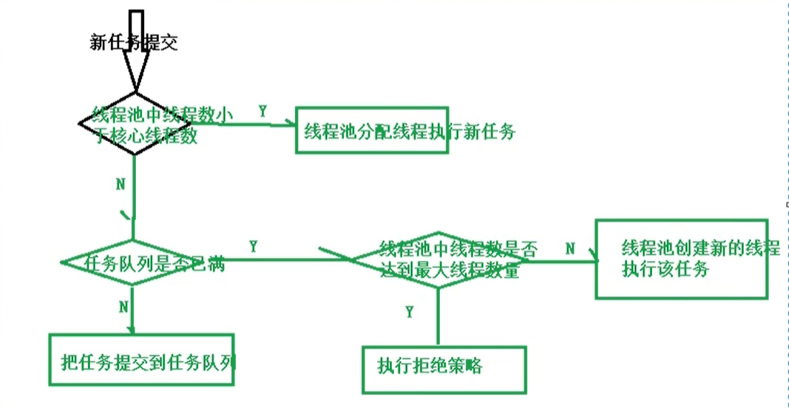
>   > - **无界任务队列**,由 LinkedBlockingQueue 对象实现,与有界队列相比,除非系统资源耗尽,否则无界队列不存在任务入队失败的情况. 当有新的任务时,在**系统线程数小于 corePoolSize 核心线程数则创建新的线程来执行任务;当线程池中线程数量大于corePoolSize 核心线程数则把任务加入阻塞队列**
>   > - 4)**优先任务队列**,是通过PriorityBlockingQueue实现的,是带有任务优先级的队列,是**一个特殊的无界队列.**不管是**ArrayBlockingQueue队列还是LinkedBlockingQueue队列都是按照先进先出算法处理任务的.在PriorityBlockingQueue队列中可以根据任务优先级顺序先后执行.**

### 6.4.4 拒绝策略

> - ThreadPoolExecutor 构造方法的最后一个参数指定了拒绝策略.当提交给线程池的任务量超过实际承载能力时,如何处理? 即线程池中 的线程已经用完了,等待队列也满了,无法为新提交的任务服务,可以 通过拒绝策略来处理这个问题. JDK提供了四种拒绝策略:
>
> - > - AbortPolicy 策略,会抛出异常 
>   > - CallerRunsPolicy 策略,只要线程池没关闭,会在调用者线程中运行当前被丢弃的任务 
>   > - DiscardOldestPolicy 将任务队列中最老的任务丢弃,尝试再次提交新任务
>   > - DiscardPolicy 直接丢弃这个无法处理的任务 
>
> -  **Executors 工具类提供的静态方法返回的线程池默认的拒绝策略是AbortPolicy 抛出异常,如果内置的拒绝策略无法满足实际需求,可以扩展RejectedExecutionHandler 接口** 

```java
/* 自定义拒绝策略*/
   public class Test03 {
   public static void main(String[] args) {
       //定义任务
       Runnable r = new Runnable() {
           @Override
           public void run() {
               int num = new Random().nextInt(5);
               System.out.println(Thread.currentThread().getId() + "--" + System.currentTimeMillis() + "开始睡眠" + num + "秒");
               try {
                   TimeUnit.SECONDS.sleep(num);
               } catch (InterruptedException e) {
                   e.printStackTrace();
               } } };
       //创建线程池, 自定义拒绝策略
       ThreadPoolExecutor threadPoolExecutor = new ThreadPoolExecutor(5, 5, 0, TimeUnit.SECONDS, new LinkedBlockingQueue<>(10), Executors.defaultThreadFactory(), new RejectedExecutionHandler(){
           @Override
       public void rejectedExecution(Runnable r, ThreadPoolExecutor executor) {
               //r就是请求的任务, executor就是当前线程池
               System.out.println(r + " is discarding..");
           } });
       //向线程池提交若干任务
       for (int i = 0; i < Integer.MAX_VALUE; i++) {
           threadPoolExecutor.submit(r);
       } }}
```

### 6.4.5 ThreadFactory

> 线程池中的线程从哪儿来的? 答案就是 **ThreadFactory.** 
>
> **ThreadFactory 是一个接口,只有一个用来创建线程的方法:Thread newThread(Runnable r); 当线程池中需要创建线程时就会调用该方法** 

```java
/** 自定义线程工厂 */
   public class Test04 {
   public static void main(String[] args) throws InterruptedException {
       //定义任务
       Runnable r = new Runnable() {
           @Override
           public void run() {
               int num = new Random().nextInt(10);
               System.out.println(Thread.currentThread().getId() + "--" + System.currentTimeMillis() + "开始睡眠:" + num + "秒");
               try {
                   TimeUnit.SECONDS.sleep(num);
               } catch (InterruptedException e) {
                   e.printStackTrace();
               }}};
       //创建线程池, 使用自定义线程工厂, 采用默认的拒绝策略是抛出异常
       ExecutorService executorService = new ThreadPoolExecutor(5, 5, 0, TimeUnit.SECONDS, new SynchronousQueue<>(), new ThreadFactory() {
           @Override
        public Thread newThread(Runnable r) {
               //根据参数r接收的任务,创建一个线程
       Thread t = new Thread( r );
       t.setDaemon(true);  //设置为守护线程, 当主线程运行结束,线程池中的线程会自动退出
               System.out.println("创建了线程: " + t);
               return t ;
           } });
       //提交5个任务, 当给当前线程池提交的任务超过5个时,线程池默认抛出异常
       for (int i = 0; i < 5; i++) {
           executorService.submit(r);
       }
       //主线程睡眠
       Thread.sleep(10000);
       //主线程睡眠超时, 主线程结束, 线程池中的线程会自动退出
  } }
```

### 6.4.6 监控线程池

> **ThreadPoolExecutor 提供了一组方法用于监控线程池** 
>
> - int getActiveCount() 获得线程池中当前活动线程的数量 
> - long getCompletedTaskCount() 返回线程池完成任务的数量 
> - int getCorePoolSize() 线程池中核心线程的数量 
> - int getLargestPoolSize() 返回线程池曾经达到的线程的最大数 
> - int getMaximumPoolSize() 返回线程池的最大容量 
> - int getPoolSize() 当前线程池的大小 
> - BlockingQueue<Runnable> getQueue() 返回阻塞队列 
> - long getTaskCount() 返回线程池收到的任务总数 

```java
import java.util.concurrent.Executors;
import java.util.concurrent.ThreadPoolExecutor;
/*** 监控线程池 */
   public class Test05 {
   public static void main(String[] args) throws InterruptedException {
       //先定义任务
       Runnable r = new Runnable() {
           @Override
           public void run() {
System.out.println(Thread.currentThread().getId() + " 编号 的线程开始执行: " + System.currentTimeMillis());
               try {
                   Thread.sleep(10000);    //线程睡眠20秒,模拟任务执行时长
               } catch (InterruptedException e) {
                   e.printStackTrace();
               } }};
       //定义线程池
       ThreadPoolExecutor poolExecutor = new ThreadPoolExecutor(2, 5, 0, TimeUnit.SECONDS, new ArrayBlockingQueue<>(5), Executors.defaultThreadFactory(), new ThreadPoolExecutor.DiscardPolicy());
       //向线程池提交30个任务
       for (int i = 0; i < 30; i++) {
           poolExecutor.submit(r);
           System.out.println("当前线程池核心线程数量: " + poolExecutor.getCorePoolSize() + ", 最大线程数:" + poolExecutor.getMaximumPoolSize() + ",当前线程池大小:" + poolExecutor.getPoolSize() + ",活动线程数量:" + poolExecutor.getActiveCount()+ ",收到任务数量:" + poolExecutor.getTaskCount() + ",完成任务数: " + poolExecutor.getCompletedTaskCount() + ",等待任务数:" + poolExecutor.getQueue().size()) ;
           TimeUnit.MILLISECONDS.sleep(500);
       }
       System.out.println("-----------------------------------------------");
       while ( poolExecutor.getActiveCount() >= 0 ){
           System.out.println("当前线程池核心线程数量: " + poolExecutor.getCorePoolSize() + ", 最大线程数:" + poolExecutor.getMaximumPoolSize() + ",当前线程池大小:" + poolExecutor.getPoolSize() + ",活动线程数量:" + poolExecutor.getActiveCount()+ ",收到任务数量:" + poolExecutor.getTaskCount() + ",完成任务数: " + poolExecutor.getCompletedTaskCount() + ",等待任务数:" + poolExecutor.getQueue().size()) ;
           Thread.sleep(1000);
       } }}
```

### 6.4.7 扩展线程池

有时需要对线程池进行扩展,如在监控每个任务的开始和结束时 间,或者自定义一些其他增强的功能.

> **ThreadPoolExecutor 线程池提供了两个方法:** 
>
> - protected void afterExecute(Runnable r, Throwable t) 
> - protected void beforeExecute(Thread t, Runnable r) 
>
> **在线程池执行某个任务前会调用 beforeExecute()方法,在任务结束后(任务异常退出)会执行 afterExecute()方法** 
>
> - 查看 ThreadPoolExecutor 源码,在该类中定义了一个内部类 Worker, ThreadPoolExecutor 线程池中的工作线程就是 Worker 类的实例, Worker 实例在执行时会调用 beforeExecute()与 afterExecute()方法

```java
/** 扩展线程池 */
   public class Test06 {
   //定义任务类
   private static class  MyTask implements  Runnable{
        String name;
       public MyTask(String name) {
           this.name = name;
       }
       @Override
       public void run() {
xSystem.out.println(name + "任务正在被线程 " + Thread.currentThread().getId() + " 执行");
           try {
               Thread.sleep(1000);     //模拟任务执行时长
           } catch (InterruptedException e) {
               e.printStackTrace();
           } } }
   public static void main(String[] args) {
//定义扩展线程池, 可以定义线程池类继承ThreadPoolExecutor,在子类中重写beforeExecute()/afterExecute()方法
       //也可以直接使用ThreadPoolExecutor的内部类
       ExecutorService executorService = new ThreadPoolExecutor(5, 5, 0, TimeUnit.SECONDS, new LinkedBlockingQueue<>() ){
           //在内部类中重写任务开始方法
           @Override
           protected void beforeExecute(Thread t, Runnable r) {
 System.out.println(t.getId() + "线程准备执行任务: " + ((MyTask)r).name);
           }
           @Override
           protected void afterExecute(Runnable r, Throwable t) {
               System.out.println( ((MyTask)r).name + "任务执行完毕");
           }
           @Override
           protected void terminated() {
               System.out.println("线程池退出");
           } };
       //向线程池中添加任务
       for (int i = 0; i < 5; i++) {
           MyTask task = new MyTask("task-" + i);
           executorService.execute(task);
       }
       //关闭线程池
       executorService.shutdown();     //关闭线程池仅仅是说线程池不再接收新的任务 , 线程池中已接收的任务正常执行完毕
   }}
```

### 6.4.8 优化线程池大小

> 线程池大小对系统性能是有一定影响的,过大或者过小都会无法 发挥最优的系统性能, 线程池大小不需要非常精确,只要避免极大或 者极小的情况即可, 一般来说,线程池大小需要考虑 CPU 数量,内存大 小等因素. 在<Java Concurrency in Practice>书中给出一个估算线程池 大小的公式:
>
> - **线程池大小 = CPU 的数量 * 目标 CPU 的使用率*( 1 + 等待时间与计算时间的比)**

### 6.4.9 线程池死锁

> - 如果在线程池中执行的 任务 A 在执行过程中又向线程池提交了 任务 B, 任务 B 添加到了线程池的等待队列中, 如果任务 A 的结束需 要等待任务 B 的执行结果. 就有可能会出现这种情况: **线程池中所有的工作线程都处于等待任务处理结果,而这些任务在阻塞队列中等待 执行, 线程池中没有可以对阻塞队列中的任务进行处理的线程,这种 等待会一直持续下去,从而造成死锁**
> - 适合给线程池提交相互独立的任务,而不是彼此依赖的任务. 对于 彼此依赖的任务,可以考虑分别提交给不同的线程池来执行.

### 6.4.10 线程池中的异常处理

> **在使用 ThreadPoolExecutor 进行 submit 提交任务时,有的任务抛出 了异常,但是线程池并没有进行提示,即线程池把任务中的异常给吃掉 了,可以把 submit 提交改为 execute 执行,也可以对 ThreadPoolExecutor 线程池进行扩展.对提交的任务进行包装:**

```java
/** 演示线程池可能会吃掉程序中的异常*/
   public class Test07 {
   //定义类实现Runnable接口,用于计算两个数相除
   private static class  DivideTask implements  Runnable{
       private  int x;
       private  int y;
       public DivideTask(int x, int y) {
           this.x = x;
           this.y = y;
       }
       @Override
       public void run() {
System.out.println(Thread.currentThread().getName() + "计算:" + x + " / " + y + " = " + (x/y));
       }}
   public static void main(String[] args) {
       //创建线程池
ThreadPoolExecutor poolExecutor = new ThreadPoolExecutor(0, Integer.MAX_VALUE, 0, TimeUnit.SECONDS, new SynchronousQueue<>());
       //向线程池中添加计算两个数相除的任务
       for (int i = 0; i < 5; i++) {
           poolExecutor.submit(new DivideTask(10, i));
   		//     poolExecutor.execute(new DivideTask(10, i));
       }
       /*
           运行程序,只有四条计算结果, 我们实际上向线程池提交了5个计算任务,分析结果发现当		i==0时,提交的任务会产生算术异常,线程池把该异常给吃掉了,导致我们对该异常一无所知
           解决方法:
               一是把submit()提交方法改为execute();
               二是对线程池进行扩展,对submit()方法进行包装
        */
   }}
```

```java
/** 自定义线程池类,对ThreadPoolExecutor进行扩展*/
   public class Test08 {
   //自定义线程池类
   private static class  TraceThreadPollExecutor extends  ThreadPoolExecutor{
       public TraceThreadPollExecutor(int corePoolSize, int maximumPoolSize, long keepAliveTime, TimeUnit unit, BlockingQueue<Runnable> workQueue) {
           super(corePoolSize, maximumPoolSize, keepAliveTime, unit, workQueue);
       }
 //定义方法,对执行的任务进行包装,接收两个参数,第一个参数接收要执行的任务,第二个参数是一个Exception异常
       public Runnable wrap( Runnable task, Exception exception){
           return  new Runnable() {
               @Override
               public void run() {
                   try {
                       task.run();
                   }catch (Exception e ){
                       exception.printStackTrace();
                       throw  e;
                   } } }; }
       //重写submit方法
       @Override
       public Future<?> submit(Runnable task) {
       }
       @Override
       public void execute(Runnable command) {
           super.execute(wrap(command, new Exception("客户跟踪异常")));
       }
   }
   private static class  DivideTask implements  Runnable{
       private  int x;
       private  int y;
       public DivideTask(int x, int y) {
           this.x = x;
           this.y = y;
       }
       @Override
       public void run() {
  System.out.println(Thread.currentThread().getName() + "计算:" + x + " / " + y + " = " + (x/y));
       } }
   public static void main(String[] args) {
       //创建线程池
   // ThreadPoolExecutor poolExecutor = new ThreadPoolExecutor(0, Integer.MAX_VALUE, 0, TimeUnit.SECONDS, new SynchronousQueue<>());
       //使用自定义的线程池
       ThreadPoolExecutor poolExecutor = new TraceThreadPollExecutor(0, Integer.MAX_VALUE, 0, TimeUnit.SECONDS, new SynchronousQueue<>());
       //向线程池中添加计算两个数相除的任务
       for (int i = 0; i < 5; i++) {
           poolExecutor.submit(new DivideTask(10, i));
// poolExecutor.execute(new DivideTask(10, i));
       } } }
```

### 6.4.11 ForkJoinPool 线程池

> - “分而治之”是一个有效的处理大数据的方法,著名的 MapReduce 就是采用这种分而治之的思路. 简单点说,如果要处理的 1000 个数据, 但是我们不具备处理1000个数据的能力,可以只处理10个数据, 可以 把这 1000 个数据分阶段处理 100 次,每次处理 10 个,把 100 次的处理 结果进行合成,形成最后这 1000 个数据的处理结果. 把一个大任务调用 fork()方法分解为若干小的任务,把小任务的处 理结果进行 join()合并为大任务的结果
> - 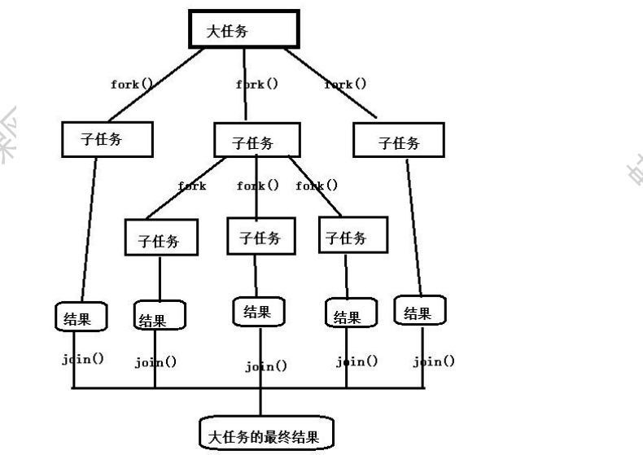
> - 系统对 ForkJoinPool 线程池进行了优化,提交的任务数量与线程的 数量不一定是一对一关系.在多数情况下,一个物理线程实际上需要处 理多个逻辑任务.
> - 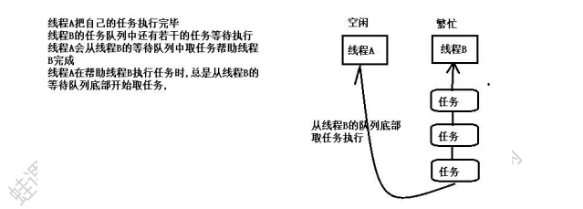
> - ForkJoinPool 线程池中最常用 的方法是:
> -  <T> ForkJoinTask<T> submit(ForkJoinTask<T> task) 向线程池提交 一个 ForkJoinTask 任务. ForkJoinTask 任务支持 fork()分解与 join()等待的任务 . 
> - ForkJoinTask 有 两 个 重 要 的 子 类 :RecursiveAction 和 RecursiveTask ,它们的区别在于 RecursiveAction 任务没有返回值, RecursiveTask 任务可以带有返回值

```java
/**演示ForkJoinPool线程池的使用,使用该线程池模拟数列求和 */
   public class Test09 {
   //计算数列的和, 需要返回结果,可以定义任务继承RecursiveTask
   private static class CountTask extends RecursiveTask<Long>{
       private static final int THRESHOLD = 10000;     //定义数据规模的阈值,允许计算10000个数内的和,超过该阈值的数列就需要分解
       private static final int TASKNUM = 100;  //定义每次把大任务分解为100个小任务
       private long start;     //计算数列的起始值
       private long end;       //计算数列的结束值
       public CountTask(long start, long end) {
           this.start = start;
           this.end = end;
       }
       //重写RecursiveTask类的compute()方法,计算数列的结果
       @Override
       protected Long compute() {
           long sum = 0 ;      //保存计算的结果
//判断任务是否需要继续分解,如果当前数列end与start范围的数超过阈值THRESHOLD,就需要继续分解
           if ( end - start < THRESHOLD){
               //小于阈值可以直接计算
               for (long i = start ; i <= end; i++){
                   sum += i;
               }
           }else {     //数列范围超过阈值,需要继续分解
               //约定每次分解成100个小任务,计算每个任务的计算量
               long step = (start + end ) / TASKNUM;
               //start = 0 , end = 200000, step = 2000, 如果计算[0,200000]范围内数列的和, 把该范围的数列分解为100个小任务,每个任务计算2000个数即可
               //注意,如果任务划分的层次很深,即THRESHOLD阈值太小,每个任务的计算量很小,层次划分就会很深,可能出现两种情况:一是系统内的线程数量会越积越多,导致性能下降严重;  二是分解次数过多,方法调用过多可能会导致栈溢出
               //创建一个存储任务的集合
               ArrayList<CountTask> subTaskList = new ArrayList<>();
               long pos = start;       //每个任务的起始位置
               for (int i = 0; i < TASKNUM; i++) {
                   long lastOne = pos + step;      //每个任务的结束位置
                   //调整最后一个任务的结束位置
                   if ( lastOne > end ){
                       lastOne = end;
                   }
                   //创建子任务
                   CountTask task = new CountTask(pos, lastOne);
                   //把任务添加到集合中
                   subTaskList.add(task);
                   //调用for()提交子任务
                   task.fork();
                   //调整下个任务的起始位置
                   pos += step + 1;
               }
               //等待所有的子任务结束后,合并计算结果
               for (CountTask task : subTaskList) {
                   sum += task.join();//join()会一直等待子任务执行完毕返回执行结果
               } }
           return sum;
       }}
   public static void main(String[] args) {
       //创建ForkJoinPool线程池
       ForkJoinPool forkJoinPool = new ForkJoinPool();
       //创建一个大的任务
       CountTask task = new CountTask(0L, 200000L);
       //把大任务提交给线程池
       ForkJoinTask<Long> result = forkJoinPool.submit(task);
       try {
           Long res = result.get();    //调用任务的get()方法返回结果
           System.out.println("计算数列结果为:" + res);
       } catch (InterruptedException e) {
           e.printStackTrace();
       } catch (ExecutionException e) {
           e.printStackTrace();
       }
       //验证
       long s = 0L;
       for (long i = 0; i <= 200000 ; i++) {
           s += i;
       }
       System.out.println(s);
 } }
```

# 7 保障线程安全的设计技术

> 从面向对象设计的角度出发介绍几种保障线程安全的设计技术, 这些技术可以使得我们在**不必借助锁的情况下保障线程安全,避免锁可能导致的问题及开销.**

## 7.1 Java 运行时存储空间

> - Java运行时(Java runtime)空间可以分为栈区,堆区与方法区(非堆空间).
> - 栈空间(Stack Space)为线程的执行准备一段固定大小的存储空间, 每个线程都有独立的线程栈空间,创建线程时就为线程分配栈空间.在 线程栈中每调用一个方法就给方法分配一个栈帧,栈帧用于存储方法的局部变量,返回值等私有数据, 即局部变量存储在栈空间中, 基本 类型变量也是存储在栈空间中, 引用类型变量值也是存储在栈空间 中,引用 的对象存储在堆中. 由于线程栈是相互独立的,一个线程不 能访问另外一个线程的栈空间,因此**线程对局部变量以及只能通过当前线程的局部变量才能访问的对象进行的操作具有固定的线程安全性.** 
>
> - 堆空间(Heap Space)用于存储对象,是在 JVM 启动时分配的一段可以动态扩容的内存空间. 创建对象时,在堆空间中给对象分配存储空间,**实例变量就是存储在堆空间中的, 堆空间是多个线程之间可以共享的空间,因此实例变量可以被多个线程共享.** 多个线程同时操作实例变量**可能存在线程安全问题** 
> - 非堆空间(Non-Heap Space)用于存储常量,类的元数据等, 非堆空间也是在 JVM 启动时分配的一段可以动态扩容的存储空间.类的元数据包括静态变量,类有哪些方法及这些方法的元数据(方法名,参数,返回值等). **非堆空间也是多个线程可以共享的, 因此访问非堆空间中的静态变量也可能存在线程安全问题** 
> - 堆空间也非堆空间是线程可以共享的空间,即实例变量与静态变量是线程可以共享的,可能存在线程安全问题. 栈空间是线程私有的存储空间,局部变量存储在栈空间中,局部变量具有固定的线程安全性

## 7.2 无状态对象

> - 对象就是数据及对数据操作的封装, **对象所包含的数据称为对象的状态(State), 实例变量与静态变量称为状态变量.** 
> - 如果一个类的同一个实例被多个线程共享并不会使这些线程存储共享的状态,那么该类的实例就称为**无状态对象(Stateless Object)**. 反之如果一个类的实例被多个线程共享会使这些线程存在共享状态,那么 该类的实例称为**有状态对象**. **实际上无状态对象就是不包含任何实例变量也不包含任何静态变量的对象.**
> - **线程安全问题的前提是多个线程存在共享的数据,实现线程安全的一种办法就是避免在多个线程之间共享数据,使用无状态对象就是这种方法**

## 7.3 不可变对象

> **不可变对象是指一经创建它的状态就保持不变的对象,不可变对象具有固有的线程安全性.** 当不可变对象现实实体的状态发生变化 时,系统会创建一个新的不可变对象,就如 String 字符串对象. 一个不可变对象需要满足以下条件:
>
> > - **类本身使用 final 修饰,防止通过创建子类来改变它的定义** 
> > - **所有的字段都是 final 修饰的,final 字段在创建对象时必须显示初始化,不能被修改** 
> > - **如果字段引用了其他状态可变的对象(集合,数组),则这些字段必须是 private 私有的** 
>
> 不可变对象主要的应用场景:
>
> > -  被建模对象的状态变化不频繁 
> > - 同时对一组相关数据进行写操作,可以应用不可变对象,既可以保障原子性也可以避免锁的使用 
> > -  使用不可变对象作为安全可靠的Map键, HashMap键值对的存储位置与键的 hashCode()有关,如果键的内部状态发生了变化会导致键的哈希码不同,可能会影响键值对的存储位置. 如果 HashMap 的键是一个不可变对象,则hashCode()方法的返回值恒定,存储位置是固定的

## 7.4 线程特有对象

> - 我们可以选择不共享非线程安全的对象,对于非线程安全的对象, **每个线程都创建一个该对象的实例**,各个线程线程访问各自创建的实 例,一个线程不能访问另外一个线程创建的实例. 这种各个线程创建 各自的实例,一个实例只能被一个线程访问的对象就称为线程特有对 象. 线程特有对象既保障了对非线程安全对象的访问的线程安全,又 避免了锁的开销.线程特有对象也具有固有的线程安全性
> - **ThreadLocal<T>类**相当于线程访问其特有对象的代理,即各个线程 通过 ThreadLocal 对象可以创建并访问各自的线程特有对象,泛型 T 指 定了线程特有对象的类型. 一个线程可以使用不同的 ThreadLocal 实 例来创建并访问不同的线程特有对象
> - 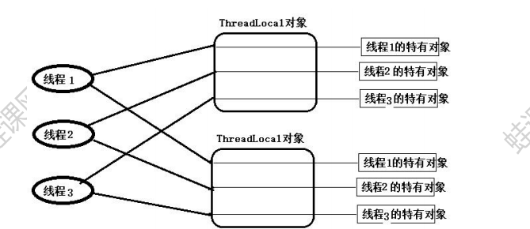
> - ThreadLocal 实例为每个访问它的线程都关联了一个该线程特有的对象, ThreadLocal 实例都有当前线程与特有实例之间的一个关联.

## 7.5 装饰器模式

> - 装饰器模式可以用来**实现线程安全,**基本思想是**为非线程安全的对象创建一个相应的线程安全的外包装对象,客户端代码不直接访问 非线程安全的对象而是访问它的外包装对象.** **外包装对象与非线程 安全的对象具有相同的接口,即外包装对象的使用方式与非线程安全对象的使用方式相同,而外包装对象内部通常会借助锁,以线程安全的 方式调用相应的非线程安全对象的方法**
> - 在 java.util.Collections 工具类中提供了一组 synchronizedXXX(xxx) 可以把不是线程安全的 xxx 集合转换为线程安全的集合,它就是采用 了这种装饰器模式. 这个**方法返回值就是指定集合的外包装对象.这 类集合又称为同步集合**
> - 使用装饰器模式的一个好处就是**实现关注点分离**,在这种设计中, 实现同一组功能的对象的两个版本:非线程安全的对象与线程安全的对象. 对于非线程安全的在设计时只关注要实现的功能,对于线程安全的版本只关注线程安全性

# 8 锁的优化及注意事项

## 8.1 有助于提高锁性能的几点建议

### 1 减少锁持有时间

> 对于使用锁进行并发控制的应用程序来说,**如果单个线程特有锁的时间过长,会导致锁的竞争更加激烈,会影响系统的性能.**在程序中 需要尽可能减少线程对锁的持有时间,如下面代码:
>
> ```java
> public synchronized void syncMethod(){ 
> othercode1(); 
> mutexMethod(); 
> othercode(); 
> }
> ```
>
> 在syncMethod同步方法中,假设只有mutexMethod()方法是需要同步的, othercode1()方法与 othercode2()方法不需要进行同步. 如果othercode1 与 othercode2 这两个方法需要花费较长的 CPU 时间,在并 发量较大的情况下,这种同步方案会导致等待线程的大量增加.一个 较好的优化方案是,只在必要时进行同步,可以减少锁的持有时间,提 高系统的吞吐量,如把上面的代码改为:
>
> ```java
> public void syncMethod(){ 
> othercode1(); 
> synchronized (this) { 
> mutexMethod(); }
> othercode(); 
> }
> ```
>
> 只对 mutexMethod()方法进行同步,这种减少锁持有时间有助于降 低锁冲突的可能性,提升系统的并发能力.

### 2 减小锁的粒度

> - **一个锁保护的共享数据的数量大小称为锁的粒度**. 如果一个锁保护的共享数据的数量大就称该锁的粒度粗,否则称该锁的粒度细.锁的粒度过粗会导致线程在申请锁时需要进行不必要的等待.**减少锁粒度是一种削弱多线程锁竞争的一种手段,可以提高系统的并发性**
> - 在JDK7前,java.util.concurrent.ConcurrentHashMap类采用分段锁协议,可以提高程序的并发性

### 3 使用读写分离锁代替独占锁

> - 使用ReadWriteLock读写分离锁可以提高系统性能, 使用读写分离 锁也是减小锁粒度的一种特殊情况. 第二条建议是能分割数据结构 实现减小锁的粒度,那么读写锁是对系统功能点的分割. 
> - **在多数情况下都允许多个线程同时读,在写的使用采用独占锁,在 读多写少的情况下,使用读写锁可以大大提高系统的并发能力**

### 4 锁分离

> 将读写锁的思想进一步延伸就是锁分离.读写锁是根据读写操作功能上的不同进行了锁分离.根据应用程序功能的特点,也可以对独占锁进行分离.如 **java.util.concurrent.LinkedBlockingQueue 类中 take()与 put()方法分别从队头取数据,把数据添加到队尾.** 虽然这两个方法都 是对队列进行修改操作,由于操作的主体是链表,take()操作的是链表 的头部,put()操作的是链表的尾部,两者并不冲突. 如果采用独占锁的 话,这两个操作不能同时并发,在该类中就采用锁分离,take()取数据时 有取锁, put()添加数据时有自己的添加锁,这样 take()与 put()相互独立实现了并发.

### 5 粗锁化

> 为了保证多线程间的有效并发,会要求**每个线程持有锁的时间尽量短.但是凡事都有一个度,如果对同一个锁不断的进行请求,同步和 释放,也会消耗系统资源**.如:
>
> ```java
> public void method1(){ 
> synchronized( lock ){ 
> 同步代码块 1 
> }
> synchronized( lock ){ 
> 同步代码块 2 
> } }
> ```
>
> JVM 在遇到**一连串不断对同一个锁进行请求和释放操作时,会把所有的锁整合成对锁的一次请求,从而减少对锁的请求次数,这个操作叫 锁的粗化,**如上一段代码会整合为:
>
> ```java
> public void method1(){ 
> synchronized( lock ){ 
> 同步代码块 1 
> 同步代码块 2 
> } } 
> ```
>
> 在开发过程中,也应该有意识的在合理的场合进行锁的粗化,尤其 在循环体内请求锁时,如
>
> ```java
> for(int i = 0 ; i< 100; i++){ synchronized(lock){} }
> ```
>
> 这种情况下,意味着每次循环都需要申请锁和释放锁,所以一种更 合理的做法就是在循环外请求一次锁,如:
>
> ```java
> synchronized( lock ){ for(int i = 0 ; i< 100; i++){} }
> ```

## 8.2 JVM 对锁的优化

### **1** **锁偏向** 

> - **锁偏向是一种针对加锁操作的优化,如果一个线程获得了锁,那么锁就进入偏向模式, 当这个线程再次请求锁时,无须再做任何同步操作,这样可以节省有关锁申请的时间,提高了程序的性能.**
>
> - 锁偏向**在没有锁竞争的场合可以有较好的优化效果**,对于锁竞争比较激烈的场景,效果不佳, 锁竞争激烈的情况下可能是每次都是不同的线程来请求锁,这时偏向模式失效

### 2 轻量级锁

> - **如果锁偏向失败,JVM 不会立即挂起线程,还会使用一种称为轻量级锁的优化手段. 会将对象的头部作为指针,指向持有锁的线程堆栈内部, 来判断一个线程是否持有对象锁. 如果线程获得轻量级锁成功, 就进入临界区. 如果获得轻量级锁失败,表示其他线程抢到了锁,那么 当前线程的锁的请求就膨胀为/*重量级锁*/.当前线程就转到阻塞队列中 变为阻塞状态**
>
> - **偏向锁,轻量级锁都是乐观锁,重量级锁是悲观锁**
>
> - /*一个对象刚开始实例化时,没有任何线程访问它,它是可偏向的,即它认为只可能有一个线程来访问它,所以当第一个线程来访问它的时候,它会偏向这个线程. 偏向第一个线程,这个线程在修改对象头成为偏向锁时使用 CAS 操作,将对象头中 ThreadId 改成自己的 ID,之后再访 问这个对象时,只需要对比 ID 即可. 一旦有第二个线程访问该对象,因为偏向锁不会主动释放,所以第二个线程可以查看对象的偏向状态,当第二个线程访问对象时,表示在这个对象上已经存在竞争了,检查原来持有对象锁的线程是否存活,如果挂了则将对象变为无锁状态,然后重新偏向新的线程; 如果原来的线程依然存活,则马上执行原来线程的栈,检查该对象的使用情况,如果仍然需要偏向锁,则**偏向锁升级为轻量级锁.***/
>
> - /*轻量级锁认为竞争存在,但是竞争的程度很轻,**一般两个线程对同 一个锁的操作会错开,或者稍微等待一下(自旋)另外一个线程就会释放锁. 当自旋超过一定次数,或者一个线程持有锁,一个线程在自旋,又来第三个线程访问时, 轻量级锁会膨胀为重量级锁, 重量级锁除了持有锁的线程外,其他的线程都阻塞.***/
>
> - > [自旋锁（spinlock](https://www.cnblogs.com/renhui/p/9755976.html)是指当一个线程在获取锁的时候，如果锁已经被其它线程获取，那么该线程将循环等待，然后不断的判断锁是否能够被成功获取，直到获取到锁才会退出循环。

