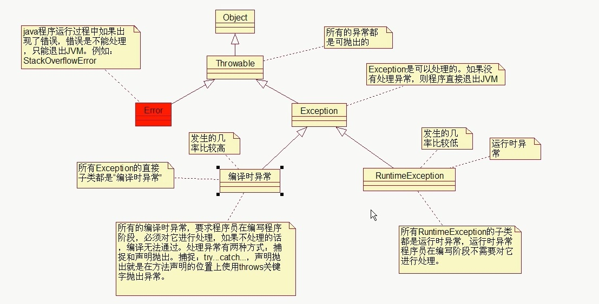
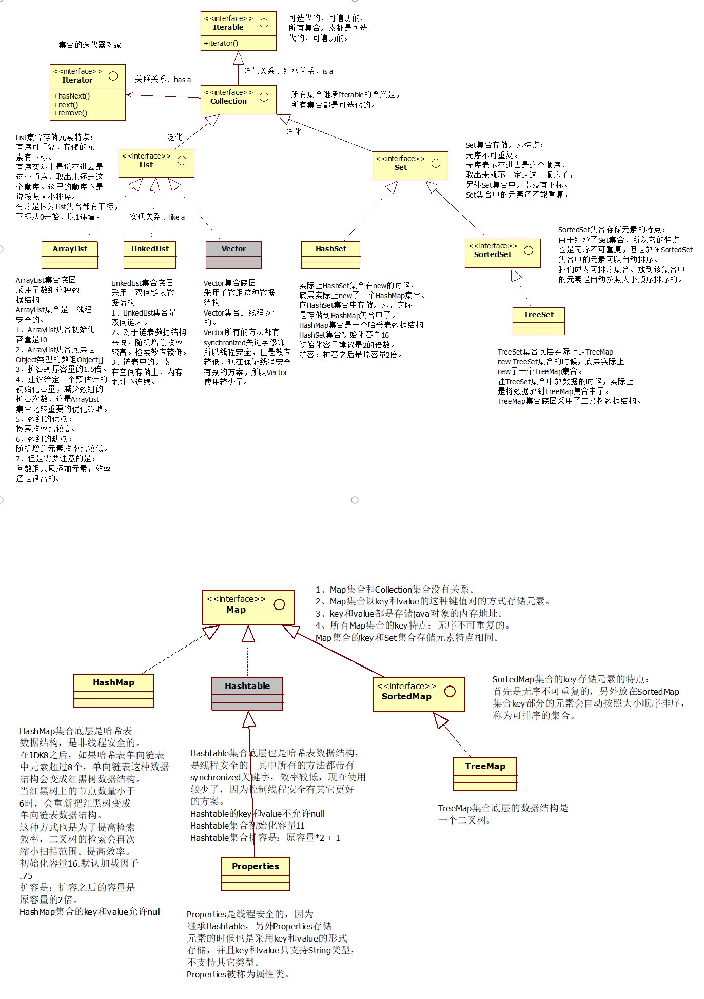

[TOC]


## API

```
什么是API？
		应用程序编程接口。（Application Program Interface）
		整个JDK的类库就是一个javase的API。
		每一个API都会配置一套API帮助文档。
		SUN公司提前写好的这套类库就是API。（一般每一份API都对应一份API帮助文档。）
```


## **JDK中的文件夹路径解析**

```java
JDK（Java开发工具箱，做Java开发必须安装的，这是最根本的一个环境。）
JDK不是集成开发环境。
JDK这个开发工具箱中是Java最核心的库。
c:\jdk\bin ：Java 开发工具包 (JDK) 中所包含的开发工具的可执行文件。PATH 环境变量应该包含一个指示此目录的项。
c:\jdk\lib ：jdk开发工具使用的类库目录
c:\jdk\jre ：JDK 开发工具所使用的 Java 运行时环境的根目录。

→JDK、JRE、JVM三者之间的关系？
JDK:Java开发工具箱 JRE:java运行环境 JVM:java虚拟机
/*JDK包括JRE，JRE包括JVM。*/
    
→假设你在软件公司开发了一个新的软件，现在要去客户那边给客户把项目部署一下，把项目跑起来，你需要安装JDK吗？
	只需要安装JRE就行了。JRE体积很小，安装非常便捷快速。
```

## **Java的加载与执行过程与原理**

```java
java程序员编写的java代码这种普通文本必须经过一个编译，将这个“普通文本代码”变成“字节码”，JVM能够识别“字节码”。
	//字节码文件不是二进制文件。
    //1个java源文件是可以编译生成多个class文件的。
第一步：会先启动JVM（java虚拟机）
第二步：JVM启动之后，JVM会去启动“类加载器classloader”
	类加载器的作用：加载类的。本质上类加载器负责去硬盘上找“类”对应的“字节码”文件。假设是“java HelloWorld”，那么类加载器会去硬盘上搜索：HelloWorld.class文件。
第三步：类加载器如果在硬盘上找到了对应的字节码文件，类加载器会将该字节码文件装载到JVM当中，JVM启动“解释器”将字节码解释为“101010000...”这种二进制码，操作系统执行二进制码和硬件交互。
    
   →默认情况下，类加载器去硬盘上找“字节码”文件的时候，默认从哪找？？？？
    	默认情况下类加载器（classloader）会从当前路径下找。
   →给类加载器指定一个路径，让类加载器去指定的路径下加载字节码文件。
    	classpath是一个环境变量，是给“类加载器”指路的。
    	classpath=D:\course：类加载器只会去D:\course目录下找“xxx.class”文件，不再从当前路径下找了。
```

## Java语言的特性

```
→简单性(屏蔽了指针概念,不直接操作内存)
→java是堪称完全面向对象的（复杂问题简单化）
→健壮性（Java中有一种机制：自动垃圾回收机制（GC机制）。JVM（C++语言写的一个虚拟的计算机）负责调度GC机制）
→java完全/完美支持多线程并发。
→可移植性/跨平台
```

## **Path环境变量**

```
path环境变量的作用是什么？
		path环境变量的作用就是给windows操作系统指路的。告诉windows操作系统去哪里找这个命令文件
在DOS命令窗口中使用该软件的某个命令的时候，如果出现“命令找不到错误了”，这个时候希望大家能够想起来配置环境变量path。
```

## 基本数据类型占用字节数量

```java
	类型			占用字节数量(byte)
		------------------------------------
		byte				 1 [-128 ~ 127]
		short				 2 [-32768 ~ 32767] 
		int				 	 4 [-2147483648 ~ 2147483647]
		long				 8
		float				 4
		double				 8
		boolean				 1  (1byte的1或0，00000001(true)或00000000(false))
		char				 2 [0~65535]    ASCII码
	
→类型转换的时候需要遵循哪些规则？     
        如果整数型字面量没有超出 byte,short,char 的取值范围，可以直接将其赋值给byte,short,char 类型的变量；
        自动类型转换：byte < short(char) < int < long < float < double，其中 short和 char 
        强制类型转换：大容量转换成小容量
        //byte,short,char 类型混合运算时，先各自转换成 int 类型再做运算；
        //多种数据类型混合运算，各自先转换成容量最大的那一种再做运算；
```

## **JVM的内存结构中三块比较重要的内存空间**

```
	→方法区：
		存储代码片段，存储xxx.class字节码文件，这个空间是最先有数据的，
		类加载器首先将代码加载到这里。
	→堆内存：
		后面讲（面向对象）
	→栈内存：
		stack栈当中存储什么？
			每个方法执行时所需要的内存空间（局部变量）。
```

## 方法重载

```
	条件1：在同一个类当中
	条件2：方法名相同
	条件3：形式参数列表不同（类型、个数、顺序）
	注意：
		方法重载和返回值类型无关，和修饰符列表无关。
```

## 面向对象的方式贯穿整个系统的话，三个术语:

```
	OOA：面向对象分析
	OOD：面向对象设计
	OOP：面向对象编程
```

## 软件开发原则

```java
//七大原则最基本的原则：OCP（对扩展开放，对修改关闭）
	目的是：降低程序耦合度，提高程序扩展力。
	面向抽象编程，不建议面向具体编程。
```

## 构造方法的作用

```
构造方法就是完成对象的初始化和对成员变量赋初始值
```

## static**关键字**

```java
→静态变量在类加载时初始化，不需要new对象。静态变量的就有了，并存储在/*方法区内*/存中
→静态代码块（自上而下依次执行）
	类加载时执行，并只执行一次
	在main方法执行前执行
注意：执行顺序：静态变量>静态代码块	
作用：可用于类加载执行日志
//本类中的静态变量（--》静态代码块）--调用类中的静态（变量）代码块--实例代码块（构造方法之前执行）
```

## extends**继承：耦合度高**

```java
→子类继承父类，除构造方法不能继承之外，剩下都可以继承。
→但是私有的属性无法在子类中直接访问。(父类中private修饰的不能在子类中直接访问。可以通过间接的手段来访问。)
→方法覆盖：
	具有相同方法名、返回值类型、形式参数列表s
	私有方法无法覆盖
	构造方法没有办法继承，因此也无法覆盖
	//方法覆盖针对实例方法，静态方法覆盖没有意义
→默认子类与父类的hashcode和equals（直接使用的==比较）都是一样的
```

## super**关键字**

```java
→super不能出现在静态方法中
→super()调用父类的构造方法（当子类的构造方法中没有this和super时，默认有super()）
	/*调用父类构造方法是真的，但是根本没有创建父类对象，只不过是调用父类构造方法来初始化属性（初始化父类特征）。
	new指令开辟空间，用于存放对象的各个属/性引用等，反编译字节码你会发现只有一个new指令，所以开辟的是一块空间，一块空间就放一个对象。*/ 
//→super不是引用，super也不保存内存地址，super也不指向任何对象，super只是代表当前对象内部的那一块父类特征
```


## System.out.println()解释

```
System:类名 out:静态变量 println:方法
Class A{public void println()}
Class B{static A a=new A()}
Class Test{//通过B调用println方法：B.a.println()}
```

## 多态

```
Animal a = new Cat();
// 编译的时候编译器发现a的类型是Animal，所以编译器会去Animal类中找move()方法（静态绑定）
// 找到了，绑定，编译通过。
//但是运行的时候和底层堆内存当中的实际对象有关，真正执行的时候会自动调用“堆内存中真实对象”的相关方法（动态绑定）
```

## final关键字

```java
	1.1、final修饰的类无法继承。
	1.2、final修饰的方法无法覆盖。
	1.3、final修饰的变量只能赋一次值。
	1.4、final修饰的引用一旦指向某个对象，则不能再重新指向其它对象，但该引用
	指向的对象内部的数据是可以修改的。
	1.5、final修饰的实例变量必须手动初始化，不能采用系统默认值。
	1.6、final修饰的实例变量一般和static联合使用，称为常量。
		 public static final double PI = 3.1415926;
//final修饰的变量只要赶在系统赋默认值之前赋值就行，不然会报错
```

## 抽象类和接口

```
→抽象类虽然无法实例化，但是抽象类有构造方法，这个构造方法是供子类使用的。（抽象类中可能有成员属性即所有子类的共同属性值）
→接口中只有常量+抽象方法
```

## **接口的作用**

```java
项目有了接口之后就有了分层，/*多个层之间可以同时开发*/，这样项目的开发效率可以提高。（调用者不用关心实现者，实现者不需要关心调用者）
接口使程序分为调用方和实现方，调用方和实现方是解耦合的，面向接口编程使项目变得具有/*可接插性，具有可插拔特性，具有很强的扩展能力。
```


## 访问控制权限

```
→控制的范围是什么？
	private 只能在‘本类’中访问
	public 在‘任何位置’都可以访问
	“默认”表示只能在‘本类’，以及‘同包下’访问。
	protected表示只能在‘本类、同包、子类’中访问。
→范围从大到小排序：public > protected > 默认 > private	
```

## StringBuffer(字符串的拼接)

```
当使用‘+’进行字符串拼接时，每次的拼接都会产生新的字符串，浪费大量的方法区内存
StringBuffer使用append()进行字符串的拼接：new StringBuffer()，创建初始化容量为16个byte[]数组，会自动扩容
```

## Integer包装类

```
【-128——127】之间的所有的包装类提前创建好，放到了方法区的‘整数型常量池’中。
	Integer i=100; Integer j=100;sout(i==j);
	=>ture(前提不是通过new关键字创建的包装类对象)
```

## 异常



```java
→编译时异常和运行时异常都是发生在运行阶段
	因为只有程序运行阶段才可以new对象，异常的发生就是new异常对象 
→关于异常的处理
	上抛 thows
	捕捉 try...catch
    注意：
        try语句块中的某一行出现异常，该行后面的代码不会执行
        try...catch捕捉异常之后，后续代码可以执行
        //finally语句中的代码一定会执行
try{
       int i=100;
       return 0;		
 }finally{			//顺序：try---->finally---->return
    ...
 }
```

```java
//自定义异常类
public class A extends Exception{
    无参构造。。
    有参构造。。
}
public class B{
    public void f(s) throws Exception{
        if(null==s){
            throw new A("该类为NULL");
        }
        return "";
    }
}
```

## 集合

```java
→集合不能直接存储基本数据类型，另外集合也不能直接存储java对象，集合当中存储的都是java对象的内存地址。
→ArryList默认初始化容量为10的Object数组（创建长度为0的数组当添加第一个元素时，初始化为10的数组）//每次扩容为上次的1.5倍
→HashMap默认初始化容量时16（扩容因子：0.75：集合数据的容量达到75%时）（扩容为之前的2^n倍）
```



## **集合遍历/迭代专题（Collection类，Map的不能用，针对二叉数：中序遍历）**

```java
	Collection c=new ArryList();
	//1.获取迭代对象	
    Iterator it=c.iterator();
	//2.开始迭代
	while(it.hasNext()){//如果仍有元素可以迭代，返回true
    	it.next();//返回迭代的下一个元素
}
-------------------------------------------------------
注意：
    1.集合结构发生变化，迭代器必须重新获取（使用remove()方法删除元素）
    2.应在集合增删数据完毕后，最后获取迭代器
    3.在使用迭代器删除元素时，迭代器会自动更新迭代器。并且更新集合（it.remove()）
-----------------------------------------------------------
// 通过map.entrySet()获取所有的keys------>Set<Map.Entry<K,V>>(继承Collection类)在使用上面的方法
```

## **集合方法的深入**

```java
1.Collection集合中的contain()方法
    判断集合中是否包含某个元素，底层使用了equals方法进行比较
2.HashMap底层时哈希表/散列表的数据结构（一维数组，数组中的每个元素为单向链表）
    //map.put(k,v);实现原理
    1.将K，V封装到Node对象中
    2.底层会调用K的hashCode()方法获取hash值。然后通过哈希函数或者哈希算法，将hash值转换为数组的下标，下标位置上如果没有任何元素，就把Node添加到这个位置上。如果说下标对应位置上如果有链表，此时会拿着K和链表上每个节点中的k进行equals()比较，如果所有的equals方法返回的都是false，那么将这个新节点添加到链表的末尾，如果有返回为ture的，那个节点的v值将会被覆盖。
	//哈希表的随机增删，以及查询效率很高：增删在链表上完成，查询只需要部分扫描
    //同一个单向链表上的所有节点的Hash值相同：数组下标相同
```

## IO流

```
文件专属：
	java.io.FileInputStream（掌握）//字节流
	java.io.FileOutputStream（掌握）
	java.io.FileReader//字符流
	java.io.FileWriter

转换流：（将字节流转换成字符流）
	java.io.InputStreamReader
	java.io.OutputStreamWriter

缓冲流专属：
	java.io.BufferedReader
	java.io.BufferedWriter
	java.io.BufferedInputStream
	java.io.BufferedOutputStream

数据流专属：
	java.io.DataInputStream
	java.io.DataOutputStream

标准输出流：
	java.io.PrintWriter
	java.io.PrintStream（掌握）

对象专属流：
	java.io.ObjectInputStream（掌握）
	java.io.ObjectOutputStream（掌握）
```

```
所有的流都实现了：
		java.io.Closeable接口，都是可关闭的，都有close()方法。
		流毕竟是一个管道，这个是内存和硬盘之间的通道，用完之后一定要关闭，
		不然会耗费(占用)很多资源。养成好习惯，用完流一定要关闭。

	所有的输出流都实现了：
		java.io.Flushable接口，都是可刷新的，都有flush()方法。
		养成一个好习惯，输出流在最终输出之后，一定要记得flush()
		刷新一下。这个刷新表示将通道/管道当中剩余未输出的数据
		强行输出完（清空管道！）刷新的作用就是清空管道。
		注意：如果没有flush()可能会导致丢失数据。
```

```java
//字节流
	1.int read(byte[] b);
//字符流
	1.void  write(byte[] b);
	2.void write(byte b,int beign,int end)
//自带缓冲区的字符流(BufferedWriter\BufferReader)
    new BufferReader(Read in);
	//该流的构造方法需要一个流：这个流为“节点流”。外部负责包装的流为“包装流”
   1.String  readLine();//一次读一行
```

## File**类**

```java
1.Boolean  exists()//判断文件是否存在
2.Boolean  isDirectory()//判断是否为一个目录
3.File[]   listFiles()//获取当前目录下所有的子文件
4.String   getParent()//获取文件的父路径
5.String   getAbsolutePath()//获取文件的绝对路径
```

## 序列化和反序列化（ObjectOutputStream(FileOutputStream f)和ObjectInputStream(FileInputStream f)）

```java
→序列化：java对象存储到文件中，将java对象的状态保存下来（硬盘）
→反序列化：将硬盘上的数据重新恢复到内存中，恢复成Java对象
//参与序列化的对象，必须实现Serializable接口（该接口为标志接口）：//JVM看到这个接口后，自动生成一个序列化版本号
→希望某个属性不参与序列化：transient String name;
→java语言中采用什么机制区分类？
    1.类名
    2.序列化版本号
→自动生成序列化版本号，有什么缺陷?
    代码一旦确定，不能进行后续更改：
    	因为只要修改必然会生成新的序列化版本号，JVM就会认为这是一个全新的类
//→建议给一个固定的序列化版本号，代码修改了（版本号不会改变）：
    private static final long SerialVersionUID=xxx;
--------------------------------------------------------
  序列化对象：void	new ObjectOutputStream(FileOutputStream f).writeObject(对象)；
  序列化集合（多个对象）：void	new ObjectOutputStream(FileOutputStream f).writeObject(集合)；
  反序列化对象：Object   new ObjectInputStream(FileInputStream f).readObject(); 

```

## **IO和Properties集合联合使用**

```java
13.text:{
    username=zhangsan
    password=123
}
    FileReader reader=new FileReader();
    Properties pro=new Properties();
    pro.load(reader);//文件中的数据顺着管道加载到map集合中。
	sout(pro.getProperty("username"))
```

## **资源绑定器**

```java
→只能绑定.properties文件。且文件必须放在类路径下
{
	ReSourceBundle bundle=ReSourceBundule("路径")；
	String Value=budle.getString("key")
}
```

## **多线程**

```java
→什么是进程？什么是线程？
	进程是一个应用程序（1个进程是一个软件）。
	线程是一个进程中的执行场景/执行单元。
	一个进程可以启动多个线程。
→进程A和进程B的内存独立不共享，线程A和线程B，堆内存和方法区内存共享。
						  但是栈内存独立，一个线程一个栈。
→实现线程有三种方式：
	1.继承java.lang.Thread，重写run方法
            // 创建线程对象
            MyThread t = new MyThread();
	2.实现java.lang.Runnable接口，实现run方法
            // 创建线程对象
            Thread t = new Thread(new MyRunnable());
     //start()方法的作用：启动一个分支线程，开辟新的栈空间。//启动成功的线程会自动调用run();
	3.实现线程的第三种方式：实现Callable接口。（JDK8新特性。）
	这种方式实现的线程可以获取线程的返回值。
```


```java
常见的线程调度模型有哪些？

​	抢占式调度模型：
		那个线程的优先级比较高，抢到的CPU时间片的概率就高一些/多一些。
		java采用的就是抢占式调度模型。

​	均分式调度模型：
		平均分配CPU时间片。每个线程占有的CPU时间片时间长度一样。
		平均分配，一切平等。
		有一些编程语言，线程调度模型采用的是这种方式。
→和线程调度有关系的方法
	实例方法：
		void setPriority(int newPriority) //设置线程的优先级
		int getPriority() //获取线程优先级
		void join()//合并线程
		class MyThread1 extends Thread {
			public void doSome(){
				MyThread2 t = new MyThread2();
				t.join(); // 当前线程进入阻塞，t线程执行，直到t线程结束。当前线程才可以继续。
			}
		}

	静态方法：
		static void yield()  让位方法
		暂停当前正在执行的线程对象，并执行其他线程
		yield()方法不是阻塞方法。让当前线程让位，让给其它线程使用。
		yield()方法的执行会让当前线程从“运行状态”回到“就绪状态”。
		注意：在回到就绪之后，有可能还会再次抢到。
```

## **解决线程安全问题:线程同步机制**

```java

第一种：同步代码块
		灵活
		synchronized(线程共享对象){
			同步代码块;
		}

第二种：在实例方法上使用synchronized
		表示共享对象一定是this
		并且同步代码块是整个方法体。
	
第三种：在静态方法上使用synchronized
		表示找类锁。
		类锁永远只有1把。
		就算创建了100个对象，那类锁也只有一把。
	
	对象锁：1个对象1把锁，100个对象100把锁。
	类锁：100个对象，也可能只是1把类锁。
//是一上来就选择线程同步吗？synchronized,不是，synchronized会让程序的执行效率降低，用户体验不好。
   
    →第一种方案：尽量使用局部变量代替“实例变量和静态变量”。

    →第二种方案：如果必须是实例变量，那么可以考虑创建多个对象，这样
    实例变量的内存就不共享了。（一个线程对应1个对象，100个线程对应100个对象，
    对象不共享，就没有数据安全问题了。）

    →第三种方案：如果不能使用局部变量，对象也不能创建多个，这个时候
    就只能选择synchronized了。线程同步机制。
```

## 守护线程

```
→守护线程的特点：
		一般守护线程是一个死循环，所有的用户线程只要结束，
		守护线程自动结束。
→应用：
	定时自动备份：
		使用Thread.sleep();
		使用java.util.Timer
```

## **关于Object类中的wait和notify方法**（生产消费者模式）

```
→o.wait()方法作用：
	让正在o对象上活动的线程进入等待状态，无期限等待，直到被唤醒为止。(释放之前占有的对象锁)
→o.notify()方法作用：
	唤醒正在o对象上等待的线程。(只会通知，不会释放之前占有的对象锁)
→o.notifyAll()方法：
	这个方法是唤醒o对象上处于等待的所有线程。
```

## **反射机制**

```java
→反射机制相关的重要的类有哪些？
	java.lang.Class：代表整个字节码，代表一个类型，代表整个类。
	java.lang.reflect.Method：代表字节码中的方法字节码。代表类中的方法。
	java.lang.reflect.Constructor：代表字节码中的构造方法字节码。代表类中的构造方法
	java.lang.reflect.Field：代表字节码中的属性字节码。代表类中的成员变量（静态变量+实例变量）。
→获取到Class，实例化对象
	class.newInstance();//内部实际调用了无参构造方法，必须保证无参构造的存在
→//Class.forName();
	该方法的执行，会导致‘类加载’（静态代码块的执行，其他程序不执行）。
→获取类路径下文件的绝对路径
    String path=Thread.currentThread().getContextClassLoader().getResource("（包名/）文件.后缀")
    			//当前线程对象        //获取当前线程的类加载器对象   //当前类加载器默认从类的根路径加载资源  
```

```java
//常用方法合集(实例方法)
→属性	
	1. Field[]  class.getFields()//获取public修饰的属性
    2. Field[]  class.getDeclaredFields()//获取所有属性
        //Field数组中的field
        1.int i= field.getModifiers()//返回的修饰符是数字
        2.String Modifier.toString(i)//静态方法，经修饰符代码转换为字符串
        3.Class  field.getType()//获取属性类型
//获取属性，并进行赋值
		{
			Class a=Class.forName("完整类名")
             Object obj=a.newInstance();
    		//获取对应属性
    		Field field=a.getDeclaredFileds("属性名");
    		field.set(obj,222);//设置属性值
    		//获取属性值
    		field.get(obj);
		}
//访问私有属性：
            Field field=a.getDeclaredFileds("属性名");
			field.setAccessible(true);
			...
→方法
     1.Method[]  class.getDeclaredMethods()//获取所有的method
     2.Modifier.toString(method.getModifiers())//修饰符
     3.method.getReturnType().getSimpleName()//获取方法的返回值类型
     4.Class[] method.getParaneterTypes();//方法的形参列表xingcan.getSimpleName()
	 5.Class[] class.getInterfaces()//获取class实现的所有接口
//获取method
		method=class.getDeclaredMethod("方法名",xx.class  ...);
//调用
		Object val=method.invoke(obj,"实参"  ...)
```

## JDK**中自带的类加载器**

```
3.1、什么是类加载器？
		专门负责加载类的命令/工具。
		ClassLoader

3.2、JDK中自带了3个类加载器
		启动类加载器:rt.jar
		扩展类加载器:ext/*.jar
		应用类加载器:classpath
	
3.3、假设有这样一段代码：
		String s = "abc";
		
		代码在开始执行之前，会将所需要类全部加载到JVM当中。
		通过类加载器加载，看到以上代码类加载器会找String.class
		文件，找到就加载，那么是怎么进行加载的呢？
	
			首先通过“启动类加载器”加载。
				注意：启动类加载器专门加载：C:\Program Files\Java\jdk1.8.0_101\jre\lib\rt.jar
				rt.jar中都是JDK最核心的类库。
			
			如果通过“启动类加载器”加载不到的时候，
			会通过"扩展类加载器"加载。
				注意：扩展类加载器专门加载：C:\Program Files\Java\jdk1.8.0_101\jre\lib\ext\*.jar

			如果“扩展类加载器”没有加载到，那么
			会通过“应用类加载器”加载。
				注意：应用类加载器专门加载：classpath中的类。
	
3.4、java中为了保证类加载的安全，使用了双亲委派机制。优先从启动类加载器中加载，这个称为“父”，“父”无法加载到，再从扩展类加载器中加载，这个称为“母”。双亲委派。如果都加载不到，才会考虑从应用类加载器中加载。直到加载到为止。
```

