# 零.动态代理深度理解：

## 0.1、前提准备：			

```
*目标接口 	*目标接口的实现类  	*InvocationHandler实现类（提供功能增强） 	*Proxy(静态方法，获取代理对象)	 
```

​		①目标接口的作用：

> 生成的代理类父类是Proxy类,通过jdk代理生成的类都继承Proxy类:
>
> > - ***因为Java是单继承的,而代理类又必须继承自Proxy类,所以通过jdk代理的类必须实现接口.**
> > - *可以看到$Proxy0已经继承了Proxy类，由于Java只允许单继承，故只能对接口进行动态代理.

可以通过下面的方法，获取代理对象的Class文件

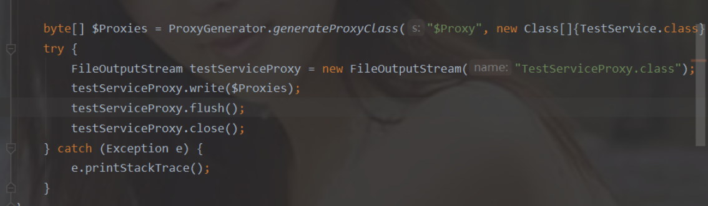

​	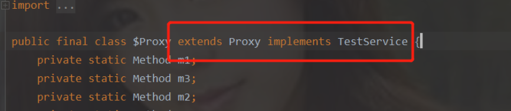

生成的代理对象中的对应方法：


> **以上对应的方法，会调用父类中的h.invoke(),也就是InvocationHandler实现类中的Invoke方法。《《m3为目标类。》》**
> **总结：代理对象的作用：创建代理对象，调用InvocationHandler实现类中的Invoke方法，以实现目标类中的方法，和附加功能的实现。**
>
> **InvocationHandler实现类中的Invoke方法的第二个参数Method为通过代理对象调用的方法。**

​	**②JDK动态代理之代理对象与目标对象**

> 首先下一个结论，代理对象proxy和目标对象userDAO(目标类)并不是同一个对象，但是它们的hashCode()方法和toString()方法的结果均相同，这是因为**JDK动态代理只对接口中声明的方法进行代理** ，hashCode()方法和toString()方法是在Object中定义的，不会被代理对象拦截。getClass()方法返回的是对象的运行时类型信息，可以看到，
>    
>    代理对象proxy的类型是class com.sun.proxy.$Proxy0，而目标对象userDAO的类型是structure.proxy.dynamicproxy.UserDAO

0、junit的使用：

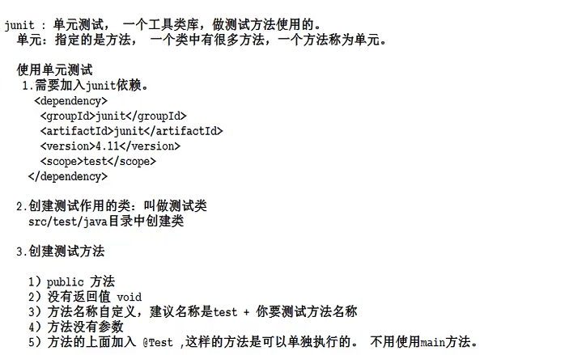

# 第1章Spring概述

## **1.1 Spring** **框架是什么**

> - Spring 是于 2003 年兴起的一个轻量级的 Java 开发框架，它是为了解决企业应用开发的复杂性而创建的。Spring 的核心是**控制反转（IoC）和面向切面编程（AOP）**。Spring 是可以在 Java SE/EE 中使用的轻量级开源框架。
> - **Spring 的主要作用就是为代码“解耦”，降低代码间的耦合度。就是让对象和对象（模块和模块）之间关系不是使用代码关联，而是通过配置来说明**。即在 Spring 中说明对象（模块）的关系。
> - Spring 根据代码的功能特点，**使用 Ioc 降低业务对象之间耦合度**。IoC 使得主业务在相互调用过程中，不用再自己维护关系了，即不用再自己创建要使用的对象了。而是由 Spring容器统一管理，自动“注入”,注入即赋值。 而 **AOP 使得系统级服务得到了最大复用**，且不用再由程序员手工将系统级服务“混杂”到主业务逻辑中了，而是由 Spring 容器统一完成“织入”。

## **1.2 Spring** **优点？**

> 它是一个容器管理对象，容器是装东西的，Spring 容器不装文本，数字。**装的是对象。Spring 是存储对象的容器。**

### **（1） 轻量**

> 架使用的 jar 都比较小，一般在 1M 以下或者几百 kb。Spring 核心功能的所需的 jar 总共在 3M 左右。Spring 框架运行占用的资源少，运行效率高。不依赖其他 jar

### **（2） 针对接口编程，解耦合**

> Spring 提供了 Ioc 控制反转，由容器管理对象，对象的依赖关系。原来在程序代码中的对象创建方式，现在由容器完成。对象之间的依赖解耦合。

### （3） AOP 编程的支持

> - 通过 Spring 提供的 AOP 功能，方便进行面向切面的编程，许多不容易用传统 OOP （面向对象程序设计）实现的功能可以通过 AOP 轻松应付
> - 在 Spring 中，开发人员可以从繁杂的事务管理代码中解脱出来，通过声明式方式灵活地进行事务的管理，提高开发效率和质量。

### **（4） 方便集成各种优秀框架**

> - Spring 不排斥各种优秀的开源框架，相反 Spring 可以降低各种框架的使用难度，**Spring提供了对各种优秀框架（如 Struts,Hibernate、MyBatis）等的直接支持**。简化框架的使用。
> - Spring 像插线板一样，其他框架是插头，可以容易的组合到一起。需要使用哪个框架，就把这个插头放入插线板。不需要可以轻易的移除。

## **1.3 Spring** **体系结构**

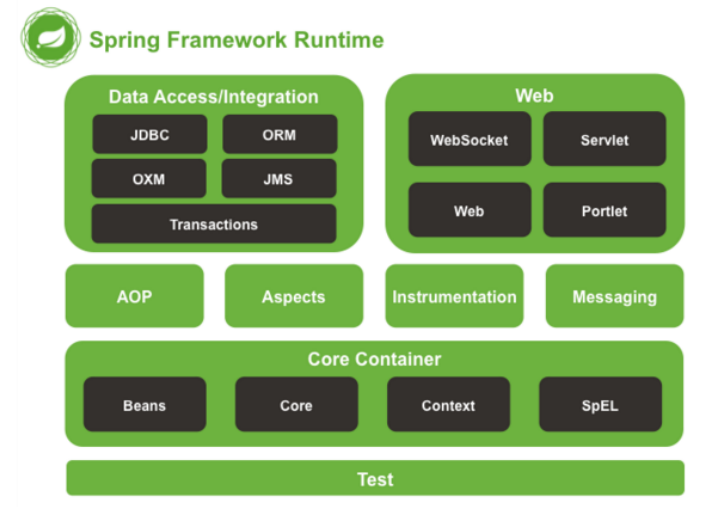

> Spring 由 20 多个模块组成，它们可以分为数据访问/集成（Data Access/Integration）、Web、面向切面编程（AOP, Aspects）、提供JVM的代理（Instrumentation）、消息发送（Messaging）、核心容器（Core Container）和测试（Test）。

# 第2章 IoC 控制反转

> - 控制反转（IoC，Inversion of Control），是一个概念，是一种思想。指将传统上由程序代码直接操控的对象调用权交给容器，通过容器来实现对象的装配和管理。**控制反转就是对对象控制权的转移，从程序代码本身反转到了外部容器。通过容器实现对象的创建，属性赋值，依赖的管理。**
>
> - **当前比较流行的实现方式是依赖注入。**
>
> - > 依赖：classA 类中含有 classB 的实例，在 classA 中调用 classB 的方法完成功能，即 classA对 classB 有依赖。
>
> - **Ioc 的实现：**
>
> - > 1. 依赖注入：DI(Dependency Injection)，程序代码不做定位查询，这些工作由容器自行完成。
>   > 2. **依赖注入 DI 是指程序运行过程中，若需要调用另一个对象协助时，无须在代码中创建被调用者，而是依赖于外部容器，由外部容器创建后传递给程序。**
>   > 3. Spring 的依赖注入对调用者与被调用者几乎没有任何要求，**完全支持对象之间依赖关系的管理。**
>
> - **Spring 框架使用依赖注入（DI）实现 IoC。**
>
> - **Spring 容器是一个超级大工厂，负责创建、管理所有的 Java 对象，这些 Java 对象被称为 Bean。**Spring 容器管理着容器中 Bean 之间的依赖关系，Spring 使用“依赖注入”的方式来管理 Bean 之间的依赖关系。**使用 IoC 实现对象之间的解耦和。**

## 2.1Spring 的第一个程序(maven项目)

### 2.1.1 定义接口与实体类

```java
public interface SomeService {
    void doSome();
}
public class SomeServiceImpl implements SomeService {
    public SomeServiceImpl() {
        super();
        System.out.println("SomeServiceImpl无参数构造方法");
    }
    @Override
    public void doSome() {
        System.out.println("====业务方法doSome()===");
    }
}
```

### 2.1.2 创建 Spring 配置文件


> - 声明bean ,就是告诉spring要创建某个类的对象
>
> - > 1. id:对象的**自定义名称**，唯一值。spring通过这个名称找到对象.Bean 与 Bean 间的依赖关系也是通过 id 属性关联的。
>   > 2. class:**类的全限定名称(不能是接口，因为spring是反射机制创建对象，必须使用类)**
>
> - spring就完成 Someservice someservice = new SomeserviceImpl();
>
> - **spring是把创建好的对象放入到map中, spring框架有一个map存放对象的。**
>   **springMap.put(id的值，对象）;**
>
> - 例如springMap.put ( "someservice", new SomeserviceImpl());一个bean标签声明一个对象。

### 2.1.3 定义测试类

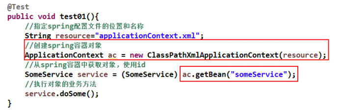

### 2.1.4 使用 spring 创建非自定义类对象

> spring 配置文件加入 java.util.Date 定义：
>
> <bean id="myDate" class="java.util.Date" />

### 2.1.5 容器接口和实现类

**ApplicationContext 接口（容器）**

> 1. ApplicationContext 用于加载 Spring 的配置文件，在程序中充当“容器”的角色。其实现类有两个。
>
> > 
>
> ​	**2**.**ApplicationContext** **容器中对象的装配时机**
>
> > **ApplicationContext 容器，会在容器对象初始化时，将其中的所有对象一次性全部装配好。**以后代码中若要使用到这些对象，只需从内存中直接获取即可。**执行效率较高。但占用内存。**
>
> ​	**3.使用 spring 容器创建的 java 对象(mvc架构的现实应用)**
>
> 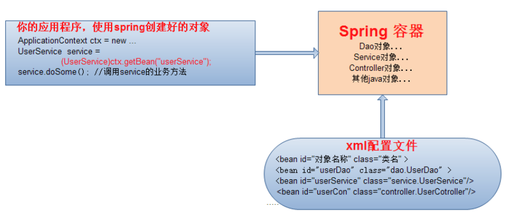

## 2.2基于 XML 的 DI

### 2.2.1 注入分类

> - bean 实例在调用无参构造器创建对象后，就要对 bean 对象的属性进行初始化。**初始化是由容器自动完成的，称为注入。**
> - 根据注入方式的不同，常用的有两类：**set 注入、构造注入**

#### （1） set 注入(掌握)

set 注入也叫设值注入是指，通过 **setter 方法**传入被调用者的实例。

##### **1.简单类型（spring中认为Java中的基本数据类型和String都是基本数据类型）**


```xml
 <bean id="myStudent" class="com.c02.Student">
/*spring调用setName(),若该方法，没有则会报错，spring创建对象赋值时，不考虑是否存在该属性，而是寻找该‘name’的set方法*/
        <property name="name" value="张三"></property>
        <property name="age" value="20"></property>
    </bean>
```

##### **2.引用类型**

> 当指定 bean 的某属性值为另一 bean 的实例时，**通过 ref 指定它们间的引用关系**。**ref**的值必须为某 bean 的 **id** 值。

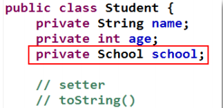

> 1. 使用<bean>标签声明School对象
> 2. 在Student对象的声明中使用<bean>标签的ref属性
>
> 

#### （2） 构造注入(理解)

> 构造注入是指，在构造调用者实例的同时，完成被调用者的实例化。即，使用构造器设置依赖关系。

```xml
 <!--使用name属性-->
    <bean id="myStudent1" class="com.c02.Student">
        <constructor-arg name="name" value="张三"></constructor-arg>
        <constructor-arg name="age" value="20"></constructor-arg>
        <constructor-arg name="school" ref="school"></constructor-arg>
    </bean>

    <!--使用索引属性-->
    <bean id="myStudent2" class="com.c02.Student">
        <constructor-arg index="0" value="张三"></constructor-arg>
        <constructor-arg index="1" value="20"></constructor-arg>
        <constructor-arg index="2" ref="school"></constructor-arg>
    </bean>
```

> - 在构造方法中给属性赋值构造注入使用**<constructor-arg>**标签
>
> - > - 一个< constructor-arg>表示构造方法一个参数。
>   >
>   > -  < constructor-arg>标签属性:
>   >
>   > - > -  name:表示构造方法的形参名
>   >   > -  index:表示构造方法的参数的位置,参数从左往右位置是0, 1 ,2的顺序
>   >   > -  value :构造方法的形参类型是简单类型的，使用value
>   >   > -  ref:构造方法的形参类型是引用类型的,使用ref


### **2.3.2** **引用类型属性自动注入**

> 对于引用类型属性的注入，也可不在配置文件中显示的注入。可以通过为<bean/>标签
> **设置 autowire 属性值**，为引用类型属性进行**隐式自动注入**（默认是不自动注入引用类型属 性）。根据自动注入判断标准的不同，可以分为两种：
>
> - > byName：根据**名称自动注入**
>   > byType： 根据**类型自动注入**

#### （1） byName 方式自动注入

> 当配置文件中**被调用者 bean 的 id 值与代码中调用者 bean 类的属性名相同**时，可使用byName 方式，让容器自动将被调用者 bean 注入给调用者 bean。容器是通过调用者的 bean类的属性名与配置文件的被调用者 bean 的 id 进行比较而实现自动注入的。

```xml
public class Student {
    private String name;
    private Integer age;
    private School school;
		setter();
    }
<!--引用类型：使用byName注入-->
<bean id="myStudent" class="com.c02.Student" autowire="byName"><!--设置autowire-->
        <property name="name" value="张三"></property>
        <property name="age" value="20"></property>
    </bean>
    <bean id="school" class="com.c02.School" >
        <property name="name" value="北京大学"></property>
        <property name="address" value="北京"></property>
    </bean>
```

#### （2） byType 方式自动注入

> 使用 byType 方式自动注入，要求：配置文件中被调用者 bean 的 class 属性指定的类，要与代码中调用者 bean 类的某引用类型属性类型同源。
>
> > 同源就是一类的意思:(例子：前Student,后School)
> > java类中引用类型的数据类型和bean的**class的值是―样**的。
> >
> > java类中引用类型的数据类型和bean的class的值**父子类**关系的。
> >
> > java类中引用类型的数据类型和bean的class的值**接口和实现类**关系的

```xml
	<bean id="school" class="com.c02.School" >
        <property name="name" value="北京大学"></property>
        <property name="address" value="北京"></property>
    </bean>
     <bean id="myStudent2" class="com.c02.Student" autowire="byType">
        <property name="name" value="张三"></property>
        <property name="age" value="20"></property>
    </bean>
```

### **2.2.3** **为应用指定多个** **Spring** **配置文件**

> 1. 多个配置优势
>    1.每个文件的大小比一个文件要小很多。效率高
>    2.避免多人竞争带来的冲突。
>
> 2. 多文件的分配方式：
>
>     1. **按功能模块**，一个模块一个配置文件
>     2. 按**类的功能**，数据库相关的配置一个**文件配置文件**， 做事务的功能一个配置文件， 做service功能的一个配置文件等

**包含关系的配置文件：**

> spring-total表示主配置文件:包含其他的配置文件的，主配置文件一般是不定义对象的。
>
> - 语法:<import resource=“其他配置文件的路径"/>
>   关键字:"classpath:”表示类路释( class文件所在的目录），
>   在spring的配置文件中要指定其他文件的位置，需要使用classpath ,告诉spring到哪去加载读取文件。

```xml
 	<import resource="classpath:c06/spring-school.xml"></import>
    <import resource="classpath:c06/spring-student.xml"></import>
<!--在包含关系的配置文件中，可以通配符（*:表示任意字符)
注意:主配置文件名称不能包含在通配符的范围内（不能叫做spring-total.xml),不然会出现报错（死循环）
-->
<import resource="classpath:c06/spring-*.xml"></import>
```

## 2.4 基于注解的 DI

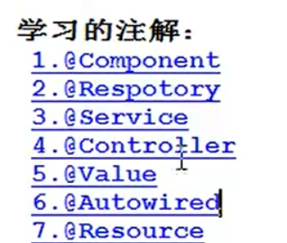

**在 Spring 配置文件中配置组件扫描器，用于在指定的基本包中扫描注解。**

> - **声明组件扫描器**(component-scan) ,组件就是java对象
> - **base-package** :指定注解在你的项目中的包名。
> - component-scan工作方式: spring会扫描遍历base-package指定的包，把包中和子包中的所有类,找到类中的注解，按照注解的功能**创建对象**，或给**属性赋值**。

```xml
    <context:component-scan base-package="com.c02"></context:component-scan>
```

**指定多个包的三种方式：**

```xml
<context: component-scan base-package="com.bjpowernode.ba01"/>
<context :component-scan base-package="com.bjpowernode.ba02"/>
<!--第二种方式:使用分隔符(;或,)分隔多个包名-->
<context: component-scan base-package="com. bjpowernode.ba01; com.bjpowernode.ba02"/>
<!--第三种方式:指定父包。
但不建议使用顶级的父包，扫描的路径比较多，导致容器启动时间变慢-->
<context : component-scan base-package="com.bjpowernode”/>
```

### 2.4.1 定义 Bean 的注解@Component(掌握)

> **@component:**创建对象的，等同于bean>的功能
>
> - **属性**:value就是对象的名称，也就是bean的id值，value的值是唯一的，创建的对象在整个spring容器中就一个
>
> - **不指定对象名称,由spring提供默认名称:类名的首字母小写**
>
> - **位置**:在类的上面
>
> - ```xml
>   @component(value = "mystudent")等同于
>   <bean id="mystudent" class="com.bjpowernode.bao1.student"/>
>   ```

```java
@Component(value ="school")//不适用value默认生成的对象id为首字母小写
public class School {}
```

> 另外，Spring 还提供了 3 个创建对象的注解：
>
> ➢ **@Repository** 用于对 DAO 实现类进行注解
>
> ➢ **@Service** 用于对 Service 实现类进行注解
>
> ➢ **@Controller** 用于对 Controller 实现类进行注解
>
> 这三个注解与@Component 都可以创建对象，但这三个注解还有其他的含义，
>
> **@Service创建业务层对象，业务层对象可以加入事务功能，@Controller 注解创建的对象可以作为处理器接收用户的请求。**
>
> @Repository，@Service，@Controller 是对@Component 注解的细化，标注不同层的对象。即持久层对象，业务层对象，控制层对象。

### 2.4.2 简单类型属性注入@Value(掌握)

> **@value**:**简单类型**的属性赋值
>
> - 属性:value是string类型的，表示简单类型的属性值
> - 位置:1.在属性定义的上面，无需set方法，推荐使用。2.在set方法的上面

```java
@Component
public class Student {
    @Value(value = "张三")
    private String name;
    @Value(value ="20")
    private Integer age;}
```

### 2.4.3 byType 自动注入@Autowired(掌握)

> **引用类型**
> **@Autowired**: spring框架提供的注解，实现引用类型的赋值。
>
> - spring中通过注解给引用类型赋值，使用的是自动注入原理，支持byName，byType
> - @Autowired:**默认使用的是byType自动注人**。
> - 属性: **required** ,是一个boolean类型的，默认true
>   required=true :表示引用类型赋值失败，**程序报错，并终止执行。**
>   required=false :引用类型如果赋值失败，**程序正常执行，引用类型是null**
> - 位置:1)在属性定义的上面，无需set方法，推荐使用 2)在set方法的上面

```java
@Component
public class Student {
    @Autowired
    private School school;}
@Component
	public class School {}
```

> **注意(以以上例子说明）：若Student类中使用@AutoWried赋值。实体类School中通过@Component注解，和在spring配置文件中使用<bean></bean>声明一个对象时。优先读取配置文件。**

### 2.4.4 byName 自动注入@Autowired 与@Qualifier(掌握)

> 如果要使用byName方式，需要做的是:
>
> 1. 在属性上面加入**@Autowired**
> 2. 在属性上面加入**@Qualifier(value="bean的id)** :表示使用指定名称的bean完成赋值。

```java
@Component
public class Student {
    @Autowired
    @Qualifier("mySchool")
    private School school;}
```

### 2.4.5 JDK 注解@Resource 自动注入(掌握)

> **引用类型@Resource**:来自jdk中的注解，spring框架提供了对这个注解的功能支持，可以使用它给引用类型进行赋值。使用的也是自动注入原理，支持byName , byType .**默认是byName**
>
> - 位置:1.在属性定义的上面，无需set方法，推荐使用。2.在set方法的上面
> - **重点：默认是byName :先使用byName自动注入，如果byName赋值失败，再使用byType**

```java
@Component
public class Student {
    @Resource
    private School school;}
```

**@Resource只使用byName:**

```java
/*resource只使用byName方式,需要增加一个属性:name
		name的值是bean的id(名称)*/
	@Resource(name="mySchool")
    private School school;
```

### **2.4.6** **注解与** **XML** **的对比**

> 注解方式： 
>
> - 优点：方便、直观、高效（代码少，没有配置文件的书写那么复杂）。
> - 其弊端也显而易见：以硬编码的方式写入到 Java 代码中，修改是需要重新编译代码的。
>
> XML 方式： 
>
> - 优点：配置和代码是分离的、在 xml 中做修改，无需编译代码，只需重启服务器即可将新的配置加载。缺点是：编写麻烦，效率低，大型项目过于复杂。

# 第3章AOP 面向切面编程

## 3.1不使用 AOP 的开发方式（理解）

> 先定义好接口与一个实现类，该实现类中除了要实现接口中的方法外，还要再写两个非业务方法。非业务方法也称为交叉业务逻辑：
>
> ➢ doTransaction()：用于事务处理
>
> ➢ doLog()：用于日志处理
>
> 然后，再使接口方法调用它们。接口方法也称为主业务逻辑。

交叉业务逻辑代码放到专门的工具类或处理类中，由主业务逻辑调用。

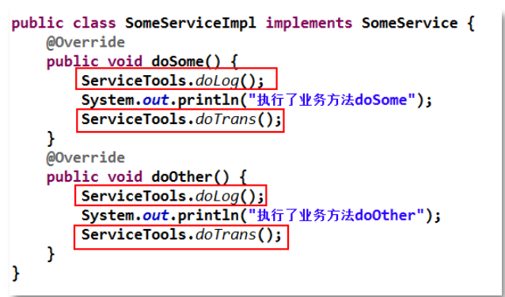

> 存在弊端：交叉业务与主业务深度耦合在一起。当交叉业务逻辑较多时，在主业务代码中会出现大量的交叉业务逻辑代码调用语句，大大影响了主业务逻辑的可读性，降低了代码的可维护性，同时也增加了开发难度。所以，可以**采用动态代理方式。在不修改主业务逻辑的前提下，扩展和增强其功能。**

### （1）动态代理

>  1.实现方式：
>
> - jdk动态代理，使用jdk中的Proxy，Method，InvocaitonHanderl创建代理对象。jdk动态代理要求目标类必须实现接口
> - cglib动态代理：第三方的工具库，创建代理对象，原理是继承。 通过继承目标类，创建子类。子类就是代理对象。 要求目标类不能是final的， 方法也不能是final的
>
> 2.动态代理的作用：
>
> - 在目标类源代码不改变的情况下，增加功能。
> - 减少代码的重复
> - 专注业务逻辑代码
> - 解耦合，让你的业务功能和日志，事务非业务功能分离。

### （2）AOP（Aspect Orient Programming）面向切面编程

> - Aop:面向切面编程， 基于动态代理的，可以使用jdk，cglib两种代理方式。
>   Aop就是动态代理的规范化， 把动态代理的实现步骤，方式都定义好了， 
>   让开发人员用一种统一的方式，使用动态代理。
>
>   Aspect: 切面，给你的目标类增加的功能，就是切面。 像上面用的日志，事务都是切面。
>   切面的特点： 一般都是非业务方法，独立使用的。
>
> -  怎么理解面向切面编程 ？ 
>
>   > ​    1）需要在分析项目功能时，找出切面。
>   > ​	2）合理的安排切面的执行时间（在目标方法前， 还是目标方法后）
>   > ​	3）合理的安全切面执行的位置，在哪个类，哪个方法增加增强功能
>
> -  术语：
>
> > - Aspect:切面，表示**增强的功能**， 就是一堆代码，完成某个一个功能。非业务功能，常见的切面功能有日志， 事务， 统计信息， 参数检查， 权限验证。
> > - JoinPoint:连接点 ，连接业务方法和切面的**位置**。 就某类中的业务方法
> > - Pointcut : 切入点 ，指**多个连接点方法的集合**。多个方法
> > - 目标对象： 给哪个类的方法增加功能， 这个类就是目标对象
> >
> > - Advice:通知，通知表示切面功能**执行的时间**。
>
> - aop的实现
>
> - > aop的技术实现框架：
>   >
>   > 1. spring：spring在内部实现了aop规范，能做aop的工作。 spring主要在事务处理时使用aop。我们项目开发中很少使用spring的aop实现。 因为spring的aop比较笨重。
>   > 2. aspectJ: 一个开源的专门做aop的框架。spring框架中集成了aspectj框架，通过spring就能使用aspectj的功能。
>   >
>   >  aspectJ框架实现aop有两种方式：
>   >
>   > > - 使用xml的配置文件 ： 配置全局事务
>   > >
>   > > - 使用注解，我们在项目中要做aop功能，一般都使用注解， aspectj有5个注解。
>   > >
>   > > - > ```xml-dtd
>   > >   > 	1）@Before前置通知
>   > >   > 	2）@AfterReturning后置通知
>   > >   > 	3）@Around环绕通知
>   > >   > 	4）@AfterThrowing异常通知
>   > >   > 	5）@After最终通知
>   > >   > ```

## 3.2 AspectJ 的切入点表达式(掌握)

> 表达式的原型是：
>
> **execution(访问权限 方法返回值 方法声明(参数) 异常类型)**
>
> ```xml-dtd
> execution(modifiers-pattern? ret-type-pattern 
> declaring-type-pattern?name-pattern(param-pattern)
>  throws-pattern?)
> 解释：
> modifiers-pattern 访问权限类型
> ret-type-pattern 返回值类型
> declaring-type-pattern 包名类名
> name-pattern(param-pattern) 方法名(参数类型和参数个数)
> throws-pattern 抛出异常类型
> ？表示可选的部分
> ```

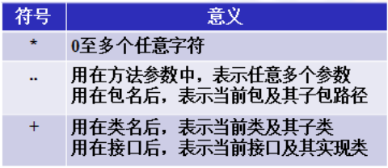

> - **execution(public * *(..))**    任意公共方法。
> - **execution(* set*(..))** 	任何一个以“set”开始的方法。
> - **execution(* com.xyz.service.* . *(..))**	定义在 service 包里的任意类的任意方法。
> - **execution(* com.xyz.service.. *. * (..))	定义在 service 包或者子包里的任意类的任意方法。“..”出现在类名中时，后面必须跟“*****”**，表示包、子包下的所有类。
> - ***execution(* * *..service. * .*(..))**	指定所有包下的 serivce 子包下所有类（接口）中所有方法为切入点

## 3.3 AspectJ 基于注解的 AOP 实现(掌握)

### (1)实现步骤

> 1. 新建maven项目
> 2. 加入依赖
>    1 ) spring依赖 **2 ) aspectj依赖** 3 ) junit单元测试
> 3. 创建目标类:接口和他的实现类。要做的是给类中的方法增加功能
> 4. 创建切面类:普通类
>    **1)在类的上面加入@Aspect**
>    **2）在类中定义方法，方法就是切面要执行的功能代码在方法的上面加入aspectj中的通知注解，例如@Before有需要指定切入点表达式execution()**
> 5. 创建spring的配置文件:声明对象,把对象交给容器统―管理声明对象你可以使用注解或者xml配置文件<bean>
>    1)  声明目标对象(可以使用注解)
>    2）声明切面类对象(可以使用注解)
>    3）**声明aspectj框架中的自动代理生成器标签。**
>    	自动代理生成器∶用来完成代理对象的自动创建功能的。
> 6. 创建测试类，从spring容器中获取目标对象（实际就是代理对象)。通过代理执行方法,实现aop的功能增强。

### （2）使用注解的共用操作

**xml配置文件:声明aspectj框架中的自动代理生成器标签。**

> 声明自动代理生成器:使用aspectj框架内部的功能，**创建目标对象的代理对象**。**创建代理对象是在内存中实现的，修改目标对象的内存中的结构**。创建为代理对象所以目标对象就是被修改后的代理对象
>
> 在定义好切面 Aspect 后，需要通知 Spring 容器，让容器生成**“目标类+ 切面”**的代理对象。这个代理是由容器自动生成的。只需要在 Spring 配置文件中注册一个基于 aspectj 的自动代理生成器，其就会**自动扫描到@Aspect 注解，并按通知类型与切入点，将其织入，并生成代理。**
>
> **其工作原理是，<aop:aspectj-autoproxy/>通过扫描找到@Aspect 定义的切面类，再由切面类根据切入点找到目标类的目标方法，再由通知类型找到切入的时间点。**
>
> **aspectj-autoproxy:**会把spring容器中的所有的**目标对象**，**一次性都生成代理对象**。

```xml
<aop:aspectj-autoproxy></aop:aspectj-autoproxy>
```

**java类：加入@Aspect**

> @Aspect:是aspectj框架中的注解。
>
> - 作用:表示当前类是切面类。
> - 切面类:是用来给业务方法增加功能的类，在这个类中有切面的功能代码
> - 位置:在类定义的上面

**java类:定义切面方法。使用AOP注解**

> - 定义方法，方法是实现切面功能的。
> - 方法的定义要求:
>
> > 1. 公共方法 public
> > 2. 方法没有返回值（不同的注解不相同）
> > 3. 方法名称自定义
> > 4. 方法可以有参数，也可以没有参数。如果有参数，参数不是自定义的，有几个参数类型可以使用

### （3） [掌握]@Before 前置通知-方法有 JoinPoint 参数

> @Before:前置通知注解
>
> - 属性: **value ,是切入点表达式**，表示切面的功能执行的位置。
>
> - 位置:在方法的上面
>
> - **特点:1.在目标方法之前先执行的 2.不会改变目标方法的执行结果 3.不会影响目标方法的执行。**
>
> - **参数：方法有JoinPoint 参数（后面的注解都可以使用该参数）**
>
> - > JoinPoint:业务方法,要加入切面功能的**业务方法**
>   > 作用是:可以在通知方法中**获取方法执行时的信息**，例如方法名称，方法的实参。如果你的切面功能中需要用到方法的信息，就加入Joinpoint.
>   > 这个JoinPoint参数的值是由框架赋予，**必须是第一个位置的参数**
>   >
>   > ```java
>   > //获取方法的完整定义
>   > system.out.println("方法的签名（定义）="+jp.getsignature());
>   > system.out.println("方法的名称="+jp.getsignature().getName());//获取方法的实参
>   > object args []= jp.getArgs();
>   >              for (object arg:args){system.out.println("参数="+arg;}
>   > 
>   > ```

```java
@Component//切面类
@Aspect
public class MyAspect {
@Before(value="execution(* com.c01.SomeServiceImp.doSome(..))")
    public void Mybefore(JoinPoint jp){//切面方法
        System.out.println(jp.getSignature().getName());//方法名称
        System.out.println("前置通知，在方法执行之前执行，输出执行时间："+new Date());
    }}
```

```java
@Component//目标类
public class SomeServiceImp implements SomeService {
    @Override
    public void doSome(String name, Integer age) {
        System.out.println("====dosome方法执行====");
    }
```

```xml
 	<!--配置对象扫描器-->
    <context:component-scan base-package="com.c01"></context:component-scan>
    <!--声明自动代理生成器-->
    <aop:aspectj-autoproxy></aop:aspectj-autoproxy>
```

### （4） [掌握]@AfterReturning 后置通知-注解有 returning 属性

> - 后置通知定义方法,方法是实现切面功能的。
> - 方法的定义要求;
>
> > 1. 公共方法 public
> > 2. 方法没有返回值
> > 3. 方法名称自定义
> > 4. 方法有参数的,推荐是object,参数名自定义

> @AfterReturning:后置通知
>
> - 属性: 
>
> - > 1.**value切入点表达式**
>   > 2.returning自定义的变量，表示目标方法的返回值的。**自定义变量名必须和通知方法的形参名一样。**
>
> - 位置:在方法定义的上面
>
> - 特点:
>   1.在目标方法之后执行的。
>   2.能够获取到目标方法的返回值，可以根据这个返回值做不同的处理功能
>                        object res = doOther()
>   3.**可以修改这个返回值**

```java
@AfterReturning(value="execution(* com.c01.SomeServiceImp.doOther(..))",returning = "res")
    public void MyAfter(Object res){//该参数是目标类中的方法执行后的结果
        System.out.println("后置通知，在方法执行之后执行，输出执行结果："+res);
        res="123456";
        System.out.println(res);
    }
```

### （5） [掌握]@Around 环绕通知-增强方法有 ProceedingJoinPoint参数

> 环绕通知方法的定义格式
>
> - 1.public
> - 2.必须有一个**返回值**，推荐使用object
> - 3.方法名称自定义
> - 4.方法有参数，**固定的参数ProceedingjoinPoint**

> @Around.环绕通知
>
> - 属性:value切入点表达式
>
> - 位置:在方法的定义
>
> - 特点：
>
> - > 1.它是功能最强的通知
>   >
>   > 2.在目标方法的前和后都能增强功能。
>   >
>   > 3.控制目标方法是否被调用执行
>   >
>   > 4.修改原来的目标方法的执行结果。**影响最后的调用结果**
>   > **环绕通知，等同于jdk动态代理的，InvocationHandler接口**
>
> - 参数:ProceedingJoinPoint就等同于**Method**
>   作用:执行目标方法
>   返回值:就是目标方法的执行结果，可以被修改。
>
> - **环绕通知:经常做事务，在目标方法之前开启事务，执行目标方法，在目标方法之后提交事务**

```java
@Around(value = "execution(* *..SomeServiceImp.doFrist(..))")
    public Object MyAround(ProceedingJoinPoint res) throws Throwable {//相当于MyHandler中的Method函数中的第二个参数
        /*类似动态代理*/
        System.out.println("环绕通知，在方法执行之前执行，输出执行结果："+new Date());
        Object obj=res.proceed();//目标方法的执行
        System.out.println("环绕通知，在方法执行之后执行，输出执行结果："+res.getSignature().getName());
        return obj;
    }
```

### （6） [了解]@AfterThrowing 异常通知-注解中有 throwing 属性

> 异常通知方法的定义格式
>
> - 1.public
> - 2.没有返回值
> - 3.方法名称自定义
> - 4.方法有个一个Exception ,如果还有是JoinPoint,

> @AfterThrowing:异常通知
>
> - 属性:
>
> - > 1. value切入点表达式 
>   > 2. throwinng自定义的变量，表示**目标方法抛出的异常对象。变量名必须和方法的参数名一样**
>
> - 特点:
>
> - > 1．在目标方法抛出异常时执行的
>   > 2．**可以做异常的监控程序，监控目标方法执行时是不是有异常。**
>   > **如果有异常，可以发送邮件，短信进行通知**

```java
@AfterThrowing(value = "execution(* *..SomeserviceImpl.doSecond(. .))"，
throwing = “ex")
public void myAfterThrowing(Exception ex){
system.out.println("异常通知:方法发生异常时，执行: "+ex.getMessage());
    //发送邮件﹐短信,通知开发人员
}
```

### （7） [了解]@After 最终通知

> @After:最终通知
>
> - 属性:value切入点表达式
> - 位置:在方法的上面
> - **特点(finally):**
>   **1.总是会执行**
>   **2.在目标方法之后执行的**

### （8） @Pointcut 定义切入点

> @Pointcut:**定义和管理切入点**，如果你的项目中有多个切入点表达式是重复的，可以复用的。可以使用@Pointcut
>
> - 属性: value切入点表达式
> - 位置:在自定义的方法上面
> - 特点:
>   当使用@Pointcut定义在一个方法的上面，此时这个**方法的名称就是切入点表达式的别名**。其它的通知中，**value属性就可以使用这个方法名称，代替切入点表达式了**

```java
@Pointcut(value ="execution(* *..Someservice1mpl.doThird(..))”)
          public void mypt(){//无需代码}
---------------------------------------------------------
    @Before(value="mypt()")<---------
    public void Mybefore(JoinPoint jp){//切面方法}
```

### (9)存在接口，并且希望使用cglib代理：

> 如果你期望目标类有接口,使用cglib代理。**proxy-target-class="true"**:告诉框架，要使用cglib动态代理

```xml
<aop: aspectj-autoproxy proxy-target-class="true"/>
```

# 第4章Spring 集成 MyBatis

> 把mybatis框架和spring集成在一起，向一个框架一样使用。
>
> - 用的技术是：ioc 。
>
> > ​	为什么ioc：能把mybatis和spring集成在一起，像一个框架， 是因为ioc能创建对象。可以把mybatis框架中的对象交给spring统一创建， 开发人员从spring中获取对象。开发人员就不用同时面对两个或多个框架了， 就面对一个spring
>
> - mybatis使用步骤，对象
>
> > 1. 定义dao接口 ，StudentDao
> > 2. 定义mapper文件 StudentDao.xml
> > 3. 定义mybatis的主配置文件 mybatis.xml
> > 4. 创建dao的代理对象，StudentDao dao =     SqlSession.getMapper(StudentDao.class);
>
>  	  List<Student> students  = dao.selectStudents();
>
> - 要使用dao对象，需要使用getMapper()方法怎么能使用getMapper()方法，需要哪些条件
>
> > 1. 获取SqlSession对象， 需要使用SqlSessionFactory的openSession()方法。
> > 2. 创建SqlSessionFactory对象。 通过读取mybatis的主配置文件，能创建SqlSessionFactory对象
> > 3. 需要SqlSessionFactory对象， 使用Factory能获取SqlSession ，有了SqlSession就能有dao ， 目的就是获取dao对象
>
> 我们会使用独立的连接池类替换mybatis默认自己带的， 把连接池类也交给spring创建。
>
> > - 通过以上的说明，我们需要让spring创建以下对象
> > - **1.独立的连接池类的对象， 使用阿里的druid连接池**
> >   **2.SqlSessionFactory对象**
> >   **3.创建出dao对象**

**Mybatis.xml配置文件：**

```xml
<configuration>
    <!--日志配置-->
    <settings>
        <setting name="logImpl" value="STDOUT_LOGGING"/>
    </settings>
    <!--mapper文件位置-->
    <mappers>
        <package name="com.c01.dao"/>
    </mappers>
</configuration>
```

## 4.1开发步骤

> 开发步骤：
>
> 1. 新建maven项目
> 2. 加入maven的依赖
>      1）spring依赖
>      2）mybatis依赖
>      3）mysql驱动
>      4）spring的事务的依赖
>      5）mybatis和spring集成的依赖： mybatis官方体用的，用来在spring项目中创建mybatis的SqlSesissonFactory，dao对象的
> 3. 创建实体类
> 4. 创建dao接口和mapper文件
> 5. 创建mybatis主配置文件
> 6. 创建Service接口和实现类，属性是dao。
> 7. 创建spring的配置文件：声明mybatis的对象交给spring创建
>     **1）数据源DataSource**
>     **2）SqlSessionFactory**
>     **3) Dao对象**
>     **4）声明自定义的service**
> 8. 创建测试类，获取Service对象，通过service调用dao完成数据库的访问

**applicationContext.xml配置：**

```xml
 <!--声明数据源DataSource，作用是连接数据库的-->
<bean id="MydataSource" class="com.alibaba.druid.pool.DruidDataSource" init-method="init" destroy-method="close">
    <property name="url" value="jdbc:mysql://localhost:3360/springdb" />
    <property name="username" value="root" />
    <property name="password" value="999125" />
    <property name="maxActive" value="20"></property>
    </bean>
<!--把数据库的配置信息，写在一个独立的文件,编译修改数据库的配置内容spring知道jdbc.properties文件的位置-->

<!-- <bean id="MydataSource" class="com.alibaba.druid.pool.DruidDataSource" init-method="init" destroy-method="close">
    <property name="url" value="${jdbc.url}" />
    <property name="username" value="${jdbc.username]}" />
    <property name="password" value="${jdbc.password}" />
    <property name="maxActive" value="20"></property>
    </bean>-->

<!--声明的是mybatis中提供的sqlsessionFactoryBean类，这个类内部创建sqlsessionFactory的
-->
    <bean id="sqlSessionFactory" class="org.mybatis.spring.SqlSessionFactoryBean">
        <property name="dataSource" ref="MydataSource"></property>
    <!----mybatis主配置文件的位置configLocation属性是Resource类型，读取配置文件
          它的赋值，使用value ,指定文件的路径，使用classpath:表示文件的位置-->        
        <property name="configLocation" value="classpath:Mybatis.xml"></property>
    </bean>

<!--创建dao对象,使用sqlsession的getMapper ( studentDao.class )
MapperScannerConfigurer:在内部调用getMapper()生成每个dao接口的代理对象。-->
    <bean class="org.mybatis.spring.mapper.MapperScannerConfigurer">
        <property name="sqlSessionFactoryBeanName" value="sqlSessionFactory"></property>
<!--指定包名，包名是dao接口所在的包名。
MapperScannerConfigurer会扫描这个包中的所有接口,把每个接口都执行一次getMapper()方法，得到每个接口的dao对象。创建好的dao对象放入到spring的容器中的。-->
        <property name="basePackage" value="com.c01.dao"></property>
    </bean>
```

> **声明数据源DataSource====原Mybatis.xml文件中的<environment>标签中的内容**
>
> **创建sqlsessionFactory，其中的参数MydataSource，configLocation结合，等同与原来的Mybatis.xml文件。（原来也是通过整个的Mybatis文件创建出sqlsessionFactory）**

**自定义的service（1.使用配置文件。2.使用注解）**

# 第5章Spring 事务

## 5.1Spring 的事务管理

> - > **事务是指一组sql语句的集合， 集合中有多条sql语句可能是insert ， update ，select ，delete， 我们希望这些多个sql语句都能成功，或者都失败， 这些sql语句的执行是一致的，作为一个整体执行。**
>
> 事务原本是数据库中的概念，在 Dao 层。但一般情况下，需要将事务提升到业务层，即 Service 层。这样做是为了能够使用事务的特性来管理具体的业务。因为业务方法会调用多个dao方法，执行多个sql语句。
>
> 在 Spring 中通常可以通过以下两种方式来实现对事务的管理：
>
> > - 使用 Spring 的事务注解管理事务
> > - 使用 AspectJ 的 AOP 配置管理事务

## 5.2当前所学知识对事务的处理有何不足？

> - 不同的数据库访问技术，处理事务的对象，方法不同，需要了解不同数据库访问技术使用事务的原理
> - 掌握多种数据库中事务的处理逻辑。什么时候提交事务，什么时候回顾事务
> - 处理事务的多种方法。
>
>   总结： 就是多种数据库的访问技术，有不同的事务处理的机制，对象，方法。

## 5.3解决不足

>   spring提供一种处理事务的统一模型， 能使用统一步骤，方式完成多种不同数据库访问技术的事务处理。
>
> -   使用spring的事务处理机制，可以完成mybatis访问数据库的事务处理
> -   使用spring的事务处理机制，可以完成hibernate访问数据库的事务处理。

## 5.4处理事务，需要怎么做

> 事务内部提交，回滚事务，使用的事务管理器对象，代替你完成commit，rollback     
>
> 事务管理器是一个接口和他的众多实现类。
>
> - 接口：**PlatformTransactionManager ，定义了事务重要方法 commit ，rollback**     
>
> - 实现类：**spring把每一种数据库访问技术对应的事务处理类都创建好了。**
>
> - >   **mybatis访问数据库---spring创建好的是DataSourceTransactionManager**    
>   >
>   >   hibernate访问数据库----spring创建的是HibernateTransactionManager
>
> - 你需要**告诉spring 你用是那种数据库的访问技术**，怎么告诉spring呢？
>
> - > 声明数据库访问技术对于的事务管理器实现类， 在spring的配置文件中使用<bean>声明就可以了
>   >   例如，你要使用mybatis访问数据库，你应该在xml配置文件中
>   >   <bean id=“xxx" class="...DataSourceTransactionManager"> //mybatis

## 5.5业务方法需要什么样的事务，说明需要事务的类型。

> - 定义了五个事务隔离级别常量(掌握)
>
> > 这些常量均是以 ISOLATION_开头。即形如 ISOLATION_XXX。 
> > ➢ DEFAULT：采用 DB 默认的事务隔离级别。MySql 的默认为 REPEATABLE_READ； Oracle
> > 默认为 READ_COMMITTED。 
> > ➢ READ_UNCOMMITTED：读未提交。未解决任何并发问题。
> > ➢ READ_COMMITTED：读已提交。解决脏读，存在不可重复读与幻读。
> > ➢ REPEATABLE_READ：可重复读。解决脏读、不可重复读，存在幻读
> > ➢ SERIALIZABLE：串行化。不存在并发问题。
>
> - 事务的超时时间： 表示一个方法最长的执行时间，如果**方法执行时超过了时间，事务就回滚**。单位是秒， 整数值， 默认是 -1. 
>
> - 事务的传播行为 :
>
> - > 所谓事务传播行为是指，处于不同事务中的方法在相互调用时，执行期间事务的维护情况。如，A 事务中的方法 doSome()调用 B 事务中的方法 doOther()，在调用执行期间事务的维护情况，就称为事务传播行为。事务传播行为是加在方法上的。
>
> - > 控制业务方法是不是有事务的， 是什么样的事务的。
>   > 	    7个传播行为，表示你的业务方法调用时，事务在方法之间是如果使用的。
>   >
>   > ```xml-dtd
>   > 	PROPAGATION_REQUIRED
>   > 	PROPAGATION_REQUIRES_NEW
>   > 	PROPAGATION_SUPPORTS
>   > 	以上三个需要掌握的
>   > 	PROPAGATION_MANDATORY
>   > 	PROPAGATION_NESTED
>   > 	PROPAGATION_NEVER
>   > 	PROPAGATION_NOT_SUPPORTED
>   > ```

### 5.5.1**PROPAGATION_REQUIRED**：

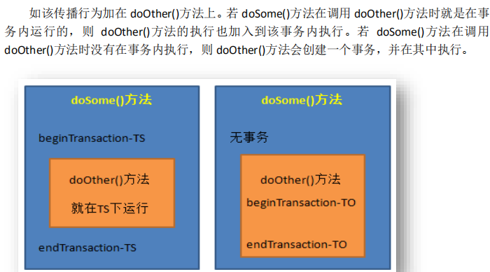

### 5.5.2**PROPAGATION_SUPPORTS**

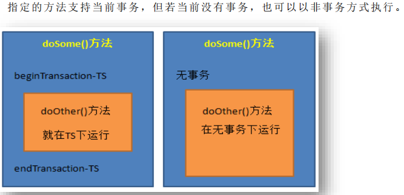

### 5.5.3**PROPAGATION_REQUIRES_NEW**

总是新建一个事务，若当前存在事务，就将当前事务挂起，直到新事务执行完毕。

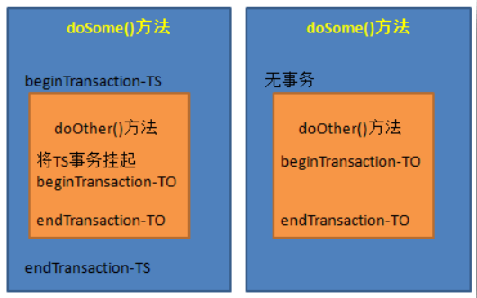

## 5.6事务提交事务，回滚事务的时机

> - 当你的业务方法，执行成功，没有异常抛出，当方法执行完毕，spring在方法执行后提交事务。事务管理器commit
>
> - 当你的业务方法抛出运行时异常或ERROR， spring执行回滚，调用事务管理器的rollback运行时异常的定义： RuntimeException  和他的子类都是运行时异常， 例NullPointException , NumberFormatException
>
> - 
>
> -  当你的业务方法抛出非运行时异常， 主要是受查异常时，提交事务
>
> - 受查异常：在你写代码中，必须处理的异常。例如IOException, SQLException
>
> - > - Throwable 类是 Java 语言中所有错误或异常的超类。只有当对象是此类(或其子类之一)的实例时，才能通过 Java 虚拟机或者 Java 的 throw 语句抛出。
>   >
>   > - Error 是程序在运行过程中出现的无法处理的错误，比如 OutOfMemoryError、
>   >
>   > - ThreadDeath、NoSuchMethodError 等。当这些错误发生时，程序是无法处理（捕获或抛出）的，JVM 一般会终止线程。
>   >
>   > - 程序在编译和运行时出现的另一类错误称之为异常，它是 JVM 通知程序员的一种方式。通过这种方式，让程序员知道已经或可能出现错误，要求程序员对其进行处理。
>   >
>   > - 异常分为运行时异常与受查异常。
>   >
>   > - > - 运行时异常，是 RuntimeException 类或其子类，即只有在运行时才出现的异常。如，NullPointerException、ArrayIndexOutOfBoundsException、IllegalArgumentException 等均属于运行时异常。这些异常由 JVM 抛出，在编译时不要求必须处理（捕获或抛出）。但，只要代码编写足够仔细，程序足够健壮，运行时异常是可以避免的。
>   >   > - 受查异常，也叫编译时异常，即在代码编写时要求必须捕获或抛出的异常，若不处理，则无法通过编译。如 SQLException，ClassNotFoundException，IOException 等都属于受查异常。
>   >   > - RuntimeException 及其子类以外的异常，均属于受查异常。当然，用户自定义的 Exception的子类，即用户自定义的异常也属受查异常。程序员在定义异常时，只要未明确声明定义的为 RuntimeException 的子类，那么定义的就是受查异常。

## 5.7实现步骤

>   1.管理事务的是 事务管理和他的实现类
>   2.spring的事务是一个统一模型
>      1）指定要使用的事务管理器实现类，使用<bean>
> 	  2）指定哪些类，哪些方法需要加入事务的功能
> 	  3）指定方法需要的隔离级别，传播行为，超时

## 5.8使用 Spring 的事务注解管理事务(掌握)

> ```xml
> 使用 Spring 的事务注解管理事务(掌握)
> 通过@Transactional 注解方式，可将事务织入到相应 public 方法中，实现事务管理。
> @Transactional 的所有可选属性如下所示：
> ➢ propagation：用于设置事务传播属性。该属性类型为 Propagation 枚举，默认值为Propagation.REQUIRED。 
> ➢ isolation：用于设置事务的隔离级别。该属性类型为 Isolation 枚举，默认值为Isolation.DEFAULT。 
> ➢ readOnly：用于设置该方法对数据库的操作是否是只读的。该属性为 boolean，默认值为 false。 
> ➢ timeout：用于设置本操作与数据库连接的超时时限。单位为秒，类型为 int，默认值为-1，即没有时限。
> ➢ rollbackFor：指定需要回滚的异常类。类型为 Class[]，默认值为空数组。当然，若只有一个异常类时，可以不使用数组。
> ➢ rollbackForClassName：指定需要回滚的异常类类名。类型为 String[]，默认值为空数组。当然，若只有一个异常类时，可以不使用数组。
> ➢ noRollbackFor：指定不需要回滚的异常类。类型为 Class[]，默认值为空数组。当然，若只有一个异常类时，可以不使用数组。
> ➢ noRollbackForClassName：指定不需要回滚的异常类类名。类型为 String[]，默认值为空数组。当然，若只有一个异常类时，可以不使用数组。
> 
> 需要注意的是，@Transactional 若用在方法上，只能用于 public 方法上。对于其他非 public
> 方法，如果加上了注解@Transactional，虽然 Spring 不会报错，但不会将指定事务织入到该方法中。因为 Spring 会忽略掉所有非 public 方法上的@Transaction 注解。
> 若@Transaction 注解在类上，则表示该类上所有的方法均将在执行时织入事务
> ```

### (1)**实现注解的事务步骤：**

```xml
<!--声明事务管理器-->
<bean id="transactionManager" class="org.springframework.jdbc.datasource.DataSourceTransactionManager">
    <!--连接的数据库，指定数据源--->
        <property name="dataSource" ref="MydateSources"></property>
    </bean>
<!--开启事务注解驱动，告诉spring使用注解管理事务，创建代理对象transaction-manager:事务管理器对象的id-->
    <tx:annotation-driven transaction-manager="transactionManager"></tx:annotation-driven>
```

```java
/* @Transactional(
            propagation = Propagation.REQUIRED,
            isolation = Isolation.DEFAULT,
            readOnly = false,
            rollbackFor = {
                    NullPointerException.class
            })*/

/*使用的是事务控制的默认值，默认的传播行为是REQUIRED，默认的隔离级别DEFAULT1默认抛出运行时异常,回滚事务。*/
	@Transactional
    @Override
    public void buy(Integer id, Integer buyamount) {}//业务方法
```

> rollbackFor:表示发生指定的异常一定回滚.
>
> - 处理逻辑是:
>
> > - spring框架会首先检查方法抛出的异常是不是在roLLbackFor的属性值中
> >   如果异常**在roLLbackFor列表中，不管是什么类型的异常，一定回滚。**
> > - 如果你的抛出的异常**不在rollbackFor列表中**，spring会判断**异常是不是RuntimeException**,如果是一定回滚

## 5.9使用 AspectJ 的 AOP 配置管理事务(掌握)

> 使用 XML 配置事务代理的方式的不足是，每个目标类都需要配置事务代理。当目标类较多，配置文件会变得非常臃肿。使用 XML 配置顾问方式可以**自动为每个符合切入点表达式的类生成事务代理**。其用法很简单，只需将前面代码中关于事务代理的配置删除，再替换为如下内容即可。

```xml
<!--声明事务管理器-->
<bean id="transactionManager" class="org.springframework.jdbc.datasource.DataSourceTransactionManager">
    <!--连接的数据库，指定数据源--->
        <property name="dataSource" ref="MydateSources"></property>
    </bean>

<!--2.声明业务方法它的事务属性(隔离级别，传播行为，超时时间)
id:自定义名称，表示<tx:advice>和</tx:advice>之间的配置内容的
transaction-manager:事务管理器对象的id-->
<tx:advice id="myAdvice" transaction-manager="transactionManager ">
<!--tx:attributes :配置事务属性-->
<tx:attributes>
        	
    <!--tx:method:给具体的方法配置事务属性,method可以有多个，分别给不同的方法设置事务属性
    name:方法名称,1）完整的方法名称，不带有包和类。
    2)方法可以使用通配符，*表示任意字符
    propagation :传播行为，枚举值
    isolation :隔离级别
    rollback-for :你指定的异常类名，全限定类名。发生异常一定回滚-->
	<tx:method name="buy" propagation="REQUIRED" isolation="DEFAULT"
rollback-for="java.lang.NullPointerException"/>
                                            
     <!--使用通配符，指定很多的方法
    <tx:method name="add*" propagation="REQUIRES_NEW"/>
    <tx :method name="modify*"/>
    <tx:method name="remove*"/>
    <tx:method name="*" propagation="SUPPORTS" read-only="true"/>-->
    
</tx:attributes>
</tx:advice>

<aop:config>
<!--指定某个包中的某个方法：将事务的等等配置与切入点表达式进行绑定。-->
<!--配置切入点表达式:指定哪些包中类，要使用事务
id:切入点表达式的名称，唯一值
expression :切入点表达式，指定哪些类要使用事务，aspectj会创建代理对象
com.bjpowernode.service
com.crm.service
com.service-->
<aop:pointcut id="servicept" expression="execution(* *..service..*.*(..))"/>
    <!----配置增强器:关联adivce和pointcut
        advice-ref:通知，上面tx:advice哪里的配置
        pointcut-ref :切入点表达式的id
-->
<aop:advisor advice-ref="myAdvice" pointcut-ref="servicePt"/>
</ aop:config>

```

> **当业务很少时，使用注解。较多时，使用配置文件的方式**

# 第6章Spring 与 Web

> 在 Web 项目中使用 Spring 框架，首先要解决在 web 层（这里指 Servlet）中获取到 Spring容器的问题。只要在 web 层获取到了 Spring 容器，便可从容器中获取到 Service 对象。

## 6.1Web 项目使用 Spring 的问题(了解)

> 每提交一次请求，就会创建一个新的 Spring 容器。对于一个应用来说，**只需要一个 Spring 容器即可**。所以，将 Spring 容器的创建语句放在 Servlet 的 doGet()或 doPost()方法中是有问题的
>
> **Servlet 还是单例多线程的，即一个业务只有一个 Servlet 实例，所有执行该业务的用户执行的都是这一个 Servlet 实例。**

## 6.2使用 Spring 的监听器 ContextLoaderListener(掌握)

> - **若将 Spring 容器的创建时机，放在 ServletContext 初始化时，就可以保证 Spring 容器的创建只会执行一次，也就保证了Spring 容器在整个应用中的唯一性。**
> - 当 Spring 容器创建好后，在整个应用的生命周期过程中，Spring 容器应该是随时可以被访问的。即，Spring 容器应具有全局性。而放入 ServletContext 对象的属性，就具有应用的全局性。所以，**将创建好的 Spring 容器，以属性的形式放入到 ServletContext 的空间中，就保证了 Spring 容器的全局性。**

maven依赖：

```xml
<dependency> 
<groupId>org.springframework</groupId> 
<artifactId>spring-web</artifactId> 
<version>5.2.5.RELEASE</version>
</dependency>
```

### 6.2.1实现步骤

```xml
<!--注册监听器contextLoaderListener
监听器被创建对象后,会读取/WEB-INF/spring.xml
为什么要读取文件:因为在监听器中要创建Applicationcontext对象，需要加载配置文件。/WEB-INF/applicationcontext.xml就是监听器默认读取的spring配置文件路径

可以修改默认的文件位置,使用context-param重新指定文件的位置-->
<context-param>
<!-- contextconfigLocation:表示配置文件的路径-->
<param-name>contextconfigLocation</param-name>
<param-value>classpath:spring.xml</param-value><!--自定义配置文件的路径-->
</context-param>
<listener>
<listener-class>org.springframework.web.context.ContextLoaderListener</listener-class>
</listener>
```

> **Spring 为该监听器接口定义了一个实现类 ContextLoaderListener，完成了两个很重要的工作：创建容器对象，并将容器对象放入到了 ServletContext 的空间中。**
>
> 打开 ContextLoaderListener 的源码。看到一共四个方法，两个是构造方法，一个初始化方法，一个销毁方法。
>
> > - 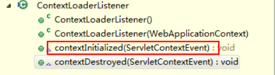
>
> 在这四个方法中较重要的方法应该就是 contextInitialized()，context 初始化方法。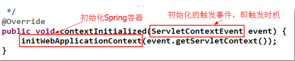
>
> 跟踪 initWebApplicationContext()方法，可以看到，在其中创建了容器对象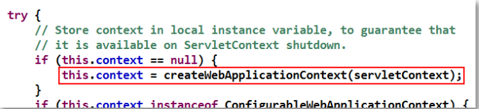
>
> 并且，将创建好的容器对象放入到了 ServletContext 的空间中，key 为一个常量：WebApplicationContext.ROOT_WEB_APPLICATION_CONTEXT_ATTRIBUTE。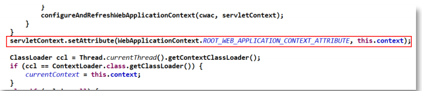

### 6.2.2获取容器对象

**（1）直接从** **ServletContext** **中获取** 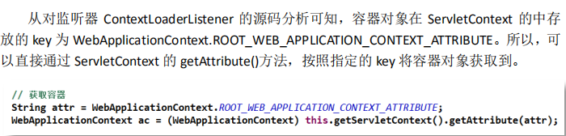

**（2）通过** **WebApplicationContextUtils** **获取**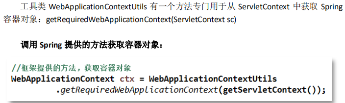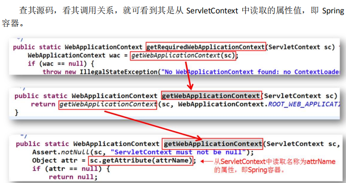

# 番外

加载属性配置文件：


使用配置文件的内容：


```
一、java不同的包下相同的类名的问题与解决办法

Java中的类以包进行分类组织，当程序中需要用到某个包下的类时，可以以该类的全限定名进行引用。这样，不同的包中的类就可以同名，不会产生混淆。但是这样就可能导致引用的时候会产生一些问题。
****第一个问题，是Spring中自动注入的问题。****
Spring自动注入不同包下的相同类名的类会有点问题。Spring并不支持不同包下的类名相同的设定。这是因为默认的Spring检索Bean的唯一id（@Service，@Component等注解中的name属性）为类名（Class Name），并不包含包名（Package Name）的信息。
*****解决的方式有两种：******
1.对Bean进行显示命名，例如@Service("userService")。
2.使用XML的方式去声明Bean。
<bean class="com.yanggb.userService">  
...  
</bean>  
```

