[TOC]

# **第**1**章** **SpringMVC** **概述**

## 1.1 SpringMVC 简介

> - SpringMVC：是基于spring的一个框架， 实际上就是spring的一个模块， 专门是做web开发的。理解是servlet的一个升级
> - **web开发底层是servlet** ， 框架是在servlet基础上面加入一些功能，让你做web开发方便。
> - SpringMVC就是一个Spring。 Spring是容器，ioc能够管理对象，使用<bean>, @Component, @Repository, @Service, @Controller
> -  **SpringMVC能够创建对象， 放入到容器中（SpringMVC容器）， springmvc容器中放的是控制器对象**

## 1.2 SpringMVC 优点

> 1. **基于MVC 架构**。基于 MVC 架构，功能分工明确。解耦合，
> 2. **容易理解，上手快；使用简单。**就可以开发一个注解的 SpringMVC 项目，SpringMVC 也是轻量级的，jar 很小。不依赖的特定的接口和类。
> 3. **作 为 Spring 框 架 一 部 分 ， 能 够 使 用 Spring 的 IoC 和 Aop 。 方 便 整 合Strtus,MyBatis,Hiberate,JPA 等其他框架。**
> 4. **SpringMVC 强化注解的使用，在控制器，Service，Dao 都可以使用注解。方便灵活。**使用@Controller 创建处理器对象,@Service 创建业务对象，@Autowired 或者@Resource在控制器类中注入 Service, Service 类中注入 Dao。

## **1.3 第一个注解的 SpringMVC 程序**

**开发步骤：**

> - **需求:**用户在页面发起一个请求，请求交给springmvc的控制器对象，并显示请求的处理结果（在结果页面显示一个欢迎语句)。
>
> - **实现步骤:**
>
> - > 1. 新建web maven工程
>   >
>   > 2. 加入依赖
>   >
>   >    > spring-webmvc依赖，间接把spring的依赖都加入到项目、jsp , servlet依赖
>   >    >
>   >    > ```xml
>   >    >  <!--Servlet依赖-->
>   >    >     <dependency>
>   >    >       <groupId>javax.servlet</groupId>
>   >    >       <artifactId>javax.servlet-api</artifactId>
>   >    >       <version>3.1.0</version>
>   >    >       <scope>provided</scope>
>   >    >     </dependency>
>   >    >     <!--springMVC依赖间接将spring依赖导入-->
>   >    >     <dependency>
>   >    >       <groupId>org.springframework</groupId>
>   >    >       <artifactId>spring-webmvc</artifactId>
>   >    >       <version>5.2.5.RELEASE</version>
>   >    >   </dependency>
>   >    > ```
>   >
>   > 3. **重点:在web.xml中注册springmvc框架的核心对象Dispatcherservlet**
>   >
>   > 4. 创建一个发起请求的页面index.jsp
>   >
>   > 5. 创建控制器类
>   >
>   >    > 1. 在类的上面加入**@controller注解**,创建对象，并放入到springmvc容器中
>   >    > 2. 在类中的方法上面加入**@RequestMapping注解**。
>   >
>   > 6. 创建一个作为结果的jsp ,显示请求的处理结果。
>   >
>   > 7. 创建springmvc的配置文件（ spring的配置文件一样)
>   >
>   >    > - **声明组件扫描器，指定@contorller注解所在的包名**
>   >    > - **声明视图解析器。帮助处理视图的。**

## **1.4中央调度器**

> - 声明、注册springmvc的核心对象Dispatcherservlet，需要在tomcat服务器启动后，创建Dispatcherservlet对象的实例。
>
> - > 1. **DispatcherServlet叫做中央调度器，是一个servlet，它的父类是继承HttpServlet**
>   > 2. **Dispatcherservlet页叫做前端控制器（front controller)**
>   > 3. **Dispatcherservlet负责接收用户提交的请求，调用其它的控制器对象，**
>   >    **并把请求的处理结果显示给用户**
>
> > **为什么要创建DispatcherServlet对象的实例呢?**
> >
> > - 因为DispatcherServlet在他的创建过程中，**会同时创建springmvc容器对象，读取springmvc的配置文件**﹐把这个配置文件中的对象都创建好，当用户发起请求时就可以直接使用对象了。
> >
> > - servlet的初始化会执行init( )方法。**Dispatcherservlet在init ( )中创建容器，读取配置文件**
> >
> > - > HttpServletBean.init()--->FrameworkServlet.initServletBean()
> >   >
> >   > -->FrameworkServlet.initWebApplicationContext()
> >   >
> >   > --->this.getservletcontext().setAttribute(attrName，wac);
> >   >
> >   > - **webApplicationcontext ctx = new ClassPathxmlApplicationContext( " springmxc.xml");**
> >   > - **把容器对象放入到servletContext中**
> >   >   getservletcontext( ) .setAttribute(key,wac)；
> >
> > 

```xml
 <servlet>
  <servlet-name>myweb</servlet-name>
     <servlet-class>
            org.springframework.web.servlet.DispatcherServlet
     </servlet-class>
        <init-param>
            <param-name>contextConfigLocation</param-name>
            <param-value>classpath:springmvc.xml</param-value>
        </init-param>
        <load-on-startup>1</load-on-startup>
    </servlet>
    <servlet-mapping>
        <servlet-name>myweb</servlet-name>
        <url-pattern>*.do</url-pattern>
    </servlet-mapping>
```


###   (1)配置文件位置与名称

> 启动tomcat报错**(FileNotFoundException异常)**，读取这个文件/WEB-INF/springmxc-servlet.xml (/WEB-INF/myweb-servlet.xml。springmvc创建容器对象时，**读取的配置文件默认是/WEB-INF/<servlet-name>-servlet.xml .**
>
> ```xml
>  		<init-param><!--自定义配置文件位置及名称-->
>             <param-name>contextConfigLocation</param-name>
>             <param-value>classpath:springmvc.xml</param-value>
>         </init-param>
> ```

> 打开 DispatcherServlet 的源码，其继承自 FrameworkServlet，而该类中有一个属性**contextConfigLocation**，**用于设置 SpringMVC 配置文件的路径及文件名**。该初始化参数的属性就来自于这里。
>
> 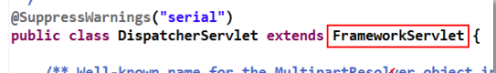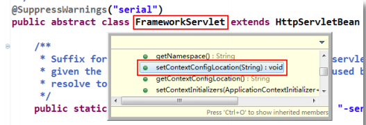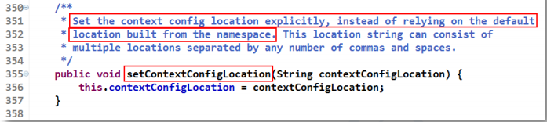

### （2） **< load-on-startup/>（掌握）**

> 在<servlet/>中添加<load-on-startup/>的作用是，标记是否在Web服务器（这里是Tomcat）启动时会创建这个 Servlet 实例，即**是否在 Web 服务器启动时调用执行该 Servlet 的 init()方法，而不是在真正访问时才创建。**
>
> - 它的值必须是一个整数。 
>
> > ➢ 当值大于等于 0 时，表示容器在**启动时就加载并初始化**这个 servlet，数值越小，该 Servlet的优先级就越高，其被创建的也就越早；
> >
> > ➢ 当值小于 0 或者没有指定时，则表示该 Servlet 在真正**被使用时**才会去创建。 
> >
> > ➢ 当值相同时，容器会自己选择创建顺序

### （3） < url-pattern/>（重点）

> 使用框架的时候，url-pattern可以使用两种值
>
> > - 使用扩展名方式，语法“.xxxx , xxxx是自定义的扩展名。常用的方式*.do，*.action，*.mvc等等
> >   http://localhost:8080/myweb/some.do
> >   http://localhost:8080/myweb/other.do
> > - 使用斜杠“/”

## **1.5创建 SpringMVC 配置文件**

### (1)创建处理器

> 在类上与方法上添加相应注解即可。
>
> > - **@Controller**：表示**当前类为处理器**,对象放在springmvc容器中。 **使用@Controller注解创建的是一个普通类的对象，不是Servlet。 springmvc赋予了控制器对象一些额外的功能。**
> >
> > - > 位置:在类的上面和Spring中讲的@service ,@component
> >
> > - **@RequestMapping**：表示当前方法为处理器方法。该方法要对 **value 属性所指定的 URI进行处理与响应**。被注解的方法的方法名可以随意。
> >
> > - > @RequestMapping:请求映射，**作用是把一个请求地址和一个方法绑定在一起。**一个请求指定一个方法处理。
> >   >
> >   > - **属性:**
> >   >
> >   > - value是一个string ,表示请求的url地址的( some.do ) 。
> >   >   value的值必须是唯一的，不能重复。在使用时，**推荐地址以“/”**
> >   >
> >   > - **位置:**
> >   >
> >   > - > - 在方法的上面，常用的。
> >   >   > - 在类的上面
> >   >
> >   > - **说明:**
> >   >
> >   > - > - 使用RequestMapping修饰的方法叫做处理器方法或者控制器方法。
> >   >   > - 使用@RequestMapping修饰的方法可以处理请求的，**类似servlet中的doGet,doPost**

```java
@Controller
public class MyController {
    @RequestMapping(value="/a.do",method = RequestMethod.POST)
    public ModelAndView doSome(String name,int age){
        ModelAndView mv=new ModelAndView();
        mv.addObject("name",name);
        mv.addObject("age",age);//返回的数据
        mv.setViewName("/jsp/show.jsp");//页面
        return mv;
    }
```

> - 若有多个请求路径均可匹配该处理器方法的执行，则@RequestMapping 的 value 属性中可以写上一个**数组**。
> - **ModelAndView 类**中的 addObject()方法用于向其 Model 中添加数据。Model 的底层为一个 **HashMap**。
> - **Model 中的数据存储在 request 作用域**中，SringMVC **默认采用转发的方式跳转到视图**，本次请求结束，模型中的数据被销毁。

### (2)声明组件扫描器

```xml
	<!--注册组件扫描器-->
    <context:component-scan base-package="com.controller">				         </context:component-scan>
```

### (3)修改视图解析器的注册

> SpringMVC 框架**为了避免对于请求资源路径与扩展名上的冗余**，在视图解析器InternalResouceViewResolver 中引入了**请求的前辍与后辍**。而 ModelAndView 中只需给出要跳转页面的文件名即可，对于具体的文件路径与文件扩展名，**视图解析器会自动完成拼接。**

```xml
<!--视图解析器-->
  <bean 				            class="org.springframework.web.servlet.view.InternalResourceViewResolver">
    <property name="prefix" value="/jsp/"></property><!--前缀：视图文件路径-->
    <property name="suffix" value=".jsp"></property><!--后缀：视图文件扩展名-->
  </bean>
<!--修改源代码-->
  mv.setViewName("show");//页面
```

## **1.6 使用 SpringMVC 框架 web 请求处理顺序**


## **1.7Springmvc的mvc组件**

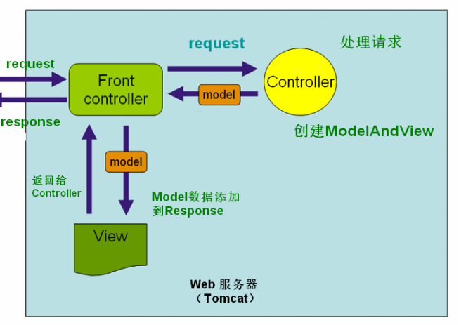

> 功能总结说明
>
> - **Front Controller 负责分发调度**
>
> - > Spring MVC中,**DispatcherServlet充当FrontController**(如Craig Walls一书中所述),此Servlet将请求委托给其他控制器,后者又调用适当的Service类(用于处理请求),然后将ModelAndView的实例返回给DispatcherServlet再次.
>
> - Controller 负责业务数据抽取
>
> - View 负责页面呈现

## **1.8 SpringMVC 执行流程（掌握）**

### 1.8.1 流程图

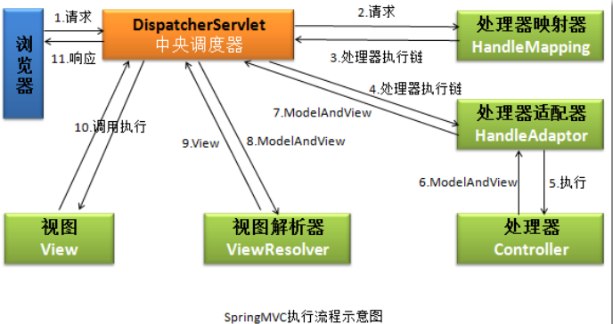

### **1.8.2 执行流程简单分析**

> 1. 浏览器提交请求到中央调度器
>
>    > 1. **执行servlet的service()**
>    >
>    >    ​         **|**
>    >
>    > 2. **DispatcherServlet.doService(HttpServletRequest request, HttpServletResponse response)**
>    >
>    >    ​          **|**
>    >
>    > 3. **DispatcherServlet.doDispatch(request, response){**
>    >
>    >     **执行下面的步骤  }**
>
> 2. **中央调度器直接将请求转给处理器映射器。**
>
>    > - **DispatcherServlet接收请求some.do,把请求转交给处理器映射器**
>    > - **处理器映射器:springave框架中的一种对象，框架把实现了HandlerMapping接口的类都叫做映射器（多个)**
>    > - **处理器映射器作用:根据请求，从springnvc容器对象中获取处理器对象( MyController controller =ctx. getBean ("some））**
>    > - 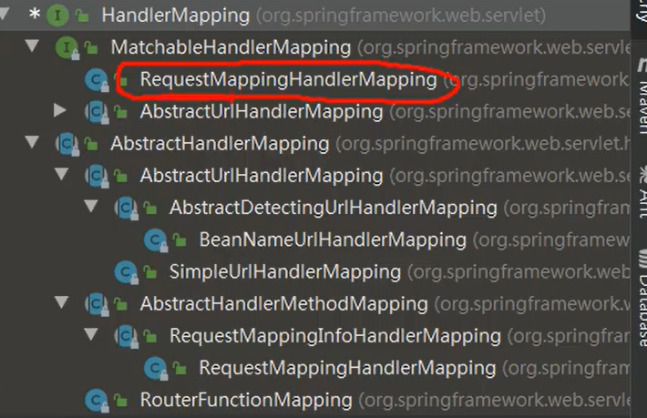
>
> 3. **处理器映射器会根据请求，找到处理该请求的处理器，并将其封装为处理器执行链后返回给中央调度器。**
>
>    > ```java
>    > HandlerExecutionchain mappedHandler = getHandler (processedRequest)//获取处理器执行链
>    > ```
>    >
>    > 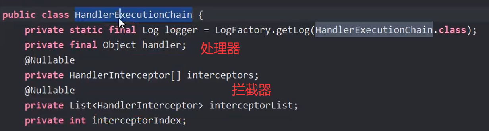
>    >
>    > **HandlerExecutionchain:类中保存着**
>    >
>    > > - **处理器对象（MyController)**
>    > > - **项目中的所有的拦截器**
>
> 4. **中央调度器根据处理器执行链中的处理器，找到能够执行该处理器的处理器适配器(有多个)。**
>
>    > - 处理器适配器:springmvc框架中的对象，需要实现**HandlerAdapter**接口.
>    >
>    > - 处理器适配器作用:**执行处理器方法**（调用yController.doSome()）得到返回值ModelAndView 
>    >
>    > - ```java
>    >   HandlerAdapter ha = getHandlerAdapter (mappedHandler.getHandler())//中央调度器调用适配器
>    >   ```
>
> 5. **处理器适配器调用执行处理器。**
>
>    > ```java
>    > mv = ha.handle (processedRequest,response,mappedHandler.getHandler());
>    > //执行处理器方法
>    > ```
>
> 6. 处理器将处理结果及要跳转的视图封装到一个对象 ModelAndView 中，并将其返回给处理器适配器。
>
> 7. 处理器适配器直接将结果返回给中央调度器。
>
> 8. **中央调度器调用视图解析器，将 ModelAndView 中的视图名称封装为视图对象。**
>
>    > - 视图解析器:springmvc中的对象，需要实现viewResoler接口(可以有多个)
>    > - 视图解析器作用:组成视图完整路径，使用前缀，后缀。并**创建view对象。**
>    > - view是一个接口，表示视图的，在框架中jsp，html不是string表示，而是使用view和他的实现类表示视图。
>    > - **InternalResourceView:视图类，表示jsp文件，视图解析器会创建**InternalResourceView类对象。这个对象的里面，有一个属性url=/WEB-INF/view/show.jsp
>
> 9. 视图解析器将封装了的视图对象返回给中央调度器
>
> 10. 中央调度器调用视图对象，让其自己进行渲染，即进行数据填充，形成响应对象。
>
>     > **Dispatcherservlet把创建的view对象获取到，调用view类自己的方法，把Model数据放入到request作用域。执行对象视图的forward。请求结束。**
>
> 11. 中央调度器响应浏览器。

# 第2章 SpringMVC 注解式开发

## 2.1 @RequestMapping 定义请求规则

> @RequestMapping 的 value 属性用于定义所匹配请求的 URI。但对于注解在方法上与类上，其 value 属性所指定的 URI，意义是不同的。
>
> > - 不同的处理器方法所匹配的 URI 是不同的。这些不同的 URI 被指定在注解于方法之上的@RequestMapping 的value 属性中。
> > - 在类的上面的 URI ，所有请求地址的公共部分，叫做模块名称

### 2.1.2 对请求提交方式的定义

> 对于**@RequestMapping，其有一个属性 method**，用于对被注解方法所处理请求的提交方式进行限制，即只有满足该 method 属性指定的提交方式的请求，才会执行该被注解方法。
>
> **Method 属性的取值为 RequestMethod 枚举常量。常用的为 RequestMethod.GET 与RequestMethod.POST，分别表示提交方式的匹配规则为 GET 与 POST 提交。**
>
> 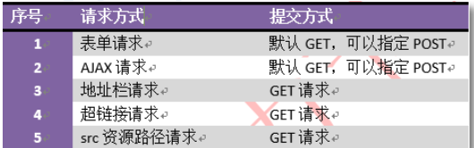
>
> **若不指定 method 属性，则无论是 GET 还是 POST 提交方式，均可匹配。即对于请求的提交方式无要求**

## **2.2 处理器方法的参数**

> 处理器方法可以包含以下四类参数，这些参数会在系统调用时由系统自动赋值，即程序员可在方法内直接使用。
>
> > - **➢ HttpServletRequest**
> > - **➢ HttpServletResponse**
> > - **➢ HttpSession**
> > - **➢ 请求中所携带的请求参数**

### 2.2.1 逐个参数接收

> 逐个接收请求参数:
> **要求:处理器（控制器）方法的形参名和请求中参数名必须一致。**
> **同名的请求参数赋值给同名的形参**
>
> > **框架接收请求参数**
> >
> > 1. 使用request对象接收请求参数
> >    string strName = request.getParameter( "name");string strAge = request.getParameter( "age");
> > 2. springmvc框架通过Dispatcherservlet调用MycontrolLer的doSome()方法
> >    调用方法时，按名称对应，把接收的参数赋值给形参
> >    dosome ( strName , Integer.valueof(strAge))
> >    **框架会提供类型转换的功能，能把string转为 int ,long , float , double等类型。**

### 2.2.2 校正请求参数名@RequestParam

> **@RequestParam:解决请求中参数名形参名不一样的问题**
>
> - 属性:
>
> > - value请求中的参数名称
> > - required是一个boolean,默认是true
> >   true :**表示请求中必须包含此参数。**
>
> - 位置:在处理器方法的形参定义的前面

```java
public ModelAndview receiveParam(@RequestPanram(value ="rname" required = false) string name,
@RequestParam(value = "rage " ,required = false)Integer age){//处理}
```

### 2.2.4 对象参数接收（可以多个不同的对象接收）

> - **处理器方法形参是java对象，这个对象的属性名和请求中参数名一样的**
> - **框架会创建形参的java对象，给属性赋值。请求中的参数是name ，框架会调用setName()**

```java
//注册学生
    @RequestMapping("/addStudent.do")
    public ModelAndView addStudent(Student stu){}//对应的请求参数赋值到对象属性
```

## **2.3请求参数中文乱码问题**

> 对于前面所接收的请求参数，若含有中文，则会出现中文乱码问题。Spring 对于请求参数中的中文乱码问题，给出了专门的**字符集过滤器：spring-web-5.2.5.RELEASE.jar 的org.springframework.web.filter 包下的 CharacterEncodingFilter 类。**
>
> 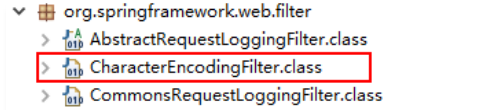

### （1） 解决方案

> 在 web.xml 中注册字符集过滤器，即可解决 Spring 的请求参数的中文乱码问题。不过，**最好将该过滤器注册在其它过滤器之前。因为过滤器的执行是按照其注册顺序进行的。**

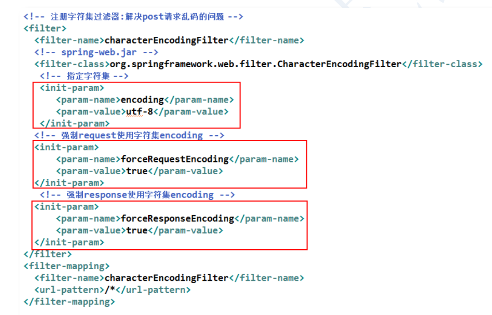

### **（2） 源码分析**

**字符集设置核心方法：**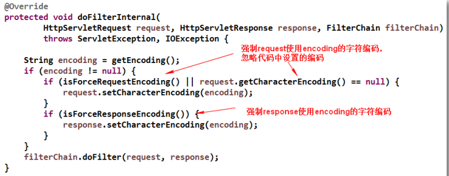

## 2.4 处理器方法的返回值

> 使用@Controller 注解的处理器的处理器方法，其返回值常用的有四种类型：
>
> - **➢ 第一种：ModelAndView**
> - **➢ 第二种：String**
> - **➢ 第三种：无返回值 void**
> - **➢ 第四种：返回自定义类型对象**

### 2.4.1 返回 ModelAndView

> - 若处理器方法处理完后，**需要跳转到其它资源，且又要在跳转的资源间传递数据**，此时处理器方法**返回 ModelAndView 比较好**。当然，若要返回 ModelAndView，则处理器方法中需要定义 ModelAndView 对象。
> - 在使用时，若该处理器方法**只是进行跳转而不传递数据，或只是传递数据而并不向任何资源跳转（如对页面的 Ajax 异步响应）**，此时若返回 ModelAndView，则将总是有一部分多余：要么 Model 多余，要么 View 多余。即此时**返回 ModelAndView 将不合适。**

### 2.4.2 返回 String

> 处理器方法返回的字符串可以指定逻辑视图名，通过视图解析器解析可以将其转换为物理视图地址。

```java
@RequestMapping(value="/b.do")
    public String doString(String name,Integer age){
        return "index";//配置视图解析器
    }
/*可以直接返回资源的物理视图名。不过，此时就不需要再在视图解析器中再配
置前辍与后辍了*/
		return "/jsp/index.jsp";//项目中不能配置视图解析器
```

### 2.4.3 返回 void（了解）

> 对于处理器方法返回 void 的**应用场景，AJAX 响应.**若处理器对请求处理后，无需跳转到其它任何资源，此时可以让处理器方法返回 void。

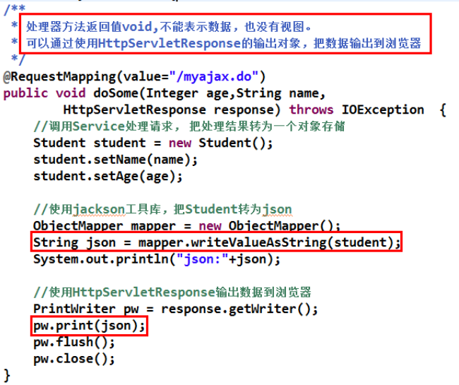

### 2.4.4 返回对象 Object

> 处理器方法也可以返回 Object 对象。这个 Object 可以是 Integer，String，自定义对象，Map，List 等。但**返回的对象不是作为逻辑视图出现的，而是作为直接在页面显示的数据出现的。**
> **返回对象，需要使用@ResponseBody 注解，将转换后的 JSON 数据放入到响应体中。**

#### （1） 环境搭建

> 1. 导入 Jackson 的相关 Jar 包。
>
> 2. **声明注解驱动**
>
>    > **将 Object 数据转化为 JSON 数据，需要由消息转换器HttpMessageConverter 完成。而转换器的开启，需要由**
>    >
>    > **< mvc:annotation-driven/>来完成。**
>    >
>    > SpringMVC 使用消息转换器实现请求数据和对象，处理器方法返回对象和响应输出之间的自动转换
>    >
>    > 当 Spring 容器进行初始化过程中，**在< mvc:annotation-driven/>处创建注解驱动时，默认创建了七个 HttpMessageConverter 对象。**也就是说，我们注册< mvc:annotation-driven/>，就是为了让容器为我们创建 HttpMessageConverter 对象。
>    >
>    > ```xml
>    >     <mvc:annotation-driven></mvc:annotation-driven>
>    > <!--http://www.springframework.org/schema/mvc-->
>    > ```
>    >
>    > 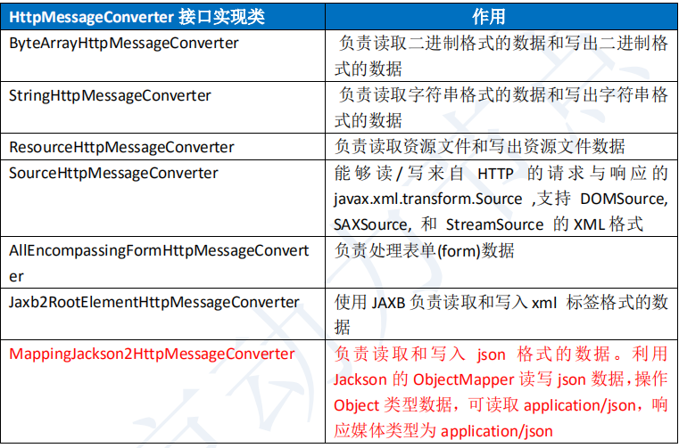
>    >
>    > **HttpMessageConverter 接口** : **HttpMessageConverter<T>**是 Spring3.0 新添加的一个接口，**负责将请求信息转换为一个对象（类型为** **T），将对象（类型为** **T）输出为响应信息**
>    >
>    > > - ```java
>    > >   //下面的两个方法是控制器类把结果输出给浏览器时使用的:
>    > >   boolean canwrite(class<?> var1，@Nullable MediaType var2);
>    > >   void write(T var1，@Nullable MediaType var2，HttpoutputMessage var3)
>    > >   ```
>    > >
>    > >   > 1. **canwrite作用检查处理器方法的返回值**，能不能转为var2表示的数据格式。检查student(lisi , 20)能不能转为var2表示的数据格式。如果检查能转为json , canwrite返回true。**MediaType:表示数格式的，例如json , xml等等**
>    > >   > 2. write:**把处理器方法的返回值对象，调用jackson中的objectMapper转为json字符串**。json = om.writevalueAsString(student);
>
> 3. **@ResponseBody注解放在处理器方法的上面，通过HttpservletResponse输出数据，响应ajax请求的。**

#### （2） 返回自定义类型对象

> 处理器方法返回一个student,通过框架转为json ，响应ajax请求
>
> **@ResponseBody:**
>
> > - 作用:把处理器方法返回对象转为json后，通过HttpservletResponse输出给浏览器。
> > - 位置:方法的定义上面。和其它注解没有顺序的关系。[

```java
	 @ResponseBody
    @RequestMapping("/selectStudent.do")//返回一个学生的信息
    public Student selectStudent(){
        return service.findStudent();
    }
```

> **返回对象框架的处理流程:**
>
> > 1. 框架会把返回student类型，调用框架的中ArrayList<HttpNessageconverter>中每个类的canMrite()方法检查哪个:HttpMessageConverter接口的实现类能处理student类型的数据--MappingJackson2HttpMessageconverter
> > 2. 框架会调用实现类的write ( ) ,MappingJackson2HttpMessageConverter的write()方法
> >    把李四同学的student对象转为json ,调用Jackson的objectMapper实现转为json
> >    contentType: application/json;charset=utf-8
> > 3. 框架会调用⑥ResponseBody把2的结果数据输出到浏览器，ajax请求处理完成

#### （3） 返回 List 集合

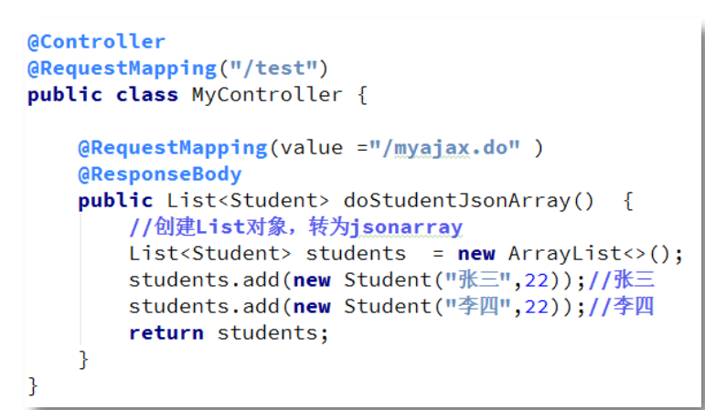

#### （4） 返回字符串对象

> 若要返回非中文字符串，将前面返回数值型数据的返回值直接修改为字符串即可。但若返回的字符串中带有中文字符 ， 则接收方页面将会出现乱码 。此时需要使用**@RequestMapping 的 produces 属性指定字符集**。(HttpMessageConverter实现类**默认使用ISO-8859-1**进行输出)

**注意区分使用String返回值时，返回的是视图还是字符串。即是@ResponeBody注解的有无**


## **2.5 解读< url-pattern/>**

### 2.5.1 配置详解

> 1.  ***.do***
>
>    > 在没有特殊要求的情况下，SpringMVC 的中央调度器 DispatcherServlet 的<url-pattern/>
>    > 常使用后辍匹配方式，如写为*.do 或者 *.action, *.mvc 等。
>
> 2.  **/(静态资源访问有问题)**
>
>    > 当你的项目中使用了/它会替代tomcat中的default，因为**DispatcherServlet 会将向静态资源的获取请求，例如.css、.js、.jpg、.png等资源的获取请求，当作是一个普通的 Controller 请求**。中央调度器会调用处理器映射器为其查找相应的处理器。当然也是找不到的，所以在这种情况下，**所有的静态资源获取请求也均会报 404 错误。**
>
> 3. 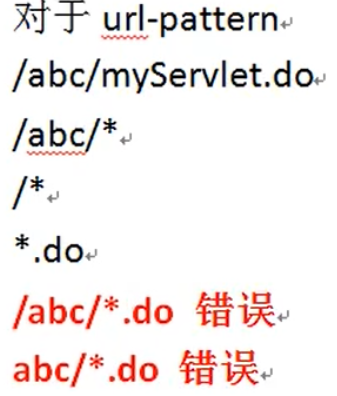

```java
http://localhost:8080/ch05_url_pattern/index.jsp ：tomcat（jsp会转为servlet）
http://localhost:8080/ch05_url_pattern/js/jquery-3.4.1.js ： tomcat
http://localhost:8080/ch05_url_pattern/images/p1.jpg ： tomcat
http://localhost:8080/ch05_url_pattern/html/test.html： tomcat
http://localhost:8080/ch05_url_pattern/some.do ：  DispatcherServlet（springmvc框架处理的）
tomcat本身能处理静态资源的访问， 像html， 图片， js文件都是静态资源
```

### **2.5.2 静态资源访问(解决问题)**

> 在 Tomcat 中，有一个**专门用于处理静态资源访问的 Servlet 名叫 DefaultServlet**。其<servlet-name/>为 default。可以处理各种静态资源访问请求。该 Servlet 注册在 Tomcat 服务器的 web.xml 中。在 Tomcat 安装目录/conf/web.xml。
>
> ```xml
> <!--表示静态资源和未映射的请求都这个default处理--> 
> <servlet>
>         <servlet-name>default</servlet-name>
>         <servlet-class>
>             org.apache.catalina.servlets.DefaultServlet
>      	</servlet-class>
>         <init-param>
>             <param-name>debug</param-name>
>             <param-value>0</param-value>
>         </init-param>
>         <init-param>
>             <param-name>listings</param-name>
>             <param-value>false</param-value>
>         </init-param>
>         <load-on-startup>1</load-on-startup>
>     </servlet>
>       <servlet-mapping>
>     <servlet-name>default</servlet-name>
>     <url-pattern>/</url-pattern> 
> </servlet-mapping>
> ```
>
> > - 1.处理静态资源
> >   2.处理未映射到其它servlet的请求。

#### （1） 使用< mvc:default-servlet-handler/>

> 声 明 了 <mvc:default-servlet-handler /> 后 ， springmvc 框 架 会 在 容 器 中 创 建**DefaultServletHttpRequestHandler 处理器对象**。它会像一个检查员，对进入DispatcherServlet的 URL 进行筛查，如果发现是**静态资源的请求，就将该请求转由 Web 应用服务器默认的Servlet 处理**。一般的服务器都有默认的 Servlet

> **default-servlet-handler 和@RequestMapping注解有冲突，需要加人annotation-driven 解决问题**

```xml
<mvc:annotation-driven />
```

#### （2） 使用< mvc:resources/>（掌握）

> 第二种处理静态资源的方式
>
> - **< mvc:resources/>**加入后框架会创建**ResourceHttpRequestHandler**这个处理器对象。让这个对象处理静态资源的访问，不依赖tomcat服务器。
>
> - > - mapping:访问静态资源的uri地址,使用通配符**
>   >
>   > - location :静态资源在你的项目中的目录位置。
>   >
>   > - > **images/**:**表示 images/p1.jpg , images/user/logo.gif , images/order/history/list.png

```xml
<mvc:resources mapping=" /images/**" location=" /images/" />
<mvc:resources mapping=" / html/**" location="/html/"/>
<mvc:resources mapping="/js/**" location="/js/"/>
```

> **mvc:resources和@RequestMapping有一定的冲突**
>
> ```xml
> <mvc:annotation-driven />
> ```

## 2.6访问路径

```java
<% String basePath = request.getScheme() + "://"+ request.getServerName() + ":" +request.getServerPort() +request.getContextPath() + "/";
%>
    <base href="<%=basePath%>">
```

> **最好使用<base>标记**

# 第3章 SSM 整合开发

> - SSM 编程，即 SpringMVC + Spring + MyBatis 整合，是当前最为流行的 JavaEE 开发技术架构。
>
> - SSM 整合的实现方式可分为两种：**基于 XML 配置方式，基于注解方式。**
>
> - > - **springMVC:视图层，界面层，负责接收请求，显示处理结果的。**
>   > - **Spring :业务层，管理service , dao ,工具类对象的。**
>   > - **MyBatis:持久层，访问数据库的**
>
> - > - springmvc容器和spring容器是有关系的,关系已经确定好了
>   > - **springmvc容器是spring容器的子容器，类似java中的继承。子可以访问父的内容**
>   > - 在子容器中的controller可以访问父容器中的service对象，就可以实现controller使用service对象

## **3.1** **搭建** **SSM** **开发环境**

### 3.1.1 maven pom.xml(重点)

```xml
<dependencies>
	<!--servlet依赖-->
    <!-- jsp依赖 -->
    <dependency>
      <groupId>javax.servlet.jsp</groupId>
      <artifactId>jsp-api</artifactId>
      <version>2.2.1-b03</version>
      <scope>provided</scope>
    </dependency>
<!--springmvc-->
    <dependency>
      <groupId>org.springframework</groupId>
      <artifactId>spring-webmvc</artifactId>
      <version>5.2.5.RELEASE</version>
    </dependency>
<!--事务-->
    <dependency>
      <groupId>org.springframework</groupId>
      <artifactId>spring-tx</artifactId>
      <version>5.2.5.RELEASE</version>
  </dependency>
<!--aspectj 依赖-->
 <dependency>
     <groupId>org.springframework</groupId>
     <artifactId>spring-aspects</artifactId>
     <version>5.2.5.RELEASE</version>
 </dependency>
  <!--mybatis 和 spring 整合的-->
 <dependency>
     <groupId>org.mybatis</groupId>
     <artifactId>mybatis-spring</artifactId>
     <version>1.3.1</version>
 </dependency>
 <!--mybatis-->
 <dependency>
     <groupId>org.mybatis</groupId>
     <artifactId>mybatis</artifactId>
     <version>3.5.1</version>
 </dependency>
<!--json依赖-->
<!--阿里巴巴连接池-->
    <dependency>
      <groupId>com.alibaba</groupId>
      <artifactId>druid</artifactId>
      <version>1.1.12</version>
  </dependency>
  </dependencies>

   <resources>
      <resource>
        <directory>src/main/java</directory><!--所在的目录-->
        <includes><!--包括目录下的.properties,.xml 文件都会扫描到-->
          <include>**/*.properties</include>
          <include>**/*.xml</include>
        </includes>
        <filtering>false</filtering>
      </resource>
    </resources>
```

### 3.1.2 配置 web.xml

> - **注册** **ContextLoaderListener** **监听器**
>
> - **注册字符集过滤器**
>
> - **配置中央调度器**
>
> - > **Spring 容器创建管理 Spring 配置文件中的 bean， SpringMVC 容器中负责视图层 bean 的初始。**

### 3.1.3配置springmvc.xml文件

> - 组件扫描器
> - 视图解析器
> - 注解驱动

### 3.1.4配置applicationContext.xml文件

> - 声明事务
> - 组件扫描器
> - ..<bean>标签

```
源文件E:\SSM\springMVC\springMVC\springmvc-spring-mybatis
```

# 第4章 SpringMVC 核心技术

## **4.1 请求重定向和转发**

> **对于请求转发的页面，可以是WEB-INF中页面；而重定向的页面，是不能为WEB-INF中页的。因为重定向相当于用户再次发出一次请求，而用户是不能直接访问 WEB-INF 中资源的**

> SpringMVC 框架把原来 Servlet 中的请求转发和重定向操作进行了封装。现在可以使用简单的方式实现转发和重定向。
>
> - **forward:表示转发**，实现 request.getRequestDispatcher("xx.jsp").forward()
> - **redirect:表示重定向**，实现 response.sendRedirect("xxx.jsp")

### 4.1.1 请求转发

> 处理器方法返回 ModelAndView 时，需**在 setViewName()指定的视图前添加 forward:**，且此时的**视图不再与视图解析器一同工作**，这样可以在配置了解析器时指定不同位置的视图。**视图页面必须写出相对于项目根的路径。forward 操作不需要视图解析器。**

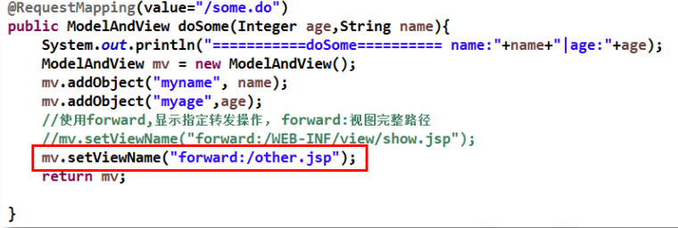

### 4.1.2 请求重定向

在处理器方法返回的**视图字符串的前面添加 redirect:**，则可实现重定向跳转。**不和视图解析器一同使用，就当项目中没有视图解析器**

> **框架对重定向的操作;**
> **框架会把Model中的简单类型的数据，转为string使用，作为hello.jsp的get请求参数使用。目的是在 doRedirect.do和 hello.jsp两次请求之间传递数据**

```java
 @RequestMapping("/doRedirect.do")
    public ModelAndView addStudent(String name,Integer age){//lisi,22
        ModelAndView mv=new ModelAndView();
        mv.addObject("myname",name);
        mv.addObject("myage",age);
        mv.setViewName("redirect:/jsp/hello.jsp");
        return mv;
    }
    //重定向访问地址
	http://localhost:8080/myweb/hello.jsp?myname=lisi&myage=22

```

> **可以使用EL表达式的Param属性：**
>
> **${Param.myname}==request.getAtrribute("myname")**

## 4.2 异常处理

> **使用两个注解**
>
> - **@ExceptionHandler**
> - **@ControllerAdvice**

**（1） 自定义异常类**

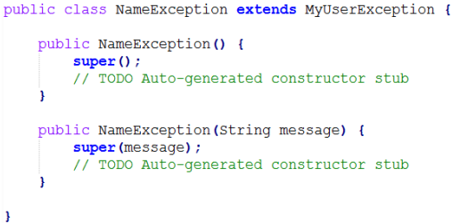

### 4.2.1@ControllerAdvice注解

> **@ControlLerAdvice :控制器增强（也就是说给控制器类增加功能--异常处理功能)**
>
> > - 位置:在类的上面。
> >
> > - 特点:必须让框架知道这个注解所在的包名，需要在springmvc配置文件声明组件扫描器。指定@ControllerAdvice所在的包名
> >
> > - 形参
> >
> > - > Exception ,表示Controller中抛出的异常对象。通过形参可以获取发生的异常信息。
> >
> > - **@ExceptionHandler(异常的class):表示异常的类型，当发生此类型异常时，由当前方法处理**
>
> - springmvc.xml文件配置：
>
> - > ```xml
>   > <context:component-scan 
>   > base-package="com. bjpowernode.handler"/>
>   > 
>   > <mvc : annotation-driven/>
>   > ```

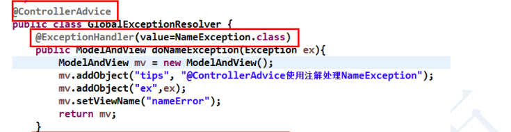


### 4.2.2 @ExceptionHandler 注解

> - 使用注解**@ExceptionHandler** 可以将一个方法指定为异常处理方法。该注解只有一个**可选属性 value，为一个 Class<?>数组，用于指定该注解的方法所要处理的异常类，**即所要匹配的异常。
> - 而被注解的方法，其返回值可以是 ModelAndView、String，或 void，方法名随意，方法参数可以是 Exception 及其子类对象、HttpServletRequest、HttpServletResponse 等。系统会自动为这些方法参数赋值。

**当使用@RequestMapping 注解修饰的方法抛出异常时，会执行@ControllerAdvice 修饰的类中的异常处理方法**

## **4.3** **拦截器（请求---》过滤器---》拦截器---》控制器）**

> - 拦截器是springmvc中的一种，需要实现**HandlerInterceptor**接口。
>
> - 拦截器和过滤器类似，功能方向侧重点不同。 **过滤器是用来过滤器请求参数，设置编码字符集等工作。 拦截器是拦截用户的请求，做请求做判断处理的。**
>
> - 拦截器是全局的，可以对多个Controller做拦截。  一个项目中可以有0个或多个拦截器， 他们在一起拦截用户的请求。
>
> - 拦截器常用在：**用户登录处理，权限检查， 记录日志。**
>
> - 拦截器的使用步骤：
>
> - > - 定义类实现HandlerInterceptor接口
>   >
>   > - 在springmvc配置文件中，声明拦截器， 让框架知道拦截器的存在。拦截器的执行时间：
>   >
>   > - > - 在请求处理之前， 也就是controller类中的方法执行之前先被拦截。
>   >   >
>   >   > - > **其拦截的时间点在“处理器映射器根据用户提交的请求映射出了所要执行的处理器类，并且也找到了要执行该处理器类的处理器适配器，在处理器适配器执行处理器之前”。当然，在处理器映射器映射出所要执行的处理器类时，已经将拦截器与处理器组合为了一个处理器执行链，并返回给了中央调度器。**
>   >   >
>   >   > - 在控制器方法执行之后也会执行拦截器。
>   >   >
>   >   > - 在请求处理完成后也会执行拦截器。
>
> - 
>   拦截器：看做是多个Controller中公用的功能，集中到拦截器统一处理。使用的aop的思想

### 4.3.1 一个拦截器的执行

#### **（1）自定义拦截器，需要实现 HandlerInterceptor 接口。而该接口中含有三个方法：**

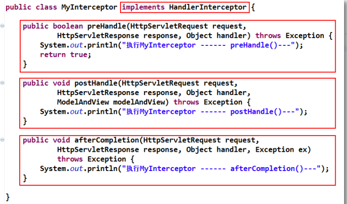

> ➢ **preHandle(request,response, Object handler)**：
>
> 该方法在**处理器方法执行之前执行**。其返回值为 boolean，若为 true，则紧接着会执行处理器方法，且会将 afterCompletion()方法放入到一个专门的方法栈中等待执行。
>
> ➢ **postHandle(request,response, Object handler,modelAndView)**
>
> 该方法在**处理器方法执行之后执行**。**处理器方法若最终未被执行，则该方法不会执行**。由于该方法是在处理器方法执行完后执行，且该方法参数中包含 ModelAndView，所以该方法可以修改处理器方法的处理结果数据，且可以修改跳转方向。
>
> ➢ **afterCompletion(request,response, Object handler, Exception ex)**
>
> 当 preHandle()方法返回 true 时，会将该方法放到专门的方法栈中，等到**对请求进行响应的所有工作完成之后才执行该方法**。即该方法是在中央调度器渲染（数据填充）了响应页面之后执行的，此时对 ModelAndView 再操作也对响应无济于事。
>
> **afterCompletion** **最后执行的方法，清除资源，例如在** **Controller** **方法中加入数据**

#### **（2）注册拦截器**

```xml
 <mvc:interceptors>
     <mvc:interceptor>
         <!--指定拦截的请求uri地址
			path :就是uri地址，可以使用通配符*
			**:表示任意的字符,文件或者多级目录和目录中的文件
-->
         <mvc:mapping path="/**"/>
         <mvc:exclude-mapping path="/image/**"/><!--去除-->
         <bean class="ds.Interceptor.MyInterceptor"></bean>
     </mvc:interceptor>
 </mvc:interceptors>
```

#### （3） 修改处理器

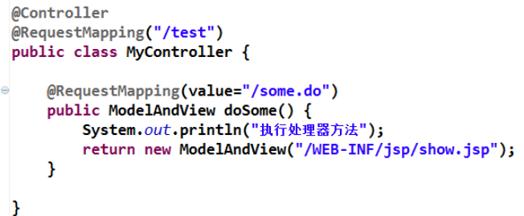

#### （4） 控制台输出结果

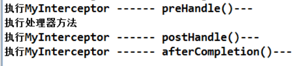

### **4.3.2拦截器中方法与处理器方法的执行顺序如下图**

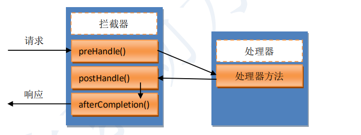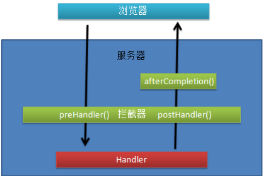

### 4.3.3 多个拦截器的执行

> - 声明拦截器:拦截器可以有0或多个在框架中保存多个拦截器是ArrayList ,按照声明的先后顺序放入到ArrayList
>
> - **多个拦截器时，执行顺序与方法的嵌套相似（压栈）**
>
> - **当某一个拦截器的 preHandle()方法返回 true 并被执行到时，会向一个专**
>
>   **门的方法栈中放入该拦截器的 afterCompletion()方法**

> 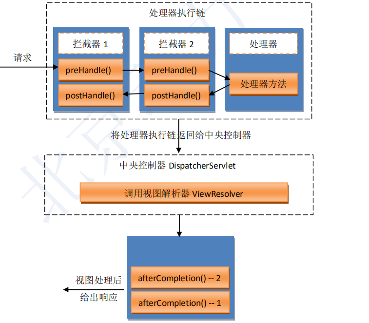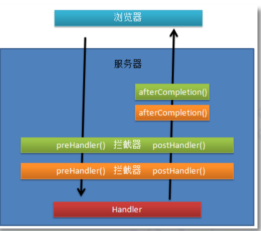

### **4.3.4拦截器和过滤器的区别**

> - 过滤器是servlet中的对象，  拦截器是框架中的对象
> - 过滤器实现Filter接口的对象， 拦截器是实现HandlerInterceptor
> - **过滤器是用来设置request，response的参数，属性的，侧重对数据过滤的。拦截器是用来验证请求的，能截断请求。**
> - **过滤器是在拦截器之前先执行的。**
> - 过滤器是tomcat服务器创建的对象， 拦截器是springmvc容器中创建的对象
> - **过滤器是一个执行时间点。拦截器有三个执行时间点**
> - **过滤器可以处理jsp，js，html等等拦截器是侧重拦截对Controller的对象。 如果你的请求不能被DispatcherServlet接收， 这个请求不会执行拦截器内容**
> - **拦截器拦截普通类方法执行，过滤器过滤servlet请求响应**


