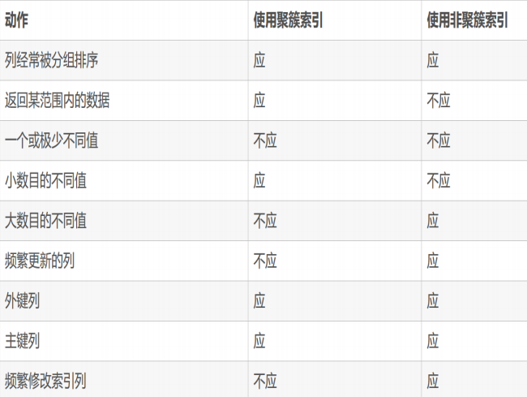
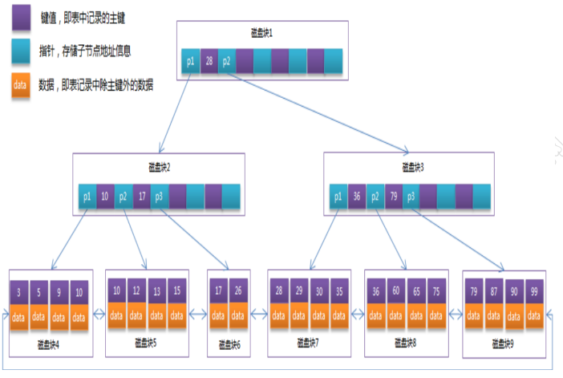

# 1.MySQL查询语句中七个查询命令的特征（根据执行优先级）

> - from
> - where
> - group by
> - having
> - select
> - order by
> - limit

## from作用

> - 将硬盘中的表文件加载到内存中，生成一张全新的**临时表**
> - 定位内存中已经存在的临时表
>
> - 注意
>
> > - 一个sql中最先执行的永远都是from
> > - 如果from定位的是内存中的一个临时表，这个临时表必须手动指定表名

## where作用

> - where操作的是由from命令生成的临时表
> - where会**循环遍历当前临时表中的每一个数据行**，将满足条件的数据行保存到一个全新的临时表中
>
> - 注意
>
> > - **由于where命令每次操作的是一行数据，因此where中无法使用聚合函数（分组函数）作为条件！！！**

## **group by作用**

> - 首先对临时表中的数据**进行一次排序处理**，
> - 然后将具有**相同特征的数据行保存到同一个临时表**中
>
> - group by注意
>
> > - 多字段分组，**分组字段执行顺序对于查询结果来说没有任何影响**
> > - 多字段分组，**从第二个分组字段开始，操作的临时表是上一个分组字段生成的临时表**
> > - 如果select操作的是group by提供的临时表，select会遍历生成的每一个临时表
> > - **在操作具体临时表时，select只会读取指定字段中第一个数据行内容**

## having作用

> - 将group by生成的临时表中不符合条件的数据做删除处理
> - having注意
>
> > - having不能独立出现，只能出现在group by之后
> > - having每次操作的是一个临时表，因此选择的判断条件应该是来自聚合函数（分组函数）

## select作用

> - **如果select操作的临时表是有from或者where命令生成的，select会将字段中左右内容读取出来，生成一张全新的临时表**
> - **如果select操作的临时表是有group by或者having命令生成的，select会遍历所有临时表，select只会读取指定字段中第一个数据行**

## order by作用

> 针对select生成的临时表进行排序，将排序的内容组成一个全新的临时表
>
> **order by注意**
>
> - 如果order by使用字段名进行排序，字段名可以不出现在select生成的临时表中
> - 如果order by使用字段顺序进行排序，索引位置必须在select查询语句中出现

## limit作用

对临时表中数据进行截取

## **（重点）查询语句特征**

- **除了having，其他查询命令执行完都会生成全新的临时表**
- **除了from，其他查询命令操作的临时表都是上一个命令操作生成的临时表**
- 当前命令执行完毕，MySQL自动销毁上一个命令生成的临时表，所以一个查询语句执行完毕，用户只能看到最后一个查询命令生成的临时表
- 进行分组查询时，从第二个字段开始，操作的临时表是上一个字段分组生成的临时表

# 2.哪些查询命令执行效率过慢（从最慢开始）

- **group by**
- **order by**
- **where**
- **limit**
- **多表查询**

> - **group by执行慢原因**
>
>   group by会先对临时表中的数据进行一次数据排序，然后进行分组
>
> - **order by执行慢原因**
>
>   order by需要对select生成的临时表进行一次排序，然后将排好序的数据行组成一张新的临时表
>
> - **where执行慢原因**
>
>   where需要对临时表中所有数据进行遍历，如果临时表中数据过多，就会导致执行速度过慢
>
> - **limit执行慢原因**
>
>   如果指定的起始行数过大，导致查询速度变慢
>
> - **多表查询过慢情况**
>
>   没有指定表文件加载顺序，会导致查询速度过慢
>
>   
>
> - **查询命令执行过慢原因**
>
>   > - 执行时需要对所有数据进行排序
>   > - 执行时需要读表中所有数据进行遍历
>   > - **I/O流加载表文件的次数（小表驱动大表的原则）**

# 3.MySQL 索引

## 1.什么索引

- 定义

  > 索引存在于对应的索引文件中，索引本质就是一组**排好了顺序**的一组数据

- 作用

  > - 在索引数据中进行排序时,避免再次排序
  > - 在索引数据中对数据行进行定位时,避免全表扫描

- 索引文件位置

  > - 如果当前表依赖于INNODB存储引擎，索引存在FRM文件
  > - 如果当前表依赖于MYISAM存户引擎,索引存在MYI文件

- 索引基本操作

  > 1)查看表文件中己经存在的索引
  >
  > > show index from 表名
  >
  > 2)创建索引
  >
  > > CREATE INDEX 索引名 ON  表名(字段)
  >
  > 3)删除索引
  >
  > > DROP INDEX 索引名   on  表名

# 4.索引分类

**MySQL 中根据存储引擎对索引进行分类**

> - INNODB 主键使用的是聚簇索引
> - MyISAM 所有的索引都是非聚簇索引

## 4.1.聚簇索引

> - **只能来自于采用INNODB存储引擎表的数据**
> -  Mysql自动将采用了INNODB存储引擎表中**主键建立索引，这个索引就是聚簇索引。**
> - 在采用INNODB存储引擎的表文件中，**必然会存在一个聚簇索引。**
> - 在采用INNODB存储引擎的表文件中，**只能有一个聚簇索引。**
> - 在表文件中**其他字段**上建立**的索引都是非聚簇索引。**

### 4.1.1主键索引与唯一性索引

> - **主键索引:**
>   如果当前表文件中字段添加了主键约束，mysql主动的将当前字段上数据进行排序，其生成的索引被称为主键索引
>
> - **唯一性索引:**
>   如果当前表文件中字段添加了唯一性索引，mysql主动的将当前字段上数据进行排序，其生成的索引被称为唯一性索引。
>   唯一性索引不包含Null
>
> - **普通索引**:如果当前当前表文件中字段上没有添加任何索引，此时在这个字段上
>   创建的索引就是普通索引。
>
> - **执行效率：**
>
> - > **主键索引  》 唯一索引  》普通索引**

### 4.1.2单字段索引与复合索引

> - 单字段索引创建
>   - CREATE INDEX 索引名 on表名(字段名)
> - 复合索引创建
>   - CREATE INDEX 索引名 on表名(字段名1，字段名2，字段名...)

## 4.2.非聚簇索引

> - 使用二叉树将列中数据进行存储。在二叉树最后一级也就是**叶子层存储的是数据对应**的**【索引值】和【数据所在行位置‘数据行的引用地址’】**，这中索引就是【非聚簇索引】
> - 对于采用了INNODB存储引擎表，除了一个聚簇索引之外，其他字段上创建的索引都是非聚簇索引
> - **在采用MyIsam存储引擎的表中，创建的所有索引都是非聚簇索引**

### 4.2.1【非聚簇索引】工作原理

> - 使用myIsam引擎创建一个表，id作为索引
> - select * from emp where id =10
>
> 会利用索引，先在索引树中**快速检索到 id**，但是要想取到 id对应行数据，必须**找到该行数据在硬盘中的存储位置**，因此 MYISAM引擎的索引**叶子节点上不仅存储了主键 id 还存储着 数据存储的地址信息。**

## 4.3.聚簇索引和非聚簇索引的区别

> **1.叶子节点存储内容**
>
> - 聚簇索引:叶子节点存储的**【索引值】以及【所在数据行内容】**
>
>   > 因为聚簇索引的这种结构,所以在查询时可以直接在定位数据节点上，读取当前数据所在数据行中字段信息**不需要使用I/O流到硬盘上表文上进行读取**．因此执行效率较快
>
> - 非聚簇索引:叶子节点存储的**【索引值】和【数据行的引用地址】**
>
>   > 由于数据节点存储的当前数据坐在行数,没有其相关内容所以定位之后，**需要使用I/O流到硬盘上表文件中,定位数据行其他字段内容**。因此执行效率相对较慢
>
> **2.关于主键的有无**
>
> - **innodb** **主动将主键作为聚簇索引**，如果当前表中**没有主键**，MySql将会**选择一个添加唯一性约束的字段作为聚于索引**。如果当前表中既没有主键字段，也没有添加了唯一性约束字段Mysql将**创建一个** **6** **个字节的字段**作为聚簇索引
> - **myisam** **允许表中可以没有主键和索引**
>
> **以下是存储引擎的区别**
>
> **3.关于自动增长**
>
> -  myisam 引擎的自动增长列必须是索引，如果是组合索引，自动增长可以不是第一列，他可以根据前面几列进行排序后
>   递增。
> -  innodb 引擎的自动增长列必须是索引，如果是组合索引也必须是组合索引的第一列
>
> **4.关于 count 函数**
>
> - 1) myisam 保存有表的总行数，如果 select count( * ) from table;会直接取出出该值
> - 2) innodb 没有保存表的总行数，如果使用 select count(*) from table；就会遍历整个表，消耗相当大，但是在加了 wehre 条件后，myisam 和 innodb 处理的方式都一样
>
> **5. delete from table**
>
> - 1) 使用这条命令时，innodb 不会从新建立表，而是一条一条的删除数据，在 innodb 上如果要清空保存有大量数据的表，最好不要使用这个命令。(推荐使用 truncate 
>   table) 
> - 2)myisam 会创建一个全新临时表，在临时表进行删除。然后使用临时表覆盖掉原始表

## 4.4聚簇索引与非聚簇索引适用的场合

> - 数据频繁被修改的表，不应该设置索引
> - 不是经常作为检索字段，分组字段，排序字段的字段不应该设置索引
>
> 

# 5.索引算法

## 1.1Mysql读取索引原理

> **在 MySQL 中，将相近的数据保存在同一个存储块中。查询根据**
> **KEY 找到存储块，然后再从存储块中找到对应的数据或则是数据**
> **行地址进行定位。**
> 因此这里涉及到一个概念。就是**磁盘的 I/O,也就是读取存储块的**
> **次数**。这个次数越少，那么查询的速度就越快。
> 那么如何减少这个次数呢？最简单的方式就是让存储块存储的
> 内容增加，这样就可以减少磁盘 I/O 读取次数，从而提高查询速
> 度。而 B+Tree 算法就是为了这个目的而诞生的.

## 1.2二分查找算法

> 将一组数组中平均值作为【根节点】，将小于【平均值】数据放在【根节点】左边，将大于【平均值】数据放在【根节点】右边定位数据时，避免整体数据扫描，只需要对一半的数据进行比较，如果数据量较大时，虽然可以节省将近一半的遍历数据量，但是依然会消耗较多时间

## 1.3平衡二叉树算法

> - **【特点】:**
>
>   > 产生**【数据节点】与【叶子节点】**概念左子
>   >
>   > **树的值总是小于根的值，右子树的值总是大于根的键值**
>
> - **【缺点】:**
>
>   > 如果索引相关的字段中数据发生变化时,导致平衡二叉树中内容失效，需要重新创建这个平衡二叉树。因此维护成本较高。如果根据**多个条件进行查询时，对二叉树进行多次遍历,同时也会产生多个I/O流**

## 1.4B+TREE算法

> - **【介绍】**
>
>   > - 是平衡二叉树算法升级版
>   > - 是目前各种数据数据在索引上使用的主要算法
>
> - **【特点】**
>
>   > - 使用**区间数据**来代替数据节点上具体的数据，降低维护难度
>   > - **即每一个叶子节点都包含指向下一个叶子节点的指针，从而方便叶子节点的范围遍历，并且除叶子节点外其他节点只存储键值和指针**
>
> 

# 6.Explain关键字

> **1)** **查看表的加载顺序**
>
> **2)** **查看** **sql** **的查询类型**
>
> **3)** **哪些索引可能被使用，哪些索引又被实际使用了**
>
> **4)** **表之间的引用关系**
>
> **5)** **一个表中有多少行被优化器查询。**
>
> **6)** **其他额外的辅助信息**

## 1.1explain中的id属性

> - 【作用】
>
>   > **通过id属性支出当前查询语句中相关表文件的加载顺序**
>
> - 【含义】
>
>   > - 情况1:如果被加载的表文件的I属性内容是相同的则根据自上而下的顺序进行加载的**（join关键字进行表的链接）**．
>   > - 情况2:如果被加载的表文件的ID属性内容是不相同的。则ID较大的表,就现被加载。ID较小的表，则后被加载**（使用‘select（select ...）’，表的查询顺序或者id属性会有所不同）.**
>   > - 情况3:如果被夹在的表文件的ID属性内容既有相同有存在不同时。
>   >   则ID较大的表,就现被加载。ID相同的表则按照自上而下顺序进行加教。

## 1.2explain中的select_type属性

对当前查询语句中的查询类型进行判断.

> -  **Simple**
>
>   > 表示当前查询语句是一个**简单查询语句**。不包含子查询，不包含
>   > 联合查询，不包含连接查询
>
> -  **Primary**
>
>   > 如果执行的是一个**包含子查询的查询，或是一个联合查询。**
>   >
>   > - **Primary 指向的外部查询语句或则是联合查询中的第一个子查询**
>   >   **语句**
>
> - **DEPENDENT SUBQUERY**
>
>   > 表示当前查询语句是**一个子查询**。并且**执行条件依赖于外部查询**
>   > **提供的条件**
>
> - **SUBQUERY**
>
>   > 表示当前查询是**一个子查询**。并且这个**子查询在执行时不需**
>   > **要得到外部查询的帮助.**

## 1.3possible_keys、key和key_len属性

> possible_keys:**表示当前查询语句执行时可能用到的索引有哪些** ，在possible_keys 可能出现多个索引，但是这些索引未必在本次查询使用到
>
> key:**表示当前查询语句真实使用的索引名称**.如果这个字段为 null.则 有两中可能.一个是当前表中没有索引。二是当前表有索引但是失效了
>
> key_len:如果本次查询使用了索引。则 key_len 内容不为空。表示当前索引字段存储内容最大长度。这个长度不是精准值。只是 MySQL 估计的值。这个值越大越精准。在能得到相同结果时，这个值越小那么查询速度越快

## 1.4explain中的type属性

> - **all** :全表扫描
> - **index**:定位数据行时，没有使用到索引(全表扫描)，但是在已经定位的数据行中读取字段时候。却是使用索引，也就是说使用select命令时，根据索引读取数据。(执行效率较低)**(where条件的字段值非索引值、但是查询的内容中有索引字段)**
> - **range**:定位数据行，使用到索引。使用区间定位方式 where age<=23这种状态实际上是一种不稳定的状态。如果定位的数据行超过了表中总行数30%以上。导致mysql放弃使用索引定位。
> - **ref**:查询时，根据非唯一非空索引进行查询的情况，使用到索引,采用直等方式where ename='mike'同时满足定位的条件的数据行只有一行。
> - **const**:定位数据行，使用到索引,采用主键索引直等方式where empno=10
> - **system**.:操作表只有一行数据，并且数据内容是固定不变的。

# 7.索引使用规则

> - **如果索引字段上使用了函数，导致索引失效**
>
>   > explain select * from emp where upper(ename)='MIKE'
>
> - **如果索引字段上使用运算，导致索引失效**
>
>   > explain select * from emp where empno+1=100;
>
> - **如果索引字段上产生了（隐式类型转换），导致索引失效**
>
>   > explain select * from emp where ename=20//20会转换为字符串
>
> - **如果索引字段上进行了模糊查询，只支持前置条件模糊查询**
>
>   > explain select * from emp where ename like 'm%';//使用索引
>   >
>   > explain select * from emp where ename like '%e';//全局查询
>   >
>   > explain select * from emp where ename like '%m%';//全局查询