# 第 1 章 内容介绍和授课方式

## 1.1 Java 设计模式内容介绍

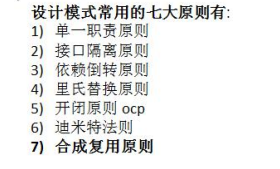

## 1.1.2设计模式的重要性

> 1. 软件工程中，**设计模式**（design pattern）是对软件设计中**普遍存在（反复出现）**的各种问题，所提出的**解决方案**。这个术语是由埃里希·伽玛（Erich Gamma）等人在 1990 年代从建筑设计领域引入到计算机科学的
> 2. 拿实际工作经历来说, 当一个项目开发完后，如果**客户提出增新功能**，怎么办?。（可扩展性,使用设计模式，软件具有很好的扩展性）
> 3. 如果项目开发完后，原来程序员离职，你接手维护该项目怎么办? (**维护性**[可读性、规范性])
> 4. ) 目前程序员门槛越来越高，一线 IT 公司(大厂)，都会问你在实际项目中**使用过什么设计模式，怎样使用的，解决了什么问题**。 
> 5. **设计模式在软件中哪里**？面向对象(oo)=>功能模块[设计模式+算法(数据结构)]=>框架[使用到多种设计模式]=> 架构 [服务器集群] 

# 第 2 章 设计模式七大原则

## 2.1 设计模式的目的

> 编写软件过程中，程序员面临着来自 **耦合性，内聚性以及可维护性，可扩展性，重用性，灵活性** 等多方面的 挑战，设计模式是为了让程序(软件)，具有更好 
>
> 1.  代码重用性 (即：相同功能的代码，不用多次编写) 
> 2. 可读性 (即：编程规范性, 便于其他程序员的阅读和理解) 
> 3. 可扩展性 (即：当需要增加新的功能时，非常的方便，称为可维护) 
> 4. 可靠性 (即：当我们增加新的功能后，对原来的功能没有影响) 
> 5.  使程序呈现高内聚，低耦合的特性 
>
> **分享金句**： 
>
> 1.  设计模式包含了面向对象的精髓，“懂了设计模式，你就懂了面向对象分析和设计（OOA/D）的精要” 
> 2. Scott Mayers 在其巨著《Effective C++》就曾经说过：C++老手和 C++新手的区别就是前者手背上有很多伤疤

## 2.2 设计模式七大原则(重点)

> 1. 单一职责原则
> 2. 接口隔离原则 
> 3.  依赖倒转(倒置)原则 
> 4.  里氏替换原则 
> 5.  开闭原则 
> 6.  迪米特法则 
> 7. 合成复用原则

## 2.3 单一职责原则

### 2.3.1基本介绍 

对类来说的，**即一个类应该只负责一项职责**。如类 A 负责两个不同职责：职责 1，职责 2。当职责 1 需求变更 而改变 A 时，可能造成职责 2 执行错误，所以需要将类 A 的粒度分解为 A1，A2

### 2.3.2应用实例

以交通工具案例讲解 

#### 1) 方案 1 [分析说明] 

```java
public class SingleResponsibility1 { 
    public static void main(String[] args) {
    Vehicle vehicle = new Vehicle(); vehicle.run("摩托车");
    vehicle.run("汽车"); vehicle.run("飞机");
}
}
// 交通工具类 
/**方式 1  
1. 在方式 1 的 run 方法中，违反了单一职责原则 
2. 解决的方案非常的简单，根据交通工具运行方法不同，分解成不同类即可 **/
class Vehicle { 
    public void run(String vehicle) {
        System.out.println(vehicle + " 在公路上运行...."); } }
```

#### 2) 方案 2 [分析说明]

```java
public class SingleResponsibility2 { 
    public static void main(String[] args) { 
        RoadVehicle roadVehicle = new RoadVehicle(); 
        roadVehicle.run("摩托车"); roadVehicle.run("汽车"); 
        AirVehicle airVehicle = new AirVehicle(); airVehicle.run("飞机"); } }
/**方案 2 的分析 
1. 遵守单一职责原则 
2. 但是这样做的改动很大，即将类分解，同时修改客户端 
3. 改进：直接修改 Vehicle 类，改动的代码会比较少=>方案 3 **/
class RoadVehicle { public void run(String vehicle) { System.out.println(vehicle + "公路运行"); } }
class AirVehicle { public void run(String vehicle) { System.out.println(vehicle + "天空运行"); }}
class WaterVehicle { public void run(String vehicle) { System.out.println(vehicle + "水中运行"); } }
```

#### 3) 方案 3 [分析说明]

```java
public class SingleResponsibility3 { 
    public static void main(String[] args) { 
 Vehicle2 vehicle2 = new Vehicle2(); vehicle2.run("汽车"); vehicle2.runWater("轮船"); vehicle2.runAir("飞机"); } }
/**方式 3 的分析
  //1. 这种修改方法没有对原来的类做大的修改，只是增加方法 //2. 这里虽然没有在类这个级别上遵守单一职责原则，但是在方法级别上，仍然是遵守单一职责 **/
  class Vehicle2 { public void run(String vehicle) {System.out.println(vehicle + " 在公路上运行...."); }
      public void runAir(String vehicle) { System.out.println(vehicle + " 在天空上运行...."); }
      public void runWater(String vehicle) { System.out.println(vehicle + " 在水中行...."); }
```

### 2.3.3单一职责原则注意事项和细节 

> 1) 降低类的复杂度，一个类只负责一项职责。 
>
> 2) 提高类的可读性，可维护性 
>
> 3) 降低变更引起的风险 
>
> 4) 通常情况下，我们应当遵守单一职责原则，只有逻辑足够简单，才可以在代码级违反单一职责原则；只有类中 方法数量足够少，可以在方法级别保持单一职责原则

## 2.4 接口隔离原则(Interface Segregation Principle)

### 2.4.1基本介绍 

> 1) 客户端不应该依赖它不需要的接口，即**一个类对另一个类的依赖应该建立在最小的接口**上
>
> 2) 先看一张图：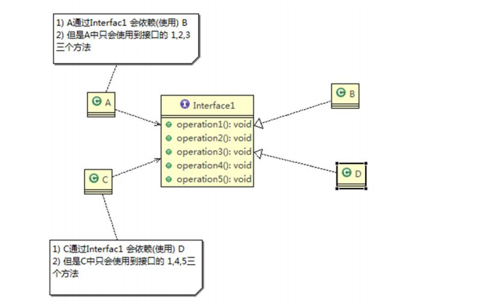
>
> 3) 类 A 通过接口 Interface1 依赖类 B，类 C 通过接口 Interface1 依赖类 D，如果接口 Interface1 对于类 A 和类 C 
>
> 来说不是最小接口，那么类 B 和类 D 必须去实现他们不需要的方法。 
>
> 4) 按隔离原则应当这样处理： 
>
> **将接口** **Interface1** 拆分为**独立的几个接口(这里我们拆分成 3 个接口)**，类 A 和类 C 分别与他们需要的接口建立 依赖关系。也就是采用接口隔离原则

### 2.4.2应用实例 

#### 1.没有使用接口隔离原则代码 

```java
 public class Segregation1 { 
     public static void main(String[] args) { }
     interface Interface1 { 
         void operation1(); void operation2(); void operation3(); void operation4(); void operation5(); }
     class B implements Interface1 { 
         public void operation1() { System.out.println("B 实现了 operation1"); }
         public void operation2() { System.out.println("B 实现了 operation2"); }
         public void operation3() { System.out.println("B 实现了 operation3"); }
         public void operation4() { System.out.println("B 实现了 operation4"); }
         public void operation5() { System.out.println("B 实现了 operation5"); } }
     class D implements Interface1 { 
         public void operation1() { System.out.println("D 实现了 operation1"); }
         public void operation2() { System.out.println("D 实现了 operation2"); }
         public void operation3() { System.out.println("D 实现了 operation3"); }
         public void operation4() { System.out.println("D 实现了 operation4"); }
         public void operation5() { System.out.println("D 实现了 operation5"); } }
     class A { 
         //A 类通过接口 Interface1 依赖(使用) B 类，但是只会用到 1,2,3 方法
         public void depend1(Interface1 i) { i.operation1(); }
         public void depend2(Interface1 i) { i.operation2(); }
         public void depend3(Interface1 i) { i.operation3();
】 } }
     class C { 
         //C 类通过接口 Interface1 依赖(使用) D 类，但是只会用到 1,4,5 方法 
         public void depend1(Interface1 i) { i.operation1(); }
         public void depend4(Interface1 i) { i.operation4(); }
         public void depend5(Interface1 i) { i.operation5(); } }
```

#### 2.应传统方法的问题和使用接口隔离原则改进 

1) 类 A 通过接口 Interface1 依赖类 B，类 C 通过接口 Interface1 依赖类 D，如果接口 Interface1 对于类 A 和类 C 来说不是最小接口，那么**类 B 和类 D 必须去实现他们不需要的方法** 

2) 将接口 **Interface1** **拆分为独立的几个接口**，类 A 和类 C 分别与他们需要的接口建立依赖关系。也就是采用接口 

隔离原则 

3) 接口 Interface1 中出现的方法，根据实际情况拆分为**三个**接口

```java
public class Segregation1 {
    public static void main(String[] args) {
        A a = new A();
        a.depend1(new B()); a.depend2(new B());a.depend3(new B());
        C c = new C();
        c.depend1(new D()); c.depend4(new D()); c.depend5(new D())
    }
}
interface Interface1 { void operation1();}
interface Interface2 {
    void operation2(); void operation3();}
interface Interface3 {
    void operation4();void operation5();}

class B implements Interface1, Interface2 {//实现了接口隔离的原则
    public void operation1() {System.out.println("B 实现了 operation1");}
    public void operation2() { System.out.println("B 实现了 operation2");}
    public void operation3() { System.out.println("B 实现了 operation3");}
}
class D implements Interface1, Interface3 {
    public void operation1() { System.out.println("D 实现了 operation1");}
    public void operation5() { System.out.println("D 实现了 operation5"); }
}
    }
class A { // A 类通过接口 Interface1,Interface2 依赖(使用) B 类，但是只会用到 1,2,3 方法
    public void depend1(Interface1 i) {i.operation1();}
    public void depend2(Interface2 i) { i.operation2(); }
    public void depend3(Interface2 i) {i.operation3();}
}
class C { // C 类通过接口 Interface1,Interface3 依赖(使用) D 类，但是只会用到 1,4,5 方法 
    public void depend1(Interface1 i) {i.operation1(); }
    public void depend4(Interface3 i) {i.operation4(); }
    public void depend5(Interface3 i) { i.operation5(); }
}
```

## 2.5 依赖倒转原则

### 2.5.1基本介绍 

> 依赖倒转原则(Dependence Inversion Principle)是指：
>
> - 高层模块不应该依赖低层模块，二者都应该依赖其抽象
> -  抽象不应该依赖细节，细节应该依赖抽象 
> -  **依赖倒转(倒置)的中心思想是面向接口编程**
> - 依赖倒转原则是基于这样的设计理念：相对于细节的多变性，抽象的东西要稳定的多。以抽象为基础搭建的架 构比以细节为基础的架构要稳定的多。在 java 中，抽象指的是接口或抽象类，细节就是具体的实现类
> -  使用接口或抽象类的目的是制定好规范，而不涉及任何具体的操作，把展现细节的任务交给他们的实现类去完成

### 2.5.2应用实例 

请编程完成 Person 接收消息 的功能。1) 实现方案 1 + 分析说明

```java
public class DependecyInversion {
    public static void main(String[] args) {
        Person person = new Person();
        person.receive(new Email());
    }
}
class Email {
    public String getInfo() {return "电子邮件信息: hello,world";}
}
/*方式 1 分析 
//1. 简单，比较容易想到 
//2. 如果我们获取的对象是 微信，短信等等，则新增类，同时 Perons 也要增加相应的接收方法 
//3. 解决思路：引入一个抽象的接口 IReceiver, 表示接收者, 这样 Person 类与接口 IReceiver 发生依赖 // 因为 Email, WeiXin 等等属于接收的范围，他们各自实现 IReceiver 接口就 ok, 这样我们就符号依赖倒转原则*/
class Person {
    public void receive(Email email) {System.out.println(email.getInfo());}
}
```

2) 实现方案 2(依赖倒转) + 分析说明

```java
public class DependecyInversion {
    public static void main(String[] args) { 
        //客户端无需改变
        Person person = new Person();
        person.receive(new Email()); person.receive(new WeiXin());
    }
}
interface IReceiver {
     String getInfo();
}
class Email implements IReceiver {
    public String getInfo() {return "电子邮件信息: hello,world";}
}
class WeiXin implements IReceiver {
    public String getInfo() {return "微信信息: hello,ok";}
}
class Person {
   // 这里我们是对接口的依赖
    public void receive(IReceiver receiver) { system.out.pringSystem.out.println(receiver.getInfo()); }}
```

### 2.5.3依赖关系传递的三种方式和应用案例

> 1. 接口传递 
> 2. 构造方法传递 
> 3. setter 方式传递

```java
public class DependencyPass {
    public static void main(String[] args) {
        ChangHong changHong = new ChangHong();
        OpenAndClose openAndClose = new OpenAndClose();
        openAndClose.open(changHong);
        
        OpenAndClose openAndClose = new OpenAndClose(changHong);
        openAndClose.open();
        
        OpenAndClose openAndClose = new OpenAndClose();
        openAndClose.setTv(changHong);
        openAndClose.open();
    }
} 
//方式 1： 通过接口传递实现依赖 开关的接口
interface IOpenAndClose {
    public void open(ITV tv);
}
interface ITV {
    public void play();
}
class ChangHong implements ITV {
    @Override
    public void play() { System.out.println("长虹电视机，打开"); }
}
class OpenAndClose implements IOpenAndClose {
    public void open(ITV tv) {tv.play(); }
}  
//方式 2:通过构造方法依赖传递
interface IOpenAndClose {
    public void open();
}
interface ITV {
    public void play();
}
class OpenAndClose implements IOpenAndClose {
    public ITV tv;
    public OpenAndClose(ITV tv) { this.tv = tv; }
    public void open() { this.tv.play(); }
}
//方式三：通过 setter 方法进行依赖传递
interface IOpenAndClose {
    public void open();
    public void setTv(ITV tv);
}
interface ITV { public void play();}
class OpenAndClose implements IOpenAndClose {
    private ITV tv;
    public void setTv(ITV tv) { this.tv = tv;}
    public void open() { this.tv.play();}
}
class ChangHong implements ITV {
    @Override
    public void play() {System.out.println("长虹电视机，打开");}
}
```

### 2.5.4依赖倒转原则的注意事项和细节

> 1) 低层模块尽量都要有抽象类或接口，或者两者都有，程序稳定性更好. 
>
> 2) 变量的**声明类型尽量是抽象类或接口**, 这样我们的变量引用和实际对象间，就存在**一个缓冲层**，利于程序扩展 和优化 
>
> 3) 继承时遵循**里氏替换**原则

## 2.6 里氏替换原则 

### 2.6.1OO 中的继承性的思考和说明

> 1) 继承包含这样一层含义：父类中凡是已经实现好的方法，实际上是在设定规范和契约，虽然它不强制要求所有 的子类必须遵循这些契约，但是如果子类对这些已经实现的方法任意修改，就会对整个继承体系造成破坏。 
>
> 2) **继承在给程序设计带来便利的同时，也带来了弊端**。比如使用继承会给程序带来**侵入性**，程序的可移植性降低， 增加对象间的耦合性，如果一个类被其他的类所继承，则当这个类需要修改时，必须考虑到所有的子类，并且 父类修改后，所有涉及到子类的功能都有可能产生故障 
>
> 3) 问题提出：**在编程中，如何正确的使用继承**? => **里氏替换**原则

### 2.6.2基本介绍

> -  里氏替换原则(Liskov Substitution Principle)在 1988 年，由麻省理工学院的以为姓里的女士提出的。 
> - 如果对每个类型为 T1 的对象 o1，都有类型为 T2 的对象 o2，使得以 T1 定义的所有程序 P 在所有的对象 o1 都 代换成 o2 时，程序 P 的行为没有发生变化，那么类型 T2 是类型 T1 的子类型。**换句话说，所有引用基类的地*****方必须能透明地使用其子类的对象**。 
> - 在使用继承时，遵循里氏替换原则，在**子类中尽量不要重写父类的方法** 
> - 里氏替换原则告诉我们，继承实际上让两个类耦合性增强了，在适当的情况下，可以通过**聚合，组合，依赖** 来 解决问题

### 2.6.3一个程序引出的问题和思考 

```java
public class Liskov {
    public static void main(String[] args) {
        A a = new A();
        System.out.println("11-3=" + a.func1(11, 3));
        System.out.println("1-8=" + a.func1(1, 8));
        System.out.println("-----------------------");
        B b = new B();
        System.out.println("11-3=" + b.func1(11, 3));
        System.out.println("1-8=" + b.func1(1, 8));
        System.out.println("11+3+9=" + b.func2(11, 3));
    }
}
class A {
    public int func1(int num1, int num2) { return num1 - num2;}
}
class B extends A {
    //无意识重写的代码。导致功能的改变
    public int func1(int a, int b) { return a + b;}
    public int func2(int a, int b) {return func1(a, b) + 9; }
}
```

### 2.6.4解决方法

> - 通用的做法是：**原来的父类和子类都继承一个更通俗的基类**(子类中的共有方法写入到Base类中，供子类继承)，原有的继承关系去掉，采用**依赖，聚合，组合**等关系代替
> - 改进方案 
>
> 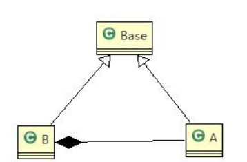

```java
public class Liskov {
    public static void main(String[] args) {
        A a = new A();
        System.out.println("11-3=" + a.func1(11, 3));
        System.out.println("1-8=" + a.func1(1, 8));
        B b = new B();
    //  因为 B 类不再继承 A 类，因此调用者，不会再 func1 是求减法 调用完成的功能就会很明确 
        System.out.println("11+3=" + b.func1(11, 3));
        System.out.println("1+8=" + b.func1(1, 8));
        System.out.println("11+3+9=" + b.func2(11, 3));
        System.out.println("11-3=" + b.func3(11, 3));
    }
}
//创建一个更加基础的基类
class Base { /**A、B类中的共有功能写入到该类中 */}
class A extends Base {
    public int func1(int num1, int num2) {return num1 - num2; }}
class B extends Base {
    //使用组合关系
    private A a = new A();
    public int func1(int a, int b) { return a + b; }
    public int func2(int a, int b) { return func1(a, b) + 9; }
    public int func3(int a, int b) { return this.a.func1(a, b); }
}
```

## 2.7 开闭原则

### 2.7.1基本介绍

> - 开闭原则（Open Closed Principle）是编程中**最基础、最重要**的设计原则
> - 一个软件实体如类，模块和函数应该对扩展开放**(对提供方)，对修改关闭(对使用方)**。用抽象构建框架，用实现扩展细节。 
> -  当软件需要变化时，尽量**通过扩展软件**实体的行为来实现变化，而不是**通过修改**已有的代码来实现变化。 
> - 编程中遵循其它原则，以及使用设计模式的目的就是遵循开闭原则。

### 2.7.2看下面一段代码 

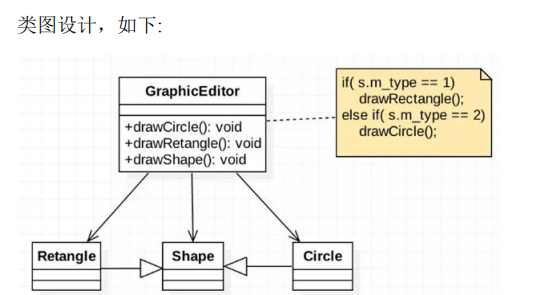

```java
public class Ocp {
    public static void main(String[] args) {
        GraphicEditor graphicEditor = new GraphicEditor();
        graphicEditor.drawShape(new Rectangle());
        graphicEditor.drawShape(new Circle());
    }
}
//这是一个用于绘图的类[使用方]
class GraphicEditor {
    public void drawShape(Shape s) {
        if (s.m_type == 1) drawRectangle(s);
        else if (s.m_type == 2) drawCircle(s);//当添加功能时，需要修改使用方
    }
    public void drawRectangle(Shape r) { System.out.println(" 绘制矩形 "); }
    public void drawCircle(Shape r) { System.out.println(" 绘制圆形 "); }
    public void drawTriangle(Shape r) { System.out.println(" 绘制三角形 "); }}
class Shape {int m_type;}
class Rectangle extends Shape {
    Rectangle() { super.m_type = 1; }
}
class Circle extends Shape {
    Circle() {super.m_type = 2; }
}
```

### 2.7.3方式 1 的优缺点 

> - 优点是比较好理解，简单易操作。 
> - 缺点是违反了设计模式的 ocp 原则，即对扩展开放(提供方)，对修改关闭(使用方)。即当我们给类增加新功能的 时候，尽量不修改代码，或者尽可能少修改代码. 
> - 比如我们这时要新增加一个图形种类 三角形，我们需要做如下修改，修改的地方较多 

### 2.7.4改进的思路分析 

> **思路**：把创建 **Shape** **类做成抽象类**，并提供一个**抽象的** **draw** 方法，让**子类去实现即可**，这样我们有新的图形 种类时，只需要让新的图形类继承 Shape，并实现 draw 方法即可，**使用方的代码就不需要修** -> 满足了开闭原则

```java
public class Ocp {
    public static void main(String[] args) {
         GraphicEditor graphicEditor = new GraphicEditor();
        graphicEditor.drawShape(new Rectangle());
    }
}
//这是一个用于绘图的类[使用方]（类似于依赖倒转）
class GraphicEditor {
    public void drawShape(Shape s) { s.draw(); }
}
//定义抽象类
abstract class Shape {
    int m_type;
    public abstract void draw();
}
class Rectangle extends Shape {
    Rectangle() { super.m_type = 1; }
    @Override
    public void draw() { System.out.println(" 绘制矩形 "); }
}
class Circle extends Shape {
    Circle() { super.m_type = 2; }
    @Override
    public void draw() { System.out.println(" 绘制圆形 "); }
}
```

## 2.8 迪米特法则

### 2.8.1基本介绍 

> -  一个对象应该对其他对象保持最少的了解 
> - 类与类关系越密切，耦合度越大 
> -  迪米特法则(Demeter Principle)又叫**最少知道原则**，即一个类**对自己依赖的类知道的越少越好**。也就是说，对于被依赖的类不管多么复杂，都尽量将逻辑封装在类的内部。对外除了提供的 public 方法，不对外泄露任何信息 
> - 迪米特法则还有个更简单的定义：**只与直接的朋友通信** 
> - **直接的朋友**：每个对象都会与其他对象有**耦合关系**，只要两个对象之间有耦合关系，我们就说这两个对象之间 是朋友关系。耦合的方式很多，依赖，关联，组合，聚合等。其中，我们称出现**成员变量**，**方法参数**，**方法返回值**中的类为直接的朋友，而出现在**局部变量中的类不是直接的朋友**。也就是说，陌生的类最好不要以局部变 量的形式出现在类的内部

### 2.8.2应用实例

有一个学校，下属有各个学院和总部，现要求打印出学校总部员工 ID 和学院员工的 id

```java
import java.util.ArrayList;
import java.util.List;
public class Demeter1 {
    public static void main(String[] args) {
        SchoolManager schoolManager = new SchoolManager();
        schoolManager.printAllEmployee(new CollegeManager());
    }
}
class CollegeEmployee {
    private String id;
    public void setId(String id) { this.id = id; }
    public String getId() { return id; }
}
class Employee {
    private String id;
    public void setId(String id) { this.id = id; }
    public String getId() { return id; }
}
class CollegeManager {
    public List<CollegeEmployee> getAllEmployee() {
        List<CollegeEmployee> list = new ArrayList<CollegeEmployee>();
        for (int i = 0; i < 10; i++) {
            CollegeEmployee emp = new CollegeEmployee();
            emp.setId("学院员工 id= " + i);
            list.add(emp);
        }
        return list;
    }
}
//分析 SchoolManager 类的直接朋友类有哪些 Employee、CollegeManager
// CollegeEmployee 不是直接朋友 而是一个陌生类，这样违背了 迪米特法则
class SchoolManager {
    public List<Employee> getAllEmployee() {
        List<Employee> list = new ArrayList<Employee>();
        for (int i = 0; i < 5; i++) {
            Employee emp = new Employee();
            emp.setId("学校总部员工 id= " + i);
            list.add(emp);
        }
        return list;
    }
        // 该方法完成输出学校总部和学院员工信息(id)
        void printAllEmployee (CollegeManager sub){
       /* 分析问题   1. 这里的 CollegeEmployee 不是 SchoolManager 的直接朋友
                    2. CollegeEmployee 是以局部变量方式出现在 SchoolManager
                    3. 违反了 迪米特法则 获取到学院员工 */
            List<CollegeEmployee> list1 = sub.getAllEmployee();
            System.out.println("------------学院员工------------");
            for (CollegeEmployee e : list1) {
                System.out.println(e.getId());
            }
            List<Employee> list2 = this.getAllEmployee();
            System.out.println("------------学校总部员工------------");
            for (Employee e : list2) {
                System.out.println(e.getId());
            }
        }
    }
```

### 2.8.3应用实例改进

前面设计的问题在于 SchoolManager 中，**CollegeEmployee** **类并不是** **SchoolManager** 类的直接朋友 (分析)

```java
/*在学院管理类中添加此方法*/
public void printEmployee(){
        List<CollegeEmployee> list1=getAllEmployee();System.out.println("------------学院员工------------");
        for(CollegeEmployee e:list1){System.out.println(e.getId());}}
/*学校管理类中*/
//将输出学院的员工方法，封装到  CollegeManager 
sub.printEmployee();
```

### 2.8.4迪米特法则注意事项和细节

> - 迪米特法则的核心是降低类之间的耦合 
> -  但是注意：由于每个类都减少了不必要的依赖，因此迪米特法则只是要求降低类间(对象间)耦合关系， 并不是要求完全没有依赖关系

## 2.9 合成复用原则（Composite Reuse Principle）

### 2.9.1基本介绍 

> 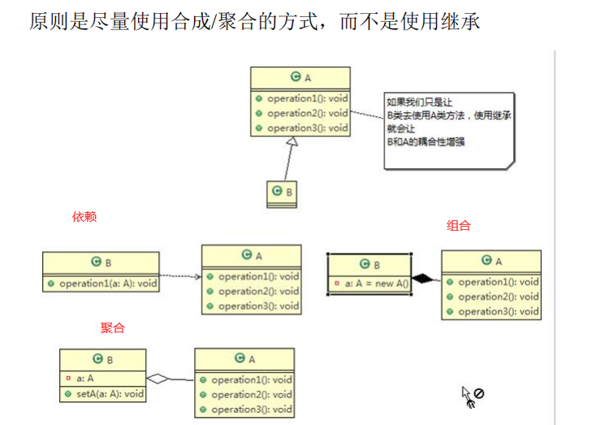

## 2.10 设计原则核心思想

> -  找出应用中可能需要变化之处，把它们独立出来，不要和那些不需要变化的代码混在一起。 
> -  针对接口编程，而不是针对实现编程。 
> - 为了交互对象之间的**松耦合设计而努力**

# 第 3 章 UML 类图

## 3.1 UML 基本介绍

> -  UML——Unified modeling language UML (统一建模语言)，是一种用于软件系统分析和设计的语言工具，它用 于帮助软件开发人员进行思考和记录思路的结果 
>
> - UML 本身是一套符号的规定，就像数学符号和化学符号一样，这些符号用于描述软件模型中的各个元素和他 们之间的关系，比如**类、接口、实现、泛化、依赖、组合、聚合**等，如右图:
>
> - > 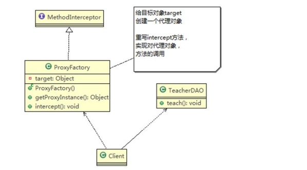
>   >
>   > 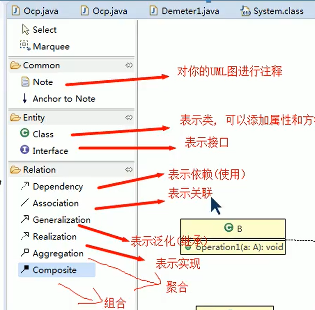

## 3.2 UML 图 

> UML 图分类：
>
> - 用例图(use case) 
>
> - 静态结构图：**类图**、对象图、包图、组件图、部署图 
>
> - 动态行为图：交互图（时序图与协作图）、状态图、活动图
>
> - 说明： 
>
>    类图是描述类与类之间的关系的，是 UML 图中最核心的 

## 3.3 UML 类图

> - 用于描述系统中的类**(对象)本身的组成和类(对象)之间的各种静态关系**。 
>
> -  类之间的关系：**依赖、泛化（继承）、实现、关联、聚合与组合**。
>
> - 类图简单举例 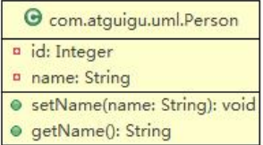
>
> - > ```java
>   > public class Person{ private Integer id; private String name; 			public void setName(String name){ this.name=name; }
>   >          public String getName(){ return name; } }
>   > ```

## 3.4 类图—依赖关系（Dependence）

只要是**在类中用到了对方**，那么他们之间就存在依赖关系。如果没有对方，连编绎都通过不了。

```java
class A{private B b;}
class B{}
```

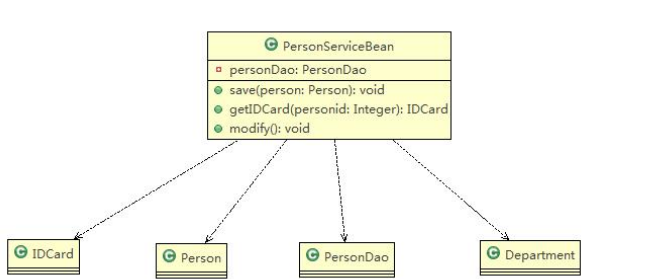

> **小结** 
>
> 1) 类中用到了对方 2) 如果是**类的成员属性** 3) 如果是**方法的返回类**型 4) 是方法**接收的参数类**型 5) **方法中使用**到

## 3.5 类图—泛化关系(generalization）

> - 泛化关系实际上就是继承关系 
> - 如果 A 类继承了 B 类，我们就说 A 和 B 存在泛化关系

```java
class A{}
class B extends A{}
```

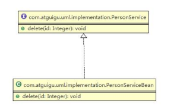

## 3.6 类图—实现关系（Implementation） 

```java
interface A{}
class B implements a{}
```


## 3.7 类图—关联关系（Association） 

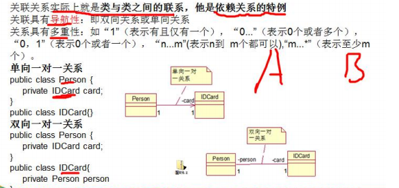

## 3.8 类图—聚合关系（Aggregation） 

### 3.8.1基本介绍 

> - 聚合关系（Aggregation）表示的是**整体和部分的关系**，**整体与部分可以分开**。聚合关系是**关联关系的特例**，所 以他具有关联的**导航性与多重性**。 
>
> - > 如：一台电脑由键盘(keyboard)、显示器(monitor)，鼠标等组成；组成电脑的各个配件是可以从电脑上分离出来 的，使用带空心菱形的实线来表示

### 3.8.2应用实例

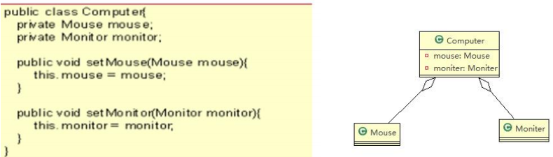

## 3.9 类图—组合关系（Composition）

### 3.9.1基本介绍 

> - 组合关系：也是整体与部分的关系，但是**整体与部分不可以分开**。 
>
> - 再看一个案例：在程序中我们定义实体：Person 与 IDCard、Head, 那么 Head 和 Person 就是 组合，IDCard 和 Person 就是聚合。 
>
> - > 但是如果在程序中 Person 实体中定义了对 IDCard 进行级联删除，即删除 Person 时连同 IDCard 一起删除，那 么 IDCard 和 Person 就是组合了.

### 3.9.2应用案例 

```java
public class Person{ 
    private IDCard card; 
    private Head head = new Head(); }
public class IDCard{} 
public class Head{}
```

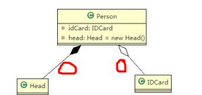

# 第 4 章 设计模式概述 

## 4.1设计模式介绍

> -  设计模式是程序员在面对同类软件工程设计问题所总结出来的有用的经验，**模式不是代码**，而是**某类问题的通** **用解决方案**，设计模式（Design pattern）代表了最佳的实践。这些解决方案是众多软件开发人员经过相当长的 一段时间的试验和错误总结出来的。 
> -  设计模式的本质提高 **软件的维护性，通用性和扩展性，并降低软件的复杂度**。 
> -  <<**设计模式**>> 是经典的书，作者是 Erich Gamma、Richard Helm、Ralph Johnson 和 John Vlissides Design（俗 称 “四人组 GOF”） 
> -  设计模式并不局限于某种语言，java，php，c++ 都有设计模式.

## 4.2 设计模式类型 

设计模式分为**三种类型**，共 **23** **种**

> 1.  **创建型**模式：单例模式、抽象工厂模式、原型模式、建造者模式、工厂模式。
> 2. **结构型**模式：适配器模式、桥接模式、装饰模式、组合模式、外观模式、享元模式、代理模式。 
> 3. **行为型**模式：模版方法模式、命令模式、访问者模式、迭代器模式、观察者模式、中介者模式、备忘录模式、 解释器模式（Interpreter 模式）、状态模式、策略模式、职责链模式(责任链模式)。

# 第 5 章 单例设计模式 

## 5.1 单例设计模式介绍 

**static 变量只依赖于类存在（类访问），不依赖于实例对象存在及内存中只有一份，共享一个变量**

> 所谓类的单例设计模式，就是**采取一定的方法保证在整个的软件系统中，对某个类只能存在一个对象实例**， 并且该类只提供一个取得其对象实例的方法(静态方法)。
>
> 比如 Hibernate 的 SessionFactory，它充当数据存储源的代理，并负责创建 Session 对象。SessionFactory 并不是 轻量级的，一般情况下，一个项目通常只需要一个 SessionFactory 就够，这是就会使用到单例模式。

## 5.2 单例设计模式八种方式

> 单例模式有八种方式： 
>
> 1. **饿汉式(静态常量)** 
> 2.  **饿汉式（静态代码块）** 
> 3. 懒汉式(线程不安全) 
> 4. 懒汉式(线程安全，同步方法) 
> 5. 懒汉式(线程安全，同步代码块) 
> 6. **双重检查** 
> 7. **静态内部类** 
> 8.  **枚举** 

## 5.3 饿汉式（静态常量）

> 1. 构造器私有化 (防止 new ) 
> 2.  类的内部创建对象 
> 3.  向外暴露一个静态的公共方法。getInstance 

```java
public class SingletonTest01 {
    public static void main(String[] args) {
        Singleton instance = Singleton.getInstance();
        Singleton instance2 = Singleton.getInstance();
        System.out.println(instance == instance2);// true 
        System.out.println("instance.hashCode=" + instance.hashCode());
        System.out.println("instance2.hashCode=" + instance2.hashCode());
    }
}
class Singleton {
    private Singleton() {}
    //2.本类内部创建对象实例
    private final static Singleton instance = new Singleton(); 
    //3.提供一个公有的静态方法，返回实例对象
    public static Singleton getInstance() { return instance; }
}
```

> - **优缺点说明**：
>
> - > 1) 优点：这种写法比较简单，就是在类装载的时候就完成实例化。避免了线程同步问题。 
>   >
>   > 2) 缺点：在类装载的时候就完成实例化，没有达到 Lazy Loading 的效果。**如果从始至终从未使用过这个实例，则会造成内存的浪费** 
>   >
>   > 3) 这种方式基于 classloder 机制**避免了多线程的同步问题**，不过，instance 在类装载时就实例化，在单例模式中大多数都是调用 getInstance 方法，但是导致类装载的原因有很多种，因此不能确定有其他的方式（或者其他的静态方法）导致类装载，这时候初始化 instance 就没有达到 lazy loading 的效果 
>   >
>   > 4) **结论：这种单例模式可用，可能造成内存浪费**

## 5.4 饿汉式（静态代码块） 

```java
//饿汉式(静态变量)
class Singleton { 
    //1.构造器私有化,外部能 new
    private Singleton() {}
    //2.本类内部创建对象实例
    private static Singleton instance;
    static {
       // 在静态代码块中，创建单例对象 
        instance = new Singleton();
    }
    //3.提供一个公有的静态方法，返回实例对象
    public static Singleton getInstance() {
        return instance;
    }
}
```

> - 优缺点说明：
>
> - > 1) 这种方式和上面的方式其实类似，只不过将类实例化的过程放在了静态代码块中，也是在类装载的时候，就执 行静态代码块中的代码，初始化类的实例。优缺点和上面是一样的。 
>   >
>   > 2) **结论：这种单例模式可用，但是可能造成内存浪费** 

## 5.5 懒汉式(线程不安全) 

```java
class Singleton {
    private static Singleton instance;
    private Singleton() {}
    //提供一个静态的公有方法，当使用到该方法时，才去创建 instance
    //即懒汉式
    public static Singleton getInstance() {
        if (instance == null) {
            instance = new Singleton();
        }
        return instance;
    }
}
```

> - 优缺点说明：
>
> - > 1) 起到了 **Lazy Loading** 的效果，但是只能在单线程下使用。 
>   >
>   > 2) 如果在多线程下，一个线程进入了 if (singleton == null)判断语句块，还未来得及往下执行，另一个线程也通过 了这个判断语句，这时便会**产生多个实例（可以理解为两个线程同时创建）**。所以在多线程环境下不可使用这种方式 (**单例模式是在整个系统中使用一个实例对象**)
>   >
>   > 3) 结论：在实际开发中，**不要使用**这种方式.

## 5.6 懒汉式(线程安全，同步方法)

```java
//懒汉式(线程安全，同步方法)
class Singleton {
    private static Singleton instance;（静态属性，第一次调用下面的方法时赋值，并存在方法区得到静态池中）
    private Singleton() {}
    //提供一个静态的公有方法，加入同步处理的代码，解决线程安全问题 
    // 即懒汉式
    public static synchronized Singleton getInstance() {//解决了多线程同时创建的问题
        if (instance == null) {
            instance = new Singleton();
        }
        return instance;
    }
}
```

> - 优缺点说明：
>
> - > 1) 解决了**线程安全**问题 
>   >
>   > 2) 效率太低了，每个线程在想获得类的实例时候，执行 getInstance()方法都要进行同步。而其实这个方法只执行 一次实例化代码就够了，后面的想获得该类实例，直接 return 就行了。**方法进行同步效率太**低 
>   >
>   > 3) 结论：在实际开发中，**不推荐**使用这种方式

## 5.7 懒汉式(线程安全，同步代码块)

没有实际的作用：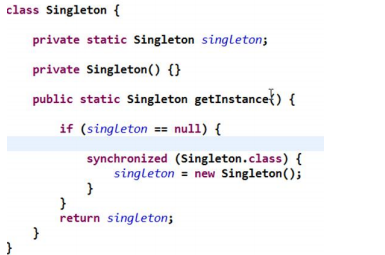

## 5.8 双重检查 （DCL）

```java
//懒汉式(线程安全，同步方法)
class Singleton {
    private static volatile Singleton instance;
    private Singleton() {}
    //提供一个静态的公有方法，加入双重检查代码，解决线程安全问题,同时解决懒加载问题.同时保证了效率, 推荐使用
    public static Singleton getInstance() {
        if (instance == null) {
            synchronized (Singleton.class) {
                if (instance == null) {
                    instance = new Singleton();
                }
            }
        }
        return instance;
    }
}
```

> - 优缺点说明： 
>
> - > 1) Double-Check 概念是多线程开发中常使用到的，如代码中所示，我们进行了两次 if (singleton == null)检查，这 样就可以保证线程安全了。 
>   >
>   > 2) 这样，实例化代码只用执行一次，后面再次访问时，判断 if (singleton == null)，直接 return 实例化对象，也避 免的反复进行方法同步. 
>   >
>   > 3) **线程安全**；**延迟加载**；**效率较高** 
>   >
>   > 4) 结论：在实际开发中，**推荐使用这种单例设计模**式 

[[java中volatile关键字的作用](https://www.cnblogs.com/ustc-anmin/p/11434769.html)]

> - ```java
>   private volatile boolean pleaseStop;
>   ```
>
> - 一个变量声明为volatile，就意味着这个变量是随时会被其他线程修改的，因此不能将它cache在线程memory中。以下例子展现了volatile的作用.
>
> - 假如pleaseStop没有被声明为volatile，线程执行run的时候检查的是自己的副本，就不能及时得知其他线程已经调用tellMeToStop()修改了pleaseStop的值。 
>
> - Volatile一般情况下不能代替sychronized，因为**volatile不能保证操作的原子性**，即使只是i++，实际上也是由多个原子操作组成：read i; inc; write i，**假如多个线程同时执行i++，volatile只能保证他们操作的i是同一块内存，**但依然可能出现写入脏数据的情况。如果配合Java 5增加的atomic wrapper classes，对它们的increase之类的操作就不需sychronized。

## 5.9 静态内部类

```java
//静态内部类完成， 推荐使用
class Singleton {
    private static volatile Singleton instance;
    //构造器私有化
    private Singleton() {}
    //写一个静态内部类,该类中有一个静态属性 Singleton
    private static class SingletonInstance {
        private static final Singleton INSTANCE = new Singleton();
    }
//    提供一个静态的公有方法，直接返回 SingletonInstance.INSTANCE
    public static synchronized Singleton getInstance() {
        return SingletonInstance.INSTANCE;
    }
}
```

> - 优缺点说明：
>
> - > -  这种方式采用了类装载的机制来保证初始化实例时只有一个线程
>   > -  静态内部类方式在 Singleton 类被装载时并不会立即实例化，而是在需要实例化时，调用 getInstance 方法，才 会装载 SingletonInstance 类，从而完成Singleton 的实例化。 
>   > -  **类的静态属性只会在第一次加载类的时候初始化**，所以在这里，**JVM 帮助我们保证了线程的安全性，在类进行 初始化时，别的线程是无法进入的**。 
>   > - 优点：**避免了线程不安全，**利用**静态内部类特点实现延迟加载，效率**高 

## 5.10 枚举 

```java
//使用枚举，可以实现单例, 推荐
enum Singleton {
INSTANCE; //属性 
public void sayOK() { System.out.println("ok~"); } }
```

> - 优缺点说明
>
> - > 1) 这借助 JDK1.5 中添加的**枚举(内部也是静态代码块进行的实例化)**来实现单例模式。不仅能避免多线程同步问题，而且还能防止反序列化重新创建 新的对象。 
>   >
>   > 2) 这种方式是 **Effective Java** **作者** **Josh Bloch** **提倡**的方式 
>   >
>   > 3) 结论：**推荐**使用 

## 5.11 单例模式在 JDK 应用的源码分析 

### 5.11.1 单例模式在 JDK 应用的源码分析

java.lang.Runtime 就是经典的单例模式(饿汉式) 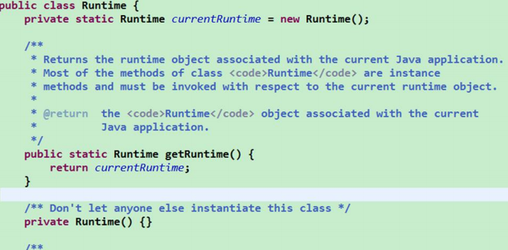

## 5.12 单例模式注意事项和细节说明

> -  单例模式保证了 系统内存中该类只存在一个对象，节省了系统资源，对于一些需要频繁创建销毁的对象，使用单例模式可以提高系统性能 
> - 当想实例化一个单例类的时候，必须要记住使用相应的获取对象的方法，而不是使用 new 
> - 单例模式使用的场景：需要频繁的进行创建和销毁的对象、创建对象时耗时过多或耗费资源过多(即：重量级 对象)，但又经常用到的对象、工具类对象、频繁访问数据库或文件的对象(比如**数据源**、**session** **工厂**等)

## 5.13重点

> - **反射是可以破坏以上的单例模式（除去枚举单例模式）**
> - **从源码中可以看出，当反射遇到枚举时直接抛出异常，因此，枚举是创建单例的不二之选**

## 5.14五种实现单例模式的方式的对比

> - 饿汉式：线程安全（不排除反射），调用效率高，不能延时加载
> - 懒汉式：线程安全（不排除反射）,调用效率不高，可以延时加载
> - DCL懒汉式：由于JVM底层模型原因，偶尔出现问题，不建议使用
> - 静态内部类式：线程安全（不排除反射），调用效率高，可以延时加载
> - 枚举单例：线程安全，调用效率高，不能延时加载

# 第 6 章 工厂模式

## 6.1核心本质:

> - 实例化对象不适用new, 用工厂方法代替
> - 将选择实现类，创建对象统一管理和控制，从而将调用者跟我们的实现类解耦

## 6.2三种模式:

> - 简单工厂模式
>   - 用来生产同一等级结构中的任何产品(对于增加新的产品，需要扩展已有代码)
> - 工厂方法模式
>   - 用来生产同一等级结构中的固定产品(支持增加任意产品)
> - 抽象工厂模式
>   - 围绕一个超级工厂创建其他工厂，该超级工厂又被称为其他工厂的工厂

## 6.3简单工厂模式(静态工厂模式 )

```java
//定义一个接口
public interface Car
{
    void name();
}
//接口的实现类
public class WuLing implements Car
{
    @Override
    public void name(){System.out.println("五菱宏光！");}
}
public class Model implements Car
{
    @Override
    public void name() {System.out.println("特斯拉！"); }
}
//简单工厂
// 静态工厂模式
public class CarFactory
{
    // 方法一  违反了开闭原则(若添加车的类型，需修改代码)
    public static Car getCar(String car)
    {
        if ("五菱".equals(car)){return new WuLing();}
        else if ("特斯拉".equals(car)) {return new Model(); }
        else{return null;}
    }
    // 方法二
    public static Car getWuLing() { return new WuLing();}
    public static Car getModel(){return new Model();}
}
//输出
public class Consumer
{
    public static void main(String[] args)
    {
        // 正常方法
        WuLing wuLing = new WuLing();
        Model model = new Model();
        wuLing.name();model.name();
        // 使用工厂创建 方法一
        Car wuLingF = CarFactory.getCar("五菱");
        wuLingF.name();
        Car modelF = CarFactory.getCar("特斯拉");
        modelF.name();
        // 方法二
        Car wuLing2 = CarFactory.getWuLing();
        Car model2 = CarFactory.getModel();
        wuLing2.name(); model2.name();
    }
}
```

> 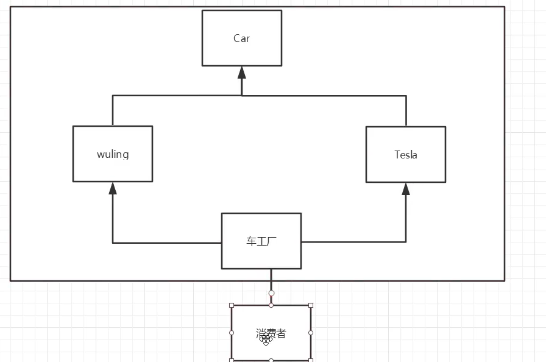
>
> 优缺点：
>
> > - 优点是比较好理解，简单易操作。 
> > - 缺点是违反了设计模式的 **ocp** **原则**，即对扩展开放，对修改关闭。即当我们给类增加新功能的时候，尽量不修 改代码，或者尽可能少修改代码

## 6.4工厂方法模式

> 工厂方法模式：**定义了一个创建对象的抽象方法**，由子**类决定要实例化的类**。工厂方法模式将**对象的实例化推迟到子类**。

```java
//接口与接口的实现类与简单工厂模式定义相同
//创建工厂方法
// 工厂方法模式
public interface CarFactory
{
    Car getCar();
}
public class WuLingFactory implements CarFactory
{
    @Override
    public Car getCar()
    {
        return new WuLing();
    }
}
public class ModelFactory implements CarFactory
{
    @Override
    public Car getCar()
    {
        return new Model();
    }
}
输出

public class Consumer
{
    public static void main(String[] args)
    {
        Car car_WuLing = new WuLingFactory().getCar();
        Car car_Model = new ModelFactory().getCar();
        car_WuLing.name();
        car_Model.name();
        Car car_xiaoPeng = new XiaoPengFactory().getCar();
        car_xiaoPeng.name();
    }
}
```

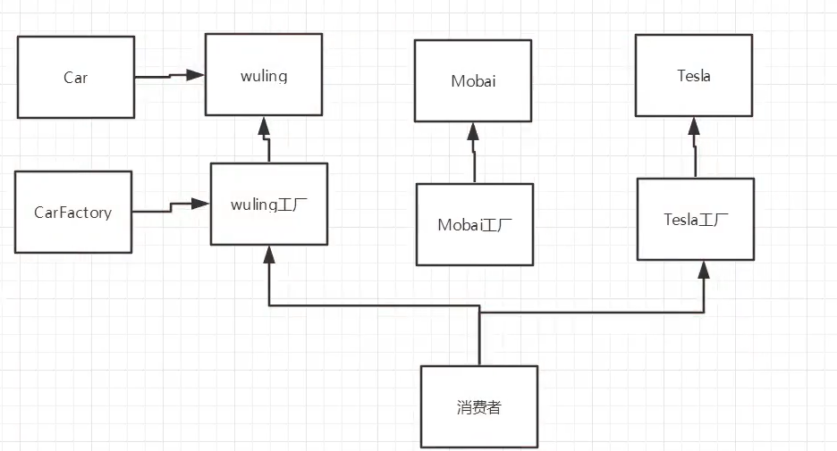

## 6.5抽象工厂模式

```java
//产品接口
// 手机接口
public interface PhoneProduct
{
    void start();
    void shutdown();
}
// 路由器产品接口
public interface RouterProduct
{
    void start();
    void shutdown();
}
//定义一个产品工厂
public interface IProductFactory
{
    // 生产手机
    PhoneProduct phoneProduct();
    // 生产路由器
    RouterProduct routerProduct();
}
//产品实现类
// 华为手机
public class HuaweiPhone implements PhoneProduct
{
    @Override
    public void start() {System.out.println("打开华为手机"); }
    @Override
    public void shutdown(){System.out.println("关闭华为手机");}
}
// 华为路由器
public class HuaweiRouter implements RouterProduct{
    @Override
    public void start(){System.out.println("打开华为路由器");}
    @Override
    public void shutdown(){ System.out.println("关闭华为路由器");}
}
// 小米手机
public class XiaomiPhone implements PhoneProduct{
    @Override
    public void start(){System.out.println("打开小米手机");}
    @Override
    public void shutdown(){System.out.println("关闭小米手机");}
}
// 小米路由器
public class XiaomiRouter implements RouterProduct{
    @Override
    public void start(){ System.out.println("打开小米路由器");}
    @Override
    public void shutdown(){System.out.println("关闭小米路由器");}
}
//创建产品工厂
public class HuaweiFactory implements IProductFactory{
    @Override
    public PhoneProduct phoneProduct() return new HuaweiPhone();}
    @Override
    public RouterProduct routerProduct(){return new HuaweiRouter();}
}
public class XiaomiFactory implements IProductFactory{
    @Override
    public PhoneProduct phoneProduct(){return new XiaomiPhone();}
    @Override
    public RouterProduct routerProduct(){return new XiaomiRouter();}
}
//输出
public class Client{
    public static void main(String[] args)
    {
        System.out.println("====================华为产品====================");
        PhoneProduct huaweiPhone = new HuaweiFactory().phoneProduct();
        huaweiPhone.start();
        huaweiPhone.callup();
        RouterProduct huaweiRouter = huaweiFactory.routerProduct();
        huaweiRouter.start();
        huaweiRouter.openWifi();
        System.out.println("====================小米产品====================");
        PhoneProduct xiaomiPhone = new XiaomiFactory().phoneProduct();
        xiaomiPhone.start();
        xiaomiPhone.callup();
        RouterProduct xiaomiRouter = xiaomiFactory.routerProduct();
        xiaomiRouter.start();
        xiaomiRouter.openWifi();
    }
}
```

> > 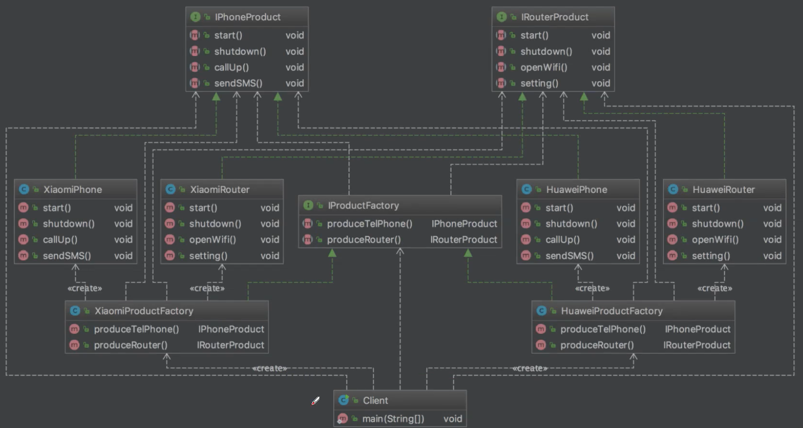
> >
> > 结论
>
> 抽象工厂模式
>
> - 定义: 抽象工厂模式提供了一个创建**一些列相关或者相互依赖对象的接口**，无需指定他们具体的类
>
> - 适用场景:
>   - 客户端(应用层) 不依赖与产品类实例如何被创建、实现等细节
>   - 强调一系列相关的产品对象(属于同一产品族) 一起使用创建对象需要大量的重复代码
>   - 提供一个产品类的库，所有的产品以同样的接口出现，从而使得客户端不依赖具体的实现
>
> - 优点:
>   - 具体产品在应用层的代码隔离，无需关心创建的细节
>   - 将一个系列的产品统一到一起创建
>
> - 缺点:
>   - 规定了所有可能被创建的产品集合，产品簇中扩展新的产品困难;
>   - 增加了系统的抽象性和理难度

## 6.6结论

> 小结:
>
> - 简单工厂模式(静态工厂模式)
>   - 虽然某种成都上不符合设计原则，但**实际使用最多**
> - 工厂方法模式
>   - 不修改已有类的前提下，通过增加新的工厂类实现扩展
> - 抽象工厂模式
>   - 不可以增加产品，可以增加产品族

应用场景:

- JDK中**Calendar的getInstance方法**
- JDBC中的Connection对象的获取
- **Spring 中的IOC 容器创建管理bean对象**
- 反射中Class对象的newInstance方法

# 第 7 章 原型模式

## 7.1原型模式概念

> - 原型模式是指通过**复制一个已经存在的实例来返回新的实例，而不是新建实例**，被复制的实例就是我们所称的原型对象。调用者不需要知道任何创建细节，既然是拷贝实例获取新的实例，**因此不会直接调用构造方法**。
>
> - 核心组成
>   - **Prototype**: 声明克隆方法的接口，是所有具体原型类的公共父类，Cloneable接口
>   - **ConcretePrototype** : 具体原型类
>   - **Client**: 让一个原型对象克隆自身从而创建一个新的对象

## 7.2原型模式应用场景

> - 初始化消耗资源较多
>
> - 实例化一个对象需要繁琐的过程
>
> - 构造函数比较复杂
>
> - 循环体中产生大量对象时
>
> - **原型模式在 Spring 框架中源码分析** 
>
> - > 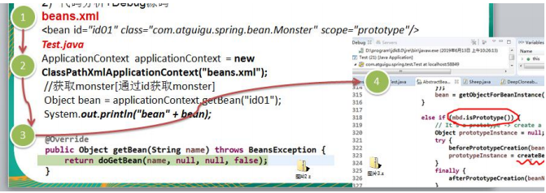


## 7.3**浅拷贝**

以拷贝文件为例

```java
public class File implements Cloneable{
    private String name;
    private Date createTime;
    // 覆写clone方法
    @Override
    protected Object clone() throws CloneNotSupportedException {
        return super.clone();
    }
}
//测试
public class Client {
    public static void main(String[] args) throws CloneNotSupportedException {
        Date date = new Date();
        File file = new File("文件1",date);
        System.out.println(file);
        File copyFile = (File) file.clone();
        System.out.println(copyFile);
    }
}
```

> - **浅拷贝，**当我们Date对象改变时，两个file对象里的data也会发生相应的变化，因为这两个对象都指向同一个date对象.
>
> - > 1) 对于基本数据类型的成员变量，浅拷贝会直接进行值传递，也就是将该**属性值复制**一份给新的对象。 
>   >
>   > 2) 对于引用数据类型的成员变量，那么浅拷贝会进行 引用传递，也就是只是将该成员变量的**引用值（内存地址）复制一份给新的对象**。因为实际上两个对象的该成 员变量都**指向同一个实例**。在这种情况下，在一个对象中修改该成员变量会影响到另一个对象的该成员变量值

## 7.4**深拷贝**

### 7.4.1修改clone方法

```java
@Override
protected Object clone() throws CloneNotSupportedException {
    Object file = super.clone();
((File)file).createTime = (Date) this.getCreateTime().clone();//将Date对象进行copy
    return file;
}
```

### 7.4.2实现序列化接口

```java
class File implement Serializable {
	public File deepClone() {
    try {
        // 输出 (序列化)
        ByteArrayOutputStream baos = new ByteArrayOutputStream();
        ObjectOutputStream oos = new ObjectOutputStream(baos);
        oos.writeObject(this);
        // 输入 (反序列化)
        ByteArrayInputStream bais = new ByteArrayInputStream(baos.toByteArray());
        ObjectInputStream ois = new ObjectInputStream(bais);
        Person person = (Person) ois.readObject();
        return person;
    } catch (Exception e) {
        e.printStackTrace();
        return null;
    }
}
}
```

> **深拷贝**，当我们Date对象改变时，原型file对象里的data会发生相应的变化，克隆对象里的data不会发生变化，因为这两个对象分别指向不同date对象.

# 第 8 章 建造者模式

## 8.1概述

> - **定义：将一个复杂对象的构建与表示分离**
> - **作用：在用户不知道 对象的建造过程和细节的情况下可以直接创建复杂对象**

## 8.2角色

> - Builder
>   - **抽象建造者: 为创建一个产品指定构造部件的方法,由具体建造者去实现**
>   - **具体实现来依赖Builder接口 面向接口编程**
>   - 例子：建房子的图纸，这张图纸有建房子的步骤(打地基，打钢筋，装修),无论是建高楼还是别墅你都要来实现这个Builder
> - ConcreteBuilder
>   - **具体建造者: 实现抽象建造者的方法，构造或装配对象**
>   - **Builder的实现类,创建复杂对象的细节在实现方法中**
>   - 例子：建高楼(具体建造者)根据图纸(抽象建造者)给出的步骤去实现详细过程
> - Product
>   - **产品: 表示被建造的复杂对象，内部由ConcreteBuild去实现,最终由Director生产出来**
>   - **最终被创建出来的产品**
>   - 例子：房子被创建出来了
> - Director
>   - **指挥者: 调用ConcreteBuilder实现的建造方法,生产出Product产品**
>   - **接收Builder的实现类ConcreteBuilder,调用创建对象详细方法,返回产品**
>   - 例子: 指挥创建房子

```java
//产品： 房子  由具体建造者来创建产品的内部
public class Product {
    private String buildA;
    private String buildB;
    private String buildC;
    @Override
    public String toString() {
        return "Product{" +
                "buildA='" + buildA + '\'' +
                ", buildB='" + buildB + '\'' +
                ", buildC='" + buildC + '\'' +
                '}';
    }
    // 字段的get/set方法...
}
----------------------------------------------------------------------
//抽象建造者：像图纸一样 规定好造房子步骤,让具体建造者去依赖 (面向接口编程)
public abstract class Builder {
    abstract void buildA();//打地基
    abstract void buildB();//打钢筋
    abstract void buildC();//装修
    abstract Product getProduct();
}
-------------------------------------------------------------------------
   //具体建造者 : 工人 按照图纸（建造者）要求 打造 产品（房子）
public class ConcreteBuilder extends Builder {
    private Product product;
    public ConcreteBuilder() { this.product = new Product();}
    @Override
    void buildA() {product.setBuildA("打地基");}
    @Override
    void buildB() {product.setBuildB("打钢筋");}
    @Override
    void buildC() {product.setBuildC("装修");}
    @Override
    Product getProduct() { return product;}
} 
----------------------------------------------------------------------
//指挥并构造一个使用Builder的对象  核心 负责指挥一个房子如何去建造
public class Director {
    //指挥建造房子 
    public Product build(Builder builder){
        builder.buildA();
        builder.buildB();
        builder.buildC();
        return builder.getProduct();
    }
}
------------------------------------------------------------------------
    //客户端
public class Client {
    public static void main(String[] args) {
        //指挥 建造房子 最终得到这个房子
        //表示层
        Director director = new Director();
        Product product = director.build(new ConcreteBuilder());
        /*
        曾经创建层表示层未分离:
        Product p = new Product();p.setBuildA();
        p.setBuildB(); p.setBuildC();
        */
        System.out.println(product.toString());
    }
}
```

> - **将复杂对象的创建层与表示层分离**
> - 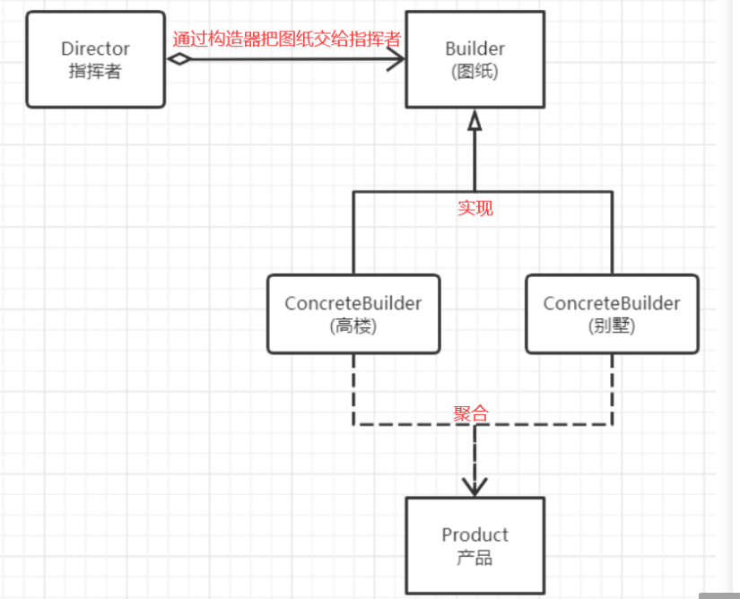
> - 建造者模式结合**链式编程**来使用，代码上更加美观

## 8.3建造者模式与抽象工厂模式的比较:

> - 建造者模式返回一个组装好的完整产品 ， 抽象工厂模式返回一系列相关的产品，这些产品位于不同的产品等级结构，构成了一个产品族
>
> - **建造者模式**是把对象的创建分散开来，**每个抽象方法负责其中的一部分**。**抽象工厂**是每个方法负责一个**产品族**。
>
> - **建造者模式所有函数加到一起才能生成一个对象。抽象工厂一个函数生成一个对象**。
>
> - > - 比如华为手机制造，华为荣耀系列 和 华为Nova系列的产品生产,**抽象工厂**有两个子厂分别负责实际生产荣耀系列手机(荣耀产品族) 和 华为Nova系列手机(Nova产品族)
>   > - 两个子工厂的生产流水线上拼凑组装华为手机产品的过程叫做**建造者模式**

## 8.4建造者模式在 JDK 的应用和源码分析

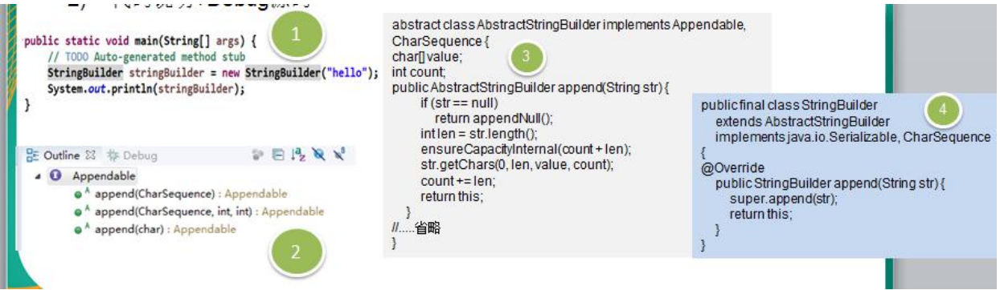

> - 源码中建造者模式角色分析 
>
> - > - Appendable 接口定义了多个 append 方法(抽象方法), 即 Appendable 为**抽象建造者**, 定义了抽象方法 
>   > - AbstractStringBuilder 实现了 Appendable 接口方法，这里AbstractStringBuilder 已经是**建造者**，只是不能实例化 
>   > - StringBuilder 即充当了**指挥者角色**，同时充当了具体的建造者，建造方法的实现是由 AbstractStringBuilder 完成, 而 StringBuilder 继承了 AbstractStringBuilder 

# 第 9 章 适配器设计模式

## 9.1 基本介绍 

> - 适配器模式(Adapter Pattern)将某个类的接口转换成客户端期望的另一个接口表示，**主的目的是兼容性**，让原本因接口不匹配不能一起工作的两个类可以协同工作。其别名为包装器(Wrapper) 
> -  适配器模式属于**结构型模式** 
> -  主要分为三类：**类适配器模式、对象适配器模式、接口适配器模**式

## 9.2 工作原理

> 1) 适配器模式：将一个类的接口转换成另一种接口.让原本接口不兼容的类可以兼容 
>
> 2) 从用户的角度看不到被适配者，是解耦的 
>
> 3) **用户调用适配器转化出来的目标接口方法，适配器再调用被适配者的相关接口方法** 
>
> 4) 用户收到反馈结果，感觉只是和目标接口交互，如图
>
> 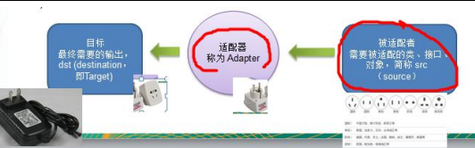

## 9.3 类适配器模式

### 9.3.1类适配器模式介绍 

基本介绍：Adapter 类，通过继承 src 类，实现 dst 类接口，完成 src->dst 的适配。

### 9.3.2类适配器模式应用实例 

> -  应用实例说明 
>
> - > 以生活中充电器的例子来讲解适配器，充电器本身相当于 Adapter，220V 交流电相当于 src (即被适配者)，我们 的目 dst(即 目标)是 5V 直流电
>
> - 思路分析(类图) 
>
> - > 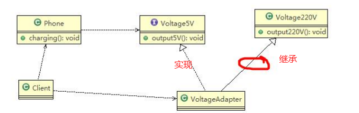

```java
public class Client {
    public static void main(String[] args) {
        System.out.println(" === 类适配器模式 ====");
        Phone phone = new Phone();
        phone.charging(new VoltageAdapter());
    }
}
public class Phone {
    //充电
    public void charging(IVoltage5V iVoltage5V) {
        if (iVoltage5V.output5V() == 5) {
            System.out.println("电压为 5V, 可以充电~~");
        } else if (iVoltage5V.output5V() > 5) {
            System.out.println("电压大于 5V, 不能充电~~");
        }
    }
}
public interface IVoltage5V {
    public int output5V();
}
public class Voltage220V {
   // 输出 220V 的电压
    public int output220V() {
        int src = 220;
        System.out.println("电压=" + src + "伏");
        return src;
    }
}
public class VoltageAdapter extends Voltage220V implements IVoltage5V {
    @Override
    public int output5V() {
        //获取到 220 V 电压 
        int srcV = output220V();
        int dstV = srcV / 44;
        return dstV;
    }
}
```

### 9.3.3类适配器模式注意事项和细节 

> - Java 是单继承机制，所以类适配器需要继承 src 类这一点算是一个缺点, 因为这要求 dst 必须是接口，有一定局 限性; 
> -  src 类的方法在 Adapter 中都会暴露出来，也增加了使用的成本。 
> -  由于其继承了 src 类，所以它可以根据需求重写 src 类的方法，使得 Adapter 的灵活性增强了。

## 9.4 对象适配器模式

### 9.5.1对象适配器模式介绍

> - 基本思路和类的适配器模式相同，只是将 Adapter 类作修改，不是继承 src 类，而是持有 src 类的实例，以解决兼容性的问题。 即：持有 src 类，实现 dst 类接口，完成 src->dst 的适配 
> - 根据“**合成复用原则**”，在系统中尽量使用**关联关系（组合）来替代继承**关系。 
> - 对象适配器模式是适配器模式常用的一种

```java
public class Client {
    public static void main(String[] args) {
        System.out.println(" === 对象适配器模式 ====");
        Phone phone = new Phone();
        phone.charging(new VoltageAdapter(new Voltage220V()));
    }
}
//适配器类
public class VoltageAdapter implements IVoltage5V {
    private Voltage220V voltage220V;
    //关联关系-聚合通过构造器，传入一个 Voltage220V实例
    public VoltageAdapter(Voltage220V voltage220v)  {this.voltage220V = voltage220v;}
    @Override
    public int output5V() {
        int dst = 0;
        if (null != voltage220V) {
            int src = voltage220V.output220V();
            System.out.println("使用对象适配器，进行适配~~");
            dst = src / 44;
            System.out.println("适配完成，输出的电压为=" + dst);
        } return dst;
    }
}
```

### 9.4.3对象适配器模式注意事项和细节 

> -  对象适配器和类适配器其实算是同一种思想，只不过实现方式不同。 根据合成复用原则，**使用组合替代继承**， 所以它解决了类适配器必须继承 src 的局限性问题，也不再要求 dst 必须是接口。 
> -  使用成本更低，更灵活。 

## 9.5 接口适配器模式

### 9.5.1接口适配器模式介绍 

> - 一些书籍称为：适配器模式(Default Adapter Pattern)或**缺省适配器模式**。 
> -  核心思路：当**不需要全部实现接口提供的方法**时，可先**设计一个抽象类**实现**接口**，并为该接口中每个方法提供 一个**默认实现（空方法）**，那么该**抽象类的子类可有选择地覆盖父类的某些方法**来实现需求 
> - 适用于一个**不想接口使用所有的方法**的情况。 

### 9.5.2接口适配器模式应用实例

```java
public interface Interface4 { 
public void m1(); 
public void m2();}

//在 AbsAdapter 我们将 Interface4 的方法进行默认实现 
public abstract class AbsAdapter implements Interface4 { 
//默认实现 
public void m1() { }
public void m2() { } }

public class Client { public static void main(String[] args) {
    AbsAdapter absAdapter = new AbsAdapter() { 
        //只需要去覆盖我们 需要使用 接口方法 
        @Override public void m1() { 
            System.out.println("使用了 m1 的方法"); } }; 
    absAdapter.m1(); } }
```

## 9.6适配器模式在 SpringMVC 框架应用的源码剖析 

> -  SpringMvc 中的 **HandlerAdapter,** 就使用了适配器模式 
>
> -  SpringMVC 处理请求的流程回顾 
>
> - 使用 HandlerAdapter 的原因分析:
>
> - > 可以看到处理器的类型不同，有多重实现方式，那么调用方式就不是确定的，如果需要直接调用 Controller 方法，需要调用的时候就得不断是使用 if else 来进行判断是哪一种子类然后执行。那么如果后面要扩展 Controller， 就得修改原来的代码，这样违背了 OCP 原则。
>   >
>   > 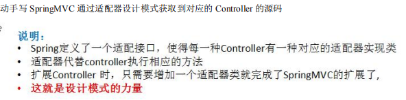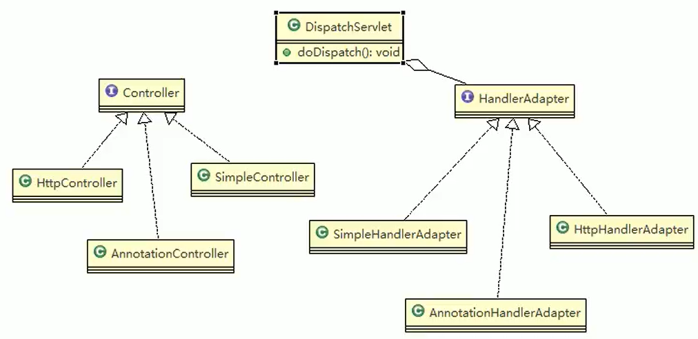


## 9.7 适配器模式的注意事项和细节 

> - 三种命名方式，是根据 src 是以怎样的形式给到 Adapter（在 Adapter 里的形式）来命名的。 
> -  类适配器：以类给到，在 Adapter 里，就是将 src 当做类，**继承** 
> - 对象适配器：以对象给到，在 Adapter 里，将 src 作为一个对象，**持有** 
> - 接口适配器：以接口给到，在 Adapter 里，将 src 作为一个接口，**实现** 
> - Adapter 模式最大的作用还是将原本不兼容的接口融合在一起工作。

# 第 10 章桥接模式 

## 10.1概述

> - **定义**：将抽象部分与它的实现部分分离，使它们都可以独立地变化。
>
> - **意图**：将抽象与实现解耦。
>
> - >  桥接模式主要应对的是由于实际的需要，**某个类具有两个或者两个以上的维度变化（违反了SRP单一原则）**，如果只是用继承将无法实现这种需要，或者使得设计变得相当臃肿。
>   >
>   > 如果每个对应的类型品牌都编写对应的类，就会造成代码的冗余
>   >
>   > 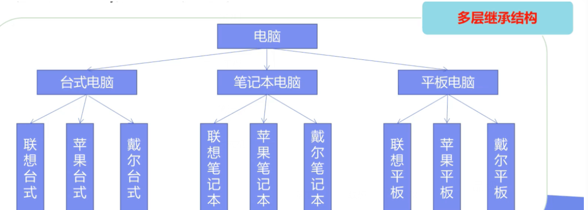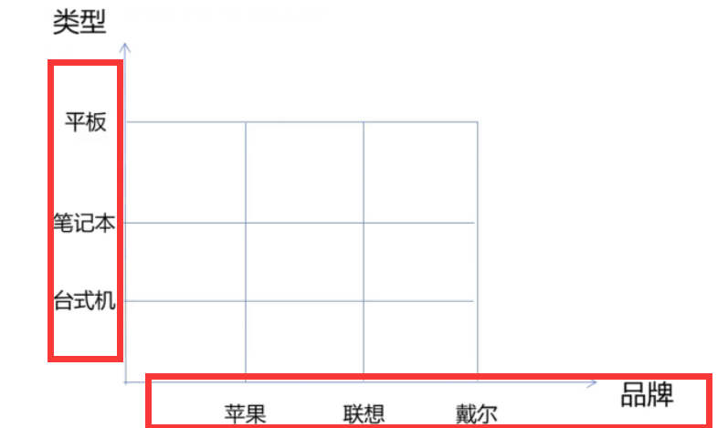

## 10.2代码实例

```java
//品牌接口
public interface Brand {
    void info();
}
//各品牌实现类
public class Lenovo implements Brand{
    public void info() {System.out.println("联想品牌..");}
}
public class Apple implements Brand{
    public void info() {System.out.println("苹果品牌..");}
}
//电脑类型，是抽象的数据类型，它并没有做一些具体的事情，
// 这里不要定义为接口，因为电脑的品牌是属性，使用组合来实现，电脑出厂是自带品牌的
public class Computer {
    // 这里使用protected，这样子类继承的时候就可以直接使用了
    protected Brand brand;
    public Computer(Brand brand){
        this.brand = brand;
    }
    public void info(){
        brand.info();
    }
}
//类型
public class Desktop extends Computer{
    public Desktop(Brand brand) {
        super(brand);
    }
    public void info() {
        super.info();
        System.out.println("台式机..");
    }
}
public class Laptop extends Computer{
    public Laptop(Brand brand) {
        super(brand);
    }
    public void info() {
        super.info();
        System.out.println("笔记本..");
    }
}
//测试
public class Client {
    public static void main(String[] args) {
        Desktop desktop = new Desktop(new Lenovo());
        desktop.info();
        Laptop laptop = new Laptop(new Dell());
        laptop.info();
    }
}
```

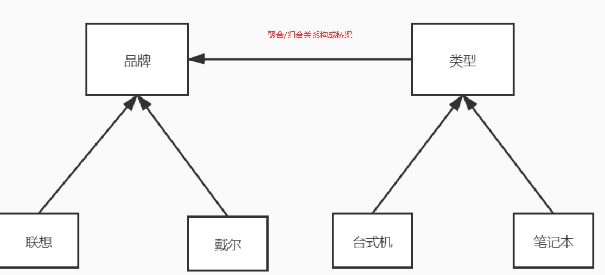

> 我们在电脑里直接将品牌组合进来，这样电脑就自带品牌了，通过组合的方式搭建了一座桥，所以我们如果要增加一个类型，例如超级计算机，只要继承computer，这个计算机就自带品牌属性了，而品牌是从brand拿过来的，新增一个品牌也不会影响类型的操作，两者互不影响，可以随意扩展

## 10.3优缺点以及实际应用场合

> **优势**
>
> - 桥接模式偶尔类似于多继承方案，但是多继承方案违背了类的单一职责原则，复用性比较差，类的个数也非常多，桥接模式是比多继承方案更好的解决方法。极大的减少了子类的个数，从而降低管理和维护的成本
> - 桥接模式**提高了系统的可扩充性**，在两个变化维度中任意扩展一个维度，都不需要修改原有系统。符合开闭原则，就像一座桥，可以把两个变化的维度连接起来!
>
> **劣势**
>
> - 桥接模式的引入会增加系统的理解与设计难度，由于聚合关联关系建立在抽象层，要求开发者针对抽象进行设计与编程。
> - 桥接模式要求正确识别出系统中两个独立变化的维度，因此其使用范围具有一定的局限性。
>
> **最佳实际**
>
> - 如果一个系统需要在构建的**抽象化角色和具体化角色之间增加更多的灵活性**，避免在两个层次之间建立静态的继承联系，通过桥接模式可以使它们在**抽象层建立一个关联关系**。抽象化角色和实现化角色可以以继承的方式独立扩展而互不影响，在程序运行时可以动态将一个抽象化子类的对象和一个实现化子类的对象进行组合，即系统需要对抽象化角色和实现化角色进行动态耦合。
>
> - **一个类存在两个独立变化的维度，且这两个维度都需要进行扩展。**
>
> - 虽然在系统中使用继承是没有问题的，但是由于抽象化角色和具体化角色需要独立变化，设计要求需要独立管理这两者。对于那些不希望使用继承或因为多层次继承导致系统类的个数急剧增加的系统，桥接模式尤为适用。
>
>   **场景**
>
>   - Java语言通过Java虚拟机实现了平台的无关性。
>
>   - AWT中的Peer架构
>
>   - **JDBC**驱动程序也是桥接模式的应用之一。
>
>   - > 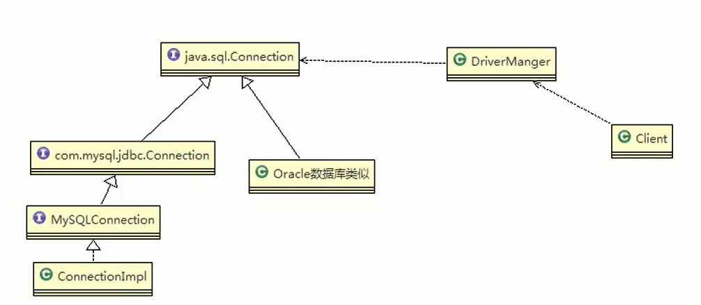